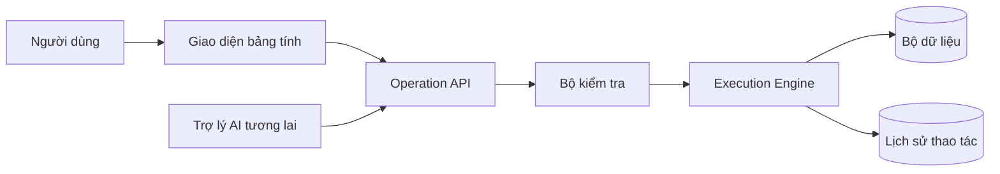

# Analyst Data Workspace

Kho đặc tả sản phẩm cho không gian làm việc dữ liệu trên web có trải nghiệm tương tự bảng tính, dành cho Data Analyst và Business Analyst.

## Mục tiêu sản phẩm

Cho phép người dùng nhập dữ liệu dạng bảng, kiểm tra và chỉnh sửa trên lưới quen thuộc, thực hiện các phép biến đổi có thể tái lập mà không cần viết mã, theo dõi mọi thao tác, hoàn tác thay đổi và xuất bộ dữ liệu sạch. Dashboard và trợ lý AI được chủ động để dành cho các giai đoạn sau.

## Lộ trình phát triển

1. **Giai đoạn 1 — MVP Data Workspace:** nhập Excel/CSV, lưới có thể chỉnh sửa, lọc, sắp xếp, profiling, biến đổi, lịch sử thao tác, undo/redo và xuất dữ liệu.
2. **Giai đoạn 1.1 — Biến đổi nâng cao:** cột tính toán, group by, pivot, join và pipeline biến đổi có thể tái sử dụng.
3. **Giai đoạn 1.2 — Phân tích:** metric, dimension, biểu đồ và dashboard.
4. **Giai đoạn 1.3 — Kết nối dữ liệu:** PostgreSQL/MySQL/data warehouse và query pushdown.
5. **Giai đoạn 2 — AI Data Assistant:** ngôn ngữ tự nhiên → thao tác biến đổi đã kiểm tra → xem trước → áp dụng.
6. **Giai đoạn 3 — AI Analyst:** phân tích bằng ngôn ngữ tự nhiên, phát hiện insight/bất thường và tạo dashboard.

## Tài liệu

- [Tài liệu yêu cầu sản phẩm](docs/PRD.md)
- [Đối chuẩn thị trường](docs/BENCHMARK.md)
- [Kiến trúc hệ thống](docs/SYSTEM_ARCHITECTURE.md)
- [Mô hình dữ liệu](docs/DATA_MODEL.md)
- [Đặc tả API](docs/API_SPEC.md)
- [User story và tiêu chí chấp nhận](docs/USER_STORIES_AND_ACCEPTANCE.md)
- [Backlog MVP](docs/MVP_BACKLOG.md)
- [Lộ trình sản phẩm](docs/ROADMAP.md)
- [Đặc tả giai đoạn trợ lý AI](docs/AI_ASSISTANT_PHASE.md)

## Nguyên tắc kiến trúc cốt lõi

Thao tác thủ công trên giao diện và lệnh AI trong tương lai phải gọi **cùng một Operation Engine có tính xác định**.

Nguyên tắc này ngăn lớp AI trở thành một hệ xử lý dữ liệu tách biệt và thiếu an toàn, đồng thời bảo đảm mọi phép biến đổi đều có thể tái lập, kiểm toán và hoàn tác.
