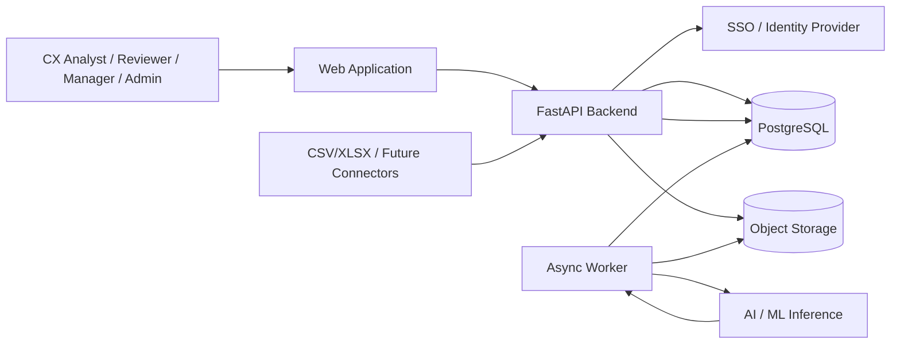
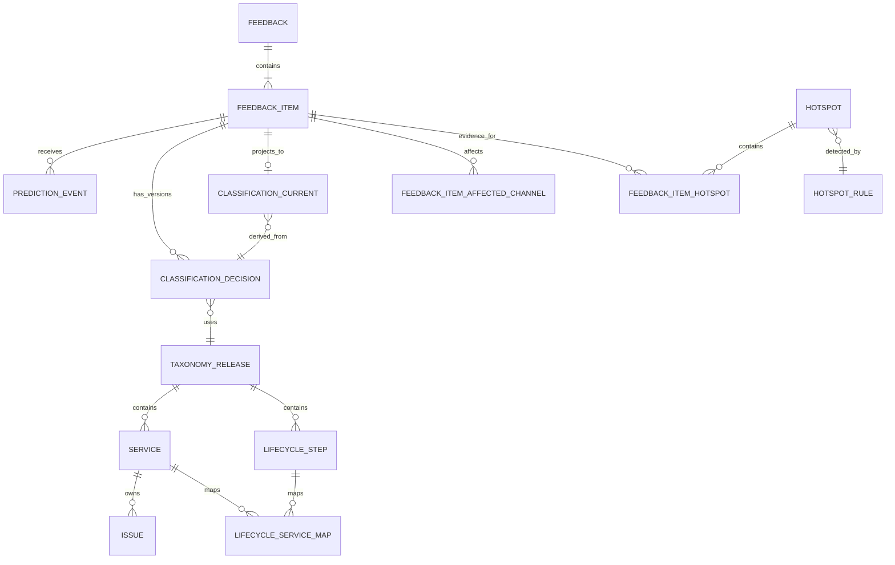
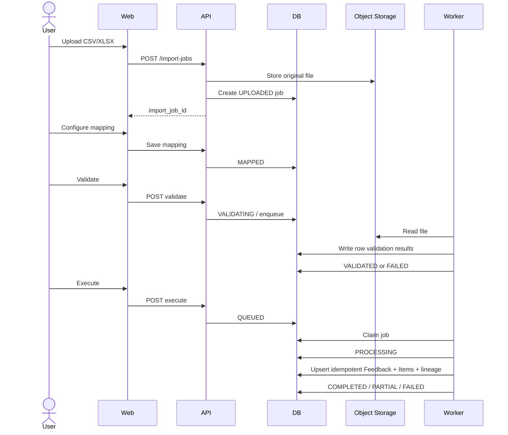
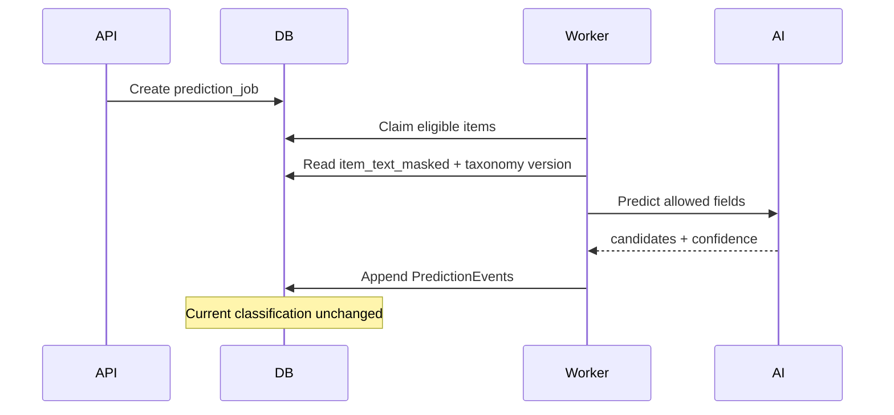
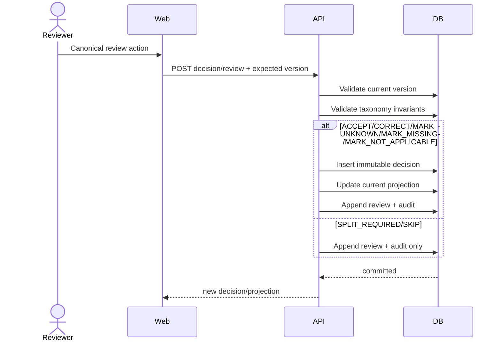
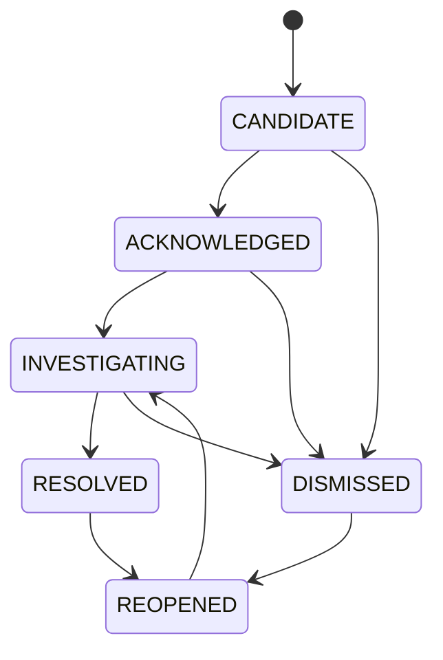

# 04 — Thiết kế Hệ thống

# Nền tảng Trí tuệ Phân tích Hành trình Khách hàng, Dịch vụ & Nguyên nhân Gốc rễ (CX Journey, Service & Root Cause Intelligence Platform)

**Phiên bản:** 1.1  
**Trạng thái:** P0 Pilot Architecture Baseline  
**Dựa trên:** `docs/PRD.md` v1.3, `docs/service_taxonomy.md` v3.0.0, `docs/Business_Rules.md` v1.1  
**Repository baseline:** Python 3.12, FastAPI, Pydantic, SQLAlchemy 2, psycopg 3, Alembic; kho lưu trữ đã tách biệt `apps/api`, `apps/web`, và `apps/worker`.

---

## 1. Mục đích

Tài liệu này xác định cách triển khai P0 CX Platform như một hệ thống nhất quán, có thể kiểm thử được.

Tài liệu chuyển đổi các hợp đồng nghiệp vụ/tên miền thành:

- kiến trúc ứng dụng;
- ranh giới mô-đun;
- mô hình lưu trữ;
- xử lý bất đồng bộ;
- thiết kế API;
- hành vi bảo mật/kiểm toán;
- đường dẫn đọc phân tích;
- xử lý điểm nóng;
- triển khai/khả năng giám sát;
- xử lý lỗi;
- thứ tự xây dựng.

Thiết kế hệ thống cố ý tối ưu hóa cho một phiên bản thử nghiệm (pilot) bị giới hạn về phạm vi sản xuất và các hợp đồng tên miền rõ ràng trước khi gia tăng độ phức tạp khi mở rộng quy mô.

---

# 2. Tóm tắt Quyết định Kiến trúc

## SD-ADR-001 — Sử dụng Modular Monolith cho P0

P0 NÊN sử dụng một ứng dụng backend định hướng theo tên miền (domain-oriented backend application) kết hợp với một worker bất đồng bộ, thay vì nhiều microservice.

```text
apps/web
   ↓ HTTPS
apps/api
   ↓
Domain/Application Modules
   ↓
PostgreSQL
   ↘
    Job Queue / Job Tables
             ↓
        apps/worker
```

**Lý do**

- P0 là phiên bản thử nghiệm có nhiều quy tắc tên miền (domain rules) nhưng quy mô còn hạn chế.
- Hầu hết các thao tác yêu cầu tính nhất quán giao dịch (transactional consistency) giữa phản hồi (feedback), quyết định (decisions), kiểm toán (audit) và các projection.
- Việc chia nhỏ thành các dịch vụ sớm sẽ làm tăng chi phí quản lý tính nhất quán phân tán và triển khai mà không mang lại giá trị sản phẩm rõ ràng.
- Ranh giới giữa các mô-đun tên miền sau này có thể chuyển đổi thành ranh giới dịch vụ nếu cần.

---

## SD-ADR-002 — PostgreSQL là System of Record cho P0

PostgreSQL NÊN lưu trữ:

- dữ liệu tham chiếu/taxonomy;
- metadata của công việc nhập dữ liệu (import-job);
- Feedback/Feedback Item;
- sổ nhật ký dự đoán (prediction ledger);
- sổ nhật ký quyết định (decision ledger);
- projection hiện tại (current projection);
- dữ liệu kiểm toán (audit);
- trạng thái/bằng chứng điểm nóng (hotspot state/evidence);
- cấu hình chỉ số (metric configuration).

Các tệp tải lên dung lượng lớn/tệp lỗi CÓ THỂ được lưu trữ trong bộ lưu trữ đối tượng (object storage) tương thích S3.

---

## SD-ADR-003 — Ledgers Chỉ ghi nối tiếp (Append-Only Ledgers) + Projection Có thể tái thiết lập (Rebuildable Projection)

Kiến trúc phân loại BẮT BUỘC phải tách biệt:

```text
Prediction Ledger        (immutable)
Decision Ledger          (immutable)
Review/Audit Events      (immutable)
        ↓
Current Classification Projection
        ↓
Analytics / Hotspot / UI reads
```

Projection là trạng thái phái sinh có thể hủy bỏ/tái thiết lập.

---

## SD-ADR-004 — Async Queue cho P0 Có thể Dựa trên PostgreSQL

Vì baseline phụ thuộc Python hiện tại không bắt buộc Redis/Celery, P0 CÓ THỂ triển khai một hàng chờ công việc (job queue) bền vững dựa trên PostgreSQL với cơ chế worker nhận việc (claiming) thông qua giao dịch/`FOR UPDATE SKIP LOCKED`.

Lộ trình chuyển đổi được đề xuất:

```text
P0:
PostgreSQL job table + apps/worker

Scale-out:
Redis / SQS / RabbitMQ / managed queue
```

Hợp đồng công việc (job contract) phải độc lập với công nghệ hàng chờ.

---

## SD-ADR-005 — AI là Adapter Bên ngoài/Có thể thay thế

Logic tên miền/ứng dụng KHÔNG ĐƯỢC phụ thuộc trực tiếp vào một nhà cung cấp/mô hình ML cụ thể.

```text
ClassificationService
        ↓
PredictionPort
        ↓
Model Adapter
   ├── local model
   ├── hosted model
   └── LLM endpoint
```

Tất cả đầu ra dự đoán đều được lưu trữ kèm theo phiên bản của mô hình/pipeline/taxonomy trước khi đánh giá (review).

---

# 3. Bối cảnh Hệ thống



---

# 4. Ánh xạ Kho lưu trữ P0

Cấu trúc kho lưu trữ được đề xuất:

```text
apps/
├── api/
│   ├── main.py
│   ├── routers/
│   ├── dependencies/
│   └── exception_handlers/
├── worker/
│   ├── main.py
│   ├── jobs/
│   └── schedulers/
└── web/
    └── ...

packages/
├── domain/
│   ├── feedback/
│   ├── taxonomy/
│   ├── classification/
│   ├── import_jobs/
│   ├── analytics/
│   ├── hotspot/
│   ├── auth/
│   └── audit/
├── application/
│   ├── commands/
│   ├── queries/
│   └── services/
├── persistence/
│   ├── models/
│   ├── repositories/
│   └── migrations/
├── ai/
│   ├── ports.py
│   └── adapters/
├── observability/
└── shared/

tests/
├── unit/
├── integration/
├── contract/
└── e2e/
```

Quy tắc: routers/controllers phải giữ cho gọn nhẹ. Các bất biến nghiệp vụbelong về domain/application services, không nằm bên trong các HTTP handler.

---

# 5. Ranh giới các Mô-đun Backend

## 5.1 Mô-đun Taxonomy

Trách nhiệm:

- đọc các danh mục lifecycle/service/issue/cause;
- xác thực cấu trúc phát hành (release shape) của taxonomy;
- xác thực các ánh xạ lifecycle-service;
- xác thực các ID ổn định/có hiệu lực;
- xuất bản bản phát hành đã được phê duyệt;
- cung cấp dữ liệu tham chiếu đã xuất bản cho UI/API.

Trong P0:

- đọc/xác thực/xuất bản;
- không cung cấp CRUD tùy ý ở cấp dòng.

Các đối tượng cốt lõi:

```text
TaxonomyRelease
LifecycleStage
LifecycleStep
Service
Issue
Cause
LifecycleServiceMapping
Location
ServiceOwnerConfig
```

---

## 5.2 Mô-đun Import

Trách nhiệm:

- upload metadata;
- cấu hình ánh xạ;
- xem trước;
- xác thực schema/dòng;
- thực thi;
- thử lại;
- báo cáo lỗi;
- nguồn gốc dòng dữ liệu;
- tính bảo toàn thao tác.

Các đối tượng cốt lõi:

```text
ImportJob
ImportMappingProfile
ImportRow
ImportRowError
```

---

## 5.3 Mô-đun Feedback

Trách nhiệm:

- vỏ bọc Feedback bất biến;
- tạo/tách Feedback Item;
- văn bản đã được ẩn danh/che dấu PII;
- chuẩn hóa nguồn/vị trí/kênh;
- truy vấn không gian làm việc Feedback.

Các đối tượng cốt lõi:

```text
Feedback
FeedbackItem
FeedbackItemAffectedChannel
```

---

## 5.4 Mô-đun Classification

Trách nhiệm:

- sổ nhật ký dự đoán AI;
- sổ nhật ký quyết định từ con người/nguồn;
- các hành động đánh giá;
- kiểm soát đồng thời lạc quan;
- tái thiết lập projection hiện tại;
- xác thực tính nhất quán của taxonomy.

Các đối tượng cốt lõi:

```text
PredictionRun
PredictionEvent
ClassificationDecision
DecisionCandidateCause
DecisionPredictionRef
ReviewEvent
ClassificationCurrent
ClassificationCurrentCandidateCause
```

Hợp đồng chuẩn hóa:

```text
decision_source = MANUAL | SOURCE_TRUSTED | HUMAN_ACCEPTED_AI | HUMAN_CORRECTED_AI | POLICY_AUTO_APPLIED | SYSTEM_MIGRATION
cause_determination_status = NOT_ASSESSED | UNKNOWN | SUGGESTED | UNDER_INVESTIGATION | CONFIRMED | NOT_APPLICABLE
review_action = ACCEPT | CORRECT | MARK_UNKNOWN | MARK_MISSING | MARK_NOT_APPLICABLE | SPLIT_REQUIRED | SKIP
```

Các luồng ghi trong P0 chỉ được sử dụng `NOT_ASSESSED`, `UNKNOWN`, `SUGGESTED`, `NOT_APPLICABLE` cho xác định nguyên nhân. P1 Investigation/RCA mới sở hữu `UNDER_INVESTIGATION` và `CONFIRMED`.

---

## 5.5 Mô-đun Analytics

Trách nhiệm:

- vị tự điều kiện hợp lệ trung tâm;
- định nghĩa các chỉ số;
- các hàm/view truy vấn KPI;
- tuần tự hóa bối cảnh bộ lọc;
- tính nhất quán khi đi sâu vào chi tiết.

Các chỉ số trong P0:

- item volume;
- negative rate;
- unknown rate;
- top service;
- top issue;
- top location;
- active hotspots;
- data-quality counts.

P0 cung cấp 4 mô hình đọc dashboard cơ bản: CX Overview, Customer Journey, Service & Pain Points, và Hotspot & Root Cause. Dashboard thứ tư chỉ chứa hotspot/evidence/owner/status/Candidate Cause trong P0. Mỗi góc độ phân tích chi tiết (`journey_stage`, `journey_step`, `service`, `issue`, `location`, `intake_channel`, `affected_channel`) trả về `item_volume`, `negative_rate`, `active_hotspots`, và `trend` trong cùng một ngữ cảnh bộ lọc/định nghĩa chỉ số.

Persona không phải là một chiều phân tích trong P0. Affected Channel được hỗ trợ độc lập với Intake Channel.

---

## 5.6 Mô-đun Hotspot

Trách nhiệm:

- cấu hình quy tắc định tính;
- lựa chọn các item đủ điều kiện;
- đánh giá theo cửa sổ trượt;
- upsert ứng viên bảo toàn thao tác;
- liên kết bằng chứng;
- thay đổi lifecycle/người sở hữu;
- kiểm toán.

Các đối tượng cốt lõi:

```text
HotspotRule
Hotspot
HotspotOccurrence [optional]
FeedbackItemHotspot
HotspotTimelineEvent
```

---

## 5.7 Mô-đun Security & Audit

Trách nhiệm:

- đối tượng thực thể được xác thực;
- phạm vi thử nghiệm;
- kiểm tra vai trò/quyền hạn;
- thực thi quy định PII thô;
- các sự kiện kiểm toán bất biến;
- ID tương quan.

---

# 6. Mô hình Dữ liệu Logic



---

# 7. Các Bảng PostgreSQL Được đề xuất

## 7.1 Tham chiếu & Quản trị

```text
taxonomy_release
customer_lifecycle_stage
customer_lifecycle_step
service_request_step
service
issue
cause
issue_cause_map
lifecycle_service_map
location
interaction_channel
service_owner_config
pilot_scope_manifest
metric_definition
```

Các ràng buộc quan trọng:

- các code duy nhất trên mỗi không gian tên chuẩn hóa;
- Issue thuộc về duy nhất một Service;
- bản phát hành đã xuất bản là bất biến, ngoại trừ metadata về ngưng sử dụng;
- các ngày có hiệu lực phải được xác thực;
- không tái sử dụng mã ổn định.

---

## 7.2 Thu thập Dữ liệu

```text
import_job
import_mapping_profile
import_row
import_row_error
feedback
feedback_item
feedback_item_affected_channel
```

Ràng buộc duy nhất được đề xuất:

```text
UNIQUE(source_system, source_record_key)
```

khi hệ thống nguồn bảo đảm một key ổn định.

Nếu không, sử dụng một idempotency key/checksum định tính trong phạm vi nguồn/chính sách nhập dữ liệu.

---

## 7.3 Phân loại

```text
prediction_run
prediction_event
classification_decision
classification_decision_candidate_cause
classification_decision_prediction_ref
review_event
classification_current
classification_current_candidate_cause
```

Ràng buộc được đề xuất:

```text
UNIQUE(feedback_item_id, decision_version)
UNIQUE(feedback_item_id) on classification_current
```

`classification_decision` là bảng chỉ ghi nối tiếp.

---

## 7.4 Điểm nóng

```text
hotspot_rule
hotspot
hotspot_timeline_event
feedback_item_hotspot
```

Idempotency key được đề xuất:

```text
UNIQUE(dimension_key, rule_version, active_window_key)
```

hoặc một unique key định tính tương đương.

---

## 7.5 Kiểm toán

```text
audit_event
```

Các trường được đề xuất:

```text
audit_event_id
occurred_at
actor_user_id
actor_role
action
resource_type
resource_id
project_id
correlation_id
reason
before_ref
after_ref
metadata_json
```

Dữ liệu kiểm toán nên tránh việc trùng lặp nội dung thô nhạy cảm trừ khi có yêu cầu rõ ràng.

---

# 8. Projection Phân loại Hiện tại

Projection tồn tại để tối ưu hóa khối lượng công việc đọc/lọc dữ liệu.

```text
feedback_item_id
current_decision_id
customer_lifecycle_value_status
customer_lifecycle_stage_id
customer_lifecycle_step_id
service_request_value_status
service_request_step_id
primary_service_value_status
primary_service_id
issue_value_status
issue_id
sentiment
operational_severity
cause_determination_status
other_reason
classification_state
taxonomy_release_id
last_decision_at
projection_version
```

## Thuật toán cập nhật Projection

Trong cùng một giao dịch:

```text
1. Lock/đọc phiên bản projection hiện tại.
2. Xác thực quyết định/phiên bản trước đó dự kiến.
3. Xác thực bản phát hành taxonomy có được phép hay không.
4. Xác thực các bất biến của Service/Issue/lifecycle.
5. Chèn ClassificationDecision bất biến mới.
6. Chèn các tham chiếu con của quyết định.
7. Upsert ClassificationCurrent từ quyết định mới.
8. Ghi sự kiện kiểm toán/đánh giá.
9. Commit.
```

Nếu bước 2 phát hiện trạng thái lỗi thời, trả về HTTP `409 Conflict`.

---

# 9. Luồng Nhập dữ liệu



---

# 10. Hợp đồng Import Worker

Mỗi thao tác của worker BẮT BUỘC phải an toàn khi thử lại.

Hành vi giả lập:

```text
claim job
↓
for each uncommitted row:
    derive idempotency key
    validate normalized fields
    if existing successful row/key:
        mark replay-safe success
    else:
        transaction:
            create Feedback
            create initial Feedback Item
            create lineage
            mark row success
↓
aggregate job status
```

Không được phép mất mát dòng dữ liệu một cách âm thầm.

---

# 11. Luồng Dự đoán AI



Các trường dự đoán trong P0:

```text
customer_lifecycle_step
service_request_step (optional)
primary_service
issue
sentiment
```

Customer Lifecycle Stage được suy ra từ step.

---

# 12. Luồng Đánh giá AI / Quyết định từ Con người



---

# 13. Luồng Phát hiện Điểm nóng

Baseline cho P0:

```text
Eligible current-classification items
        ↓
Normalize event bucket + configured location level
        ↓
Group by Service + Issue + Location
        ↓
Evaluate rolling W
        ↓
count >= N ?
   ├── no → no candidate
   └── yes
        ↓
idempotent upsert Hotspot CANDIDATE
        ↓
link evidence Feedback Items
        ↓
resolve default owner
        ↓
audit/timeline
```

## Vòng đời của Candidate



Mọi thay đổi trạng thái đều yêu cầu actor/timestamp/reason.

---

# 14. Đường dẫn Đọc dữ liệu Phân tích

Analytics BẮT BUỘC phải đọc từ một lớp truy vấn ngữ nghĩa được quản trị, không đọc trực tiếp từ các bảng thô tùy ý.

View logic được đề xuất:

```text
analytics_feedback_item_v1
```

kết hợp:

```text
feedback_item
+ feedback
+ classification_current
+ published reference labels
+ location
```

và áp dụng một vị tự điều kiện hợp lệ trung tâm.

Ví dụ về vị tự ngữ niệm:

```sql
WHERE feedback_item.status = 'ACTIVE'
  AND feedback_item.analytic_eligibility = 'INCLUDED'
  AND classification_current.current_decision_id IS NOT NULL
  AND classification_current.classification_state = 'ACCEPTED'
```

Triển khai thực tế có thể khác nhau, nhưng tất cả các truy vấn KPI, biểu đồ, xuất dữ liệu và xem chi tiết phải tái sử dụng cùng một predicate/phiên bản.

---

# 15. Thiết kế API

Base prefix:

```text
/api/v1
```

## 15.1 Quy ước

Mỗi request nên có:

- authenticated principal;
- correlation ID;
- thực thi pilot-scope.

Các endpoint thay đổi dữ liệu có thể thử lại NÊN chấp nhận:

```http
Idempotency-Key: <client-generated-key>
```

Response NÊN công khai:

```text
request_id / correlation_id
resource version
created/updated timestamp
```

Các mã lỗi chuẩn:

```text
400 VALIDATION_ERROR
401 UNAUTHENTICATED
403 FORBIDDEN
404 NOT_FOUND
409 VERSION_CONFLICT / IDEMPOTENCY_CONFLICT
422 DOMAIN_RULE_VIOLATION
429 RATE_LIMITED
500 INTERNAL_ERROR
```

---

## 15.2 Import

```http
POST /api/v1/import-jobs
POST /api/v1/import-jobs/{id}/validate
POST /api/v1/import-jobs/{id}/execute
POST /api/v1/import-jobs/{id}/retry
GET  /api/v1/import-jobs/{id}
GET  /api/v1/import-jobs/{id}/errors
POST /api/v1/import-jobs/{id}/cancel
```

---

## 15.3 Feedback

```http
GET  /api/v1/feedback-items
GET  /api/v1/feedback/{id}
GET  /api/v1/feedback-items/{id}
POST /api/v1/feedback/{id}/items/split
GET  /api/v1/feedback-items/{id}/predictions
GET  /api/v1/feedback-items/{id}/decisions
POST /api/v1/feedback-items/{id}/decisions
GET  /api/v1/feedback-items/{id}/current-classification
```

Việc lọc nên sử dụng các ID/mã ổn định, không dùng nhãn đã bản địa hóa.

---

## 15.4 Taxonomy

```http
GET  /api/v1/customer-lifecycle/stages
GET  /api/v1/customer-lifecycle/steps
GET  /api/v1/service-request-lifecycle/steps
GET  /api/v1/services
GET  /api/v1/services/{id}/issues
GET  /api/v1/issues/{id}/candidate-causes
GET  /api/v1/lifecycle-service-mappings
GET  /api/v1/locations
POST /api/v1/taxonomy-versions/{id}/validate
POST /api/v1/taxonomy-versions/{id}/publish
```

P0 không cung cấp API CRUD taxonomy tổng quát ở cấp dòng.

---

## 15.5 AI

```http
POST /api/v1/ai/prediction-jobs
GET  /api/v1/ai/prediction-jobs/{id}
POST /api/v1/ai/predictions/{id}/review
```

---

## 15.6 Analytics

```http
GET /api/v1/analytics/summary
GET /api/v1/analytics/breakdown
GET /api/v1/analytics/trend
```

`breakdown` chấp nhận một chiều dữ liệu cộng với danh sách chỉ số phân tách bằng dấu phẩy/lặp lại chứa `item_volume`, `negative_rate`, `active_hotspots`, `trend`. Tuần tự hóa bộ lọc bao gồm `affected_channel_code`; Persona bị từ chối do là chiều dữ liệu không được hỗ trợ trong P0.

---

## 15.7 Hotspot

```http
GET  /api/v1/hotspots
GET  /api/v1/hotspots/{id}
POST /api/v1/hotspots/{id}/acknowledge
POST /api/v1/hotspots/{id}/assign
POST /api/v1/hotspots/{id}/dismiss
POST /api/v1/hotspots/{id}/resolve
POST /api/v1/hotspots/{id}/reopen
```

---

# 16. Xác thực & Phân quyền

P0 sử dụng SSO kết hợp với kiểm soát vai trò/quyền hạn ứng dụng.

Các vai trò tối thiểu:

```text
PILOT_ADMIN
ANALYST
REVIEWER
VIEWER
```

Phân quyền phải được đánh giá phía server.

Ngữ cảnh principal được đề xuất:

```text
user_id
role_ids
privileges
allowed_project_ids
raw_pii_allowed
export_allowed
```

P0 có thể sử dụng danh sách cho phép dự án thử nghiệm. Phân quyền chi tiết theo tòa nhà/dịch vụ thuộc phạm vi P1.

---

# 17. PII và Ranh giới Dữ liệu

## Thô vs Đã che dấu

```text
content_raw      → privileged storage/read
content_masked   → default analytics/AI display
item_text_masked → AI inference default
```

Quy tắc:

- không ghi log PII thô trong nhật ký ứng dụng tiêu chuẩn;
- không đưa PII thô vào thông điệp tương quan/lỗi;
- AI nhận văn bản đã được che dấu PII ngoại trừ các trường hợp sử dụng đã phê duyệt có yêu cầu khác;
- xem/xuất dữ liệu thô luôn được kiểm toán;
- hỗ trợ tệp đính kèm nằm ngoài phạm vi P0.

---

# 18. Thiết kế Kiểm toán

Kiểm toán nên được tạo bởi ứng dụng cho các thao tác ngữ nghĩa hơn là chỉ dựa vào log DB.

Các thao tác tối thiểu cần kiểm toán:

- xuất bản taxonomy;
- thực thi/thử lại import;
- tách Feedback Item;
- xem/xuất nội dung thô;
- quyết định phân loại;
- hành động đánh giá;
- phân công/thay đổi trạng thái điểm nóng;
- thay đổi cấu hình/quy tắc;
- thay đổi vai trò/quyền hạn admin.

Sự kiện kiểm toán và giao dịch tên miền nên commit cùng nhau trong thực tế.

---

# 19. Ranh giới Giao dịch

Sử dụng giao dịch cơ sở dữ liệu cho các thao tác phải đảm bảo tính nhất quán.

## Giao dịch Quyết định

```text
validate expected version
+ insert decision
+ update projection
+ insert review event
+ insert audit
= one transaction
```

## Giao dịch Tách Phản hồi

```text
validate source item
+ create child/new items
+ update split metadata
+ audit
= one transaction
```

## Thay đổi Trạng thái Điểm nóng

```text
validate transition
+ update hotspot
+ timeline event
+ audit
= one transaction
```

Các cuộc gọi bất đồng bộ bên ngoài (AI/object storage) không được giữ bên trong các giao dịch DB kéo dài.

---

# 20. Mô hình Đồng thời

## Phân loại

Sử dụng kiểm soát đồng thời lạc quan:

- `projection_version`;
- hoặc `expected_current_decision_id`.

Xung đột → HTTP `409`.

## Nhận công việc

Đối với hàng chờ dựa trên PostgreSQL:

```sql
SELECT ...
FOR UPDATE SKIP LOCKED
LIMIT ...
```

Worker đánh dấu lease/trạng thái đã nhận và xử lý bên ngoài các khóa giữ lâu.

## Điểm nóng

Sử dụng unique key định tính kết hợp với UPSERT để ngăn chặn các ứng viên trùng lặp.

---

# 21. Chiến lược Đánh chỉ mục

Các chỉ mục ứng viên tối thiểu:

```text
feedback(reported_at, project_id)
feedback(source_system, source_record_key)

feedback_item(feedback_id)
feedback_item(location_id)
feedback_item(status, analytic_eligibility)

classification_current(primary_service_id, issue_id)
classification_current(customer_lifecycle_step_id)
classification_current(service_request_step_id)
classification_current(sentiment)
classification_current(operational_severity)
classification_current(last_decision_at)

prediction_event(feedback_item_id, field_name, created_at)
classification_decision(feedback_item_id, decision_version)

hotspot(status, last_seen)
hotspot(rule_version, dimension_key)
feedback_item_hotspot(hotspot_id, feedback_item_id)

audit_event(resource_type, resource_id, occurred_at)
audit_event(actor_user_id, occurred_at)
```

Chỉ mục tổng hợp nên được xác thực theo execution plan của truy vấn thử nghiệm thực tế trước khi phê duyệt sản xuất.

---

# 22. Lưu trữ Đối tượng

Sử dụng bộ lưu trữ đối tượng cho:

- tệp tải lên ban đầu;
- tệp lỗi được tạo ra;
- artifact xem trước import (tùy chọn);
- artifact xuất dữ liệu trong tương lai.

Metadata được đề xuất trong DB:

```text
object_key
content_type
size_bytes
checksum
created_at
created_by
retention_class
```

Không công khai các URL truy cập vĩnh viễn. Sử dụng signed URL thời hạn ngắn khi cần.

---

# 23. Khả năng Giám sát

Mọi luồng API/job nên mang theo một correlation ID.

## Log

Các trường có cấu trúc:

```text
timestamp
level
service/app
correlation_id
user_id (when safe)
job_id
resource_type
resource_id
event
duration_ms
error_code
```

Không bao giờ ghi log PII thô theo mặc định.

## Các chỉ số

Các chỉ số nền tảng trong P0:

- độ trễ/tỷ lệ lỗi API;
- thời lượng/số dòng xử lý/giây của import job;
- tỷ lệ dòng lỗi khi import;
- độ sâu/thời gian chờ của hàng chờ worker;
- thời lượng batch/tỷ lệ thất bại của AI;
- thời gian tồn tại của hàng chờ đánh giá;
- tỷ lệ không xác định/không đủ điều kiện;
- độ trễ phát hiện điểm nóng;
- số lượng xung đột trùng lặp/idempotency.

## Tracing

Tùy chọn trong P0, đề xuất nếu hạ tầng đã hỗ trợ OpenTelemetry.

---

# 24. Mục tiêu Hiệu năng

Từ yêu cầu sản phẩm:

```text
Feedback list/filter p95 < 3s
Feedback detail p95 < 2s
Standard dashboard p95 < 5s
```

Các mục tiêu này chỉ có hiệu lực sau khi quy mô phiên bản thử nghiệm được thống nhất:

- số lượng dòng lịch sử;
- lượng dữ liệu nhập hàng ngày;
- số người dùng đồng thời;
- thời gian lưu trữ dữ liệu;
- dung lượng tệp tối đa.

Thiết kế hệ thống không nên cam kết SLO sản xuất quy mô doanh nghiệp trước khi các tham số đầu vào đó được xác định.

---

# 25. Độ tin cậy

Các tính chất bắt buộc của P0:

- import có thể tiếp tục/thử lại;
- thu thập dữ liệu bảo toàn thao tác;
- projection phân loại có thể tái thiết lập;
- tính bảo toàn thao tác định tính của điểm nóng;
- quy trình sao lưu/khôi phục cơ sở dữ liệu;
- kế hoạch rollback/sửa lỗi chuyển tiếp cho migration;
- khôi phục sự cố của worker;
- không mất dòng dữ liệu âm thầm.

Mục tiêu đọc/quyết định phản hồi cốt lõi sau khi triển khai sản xuất có giới hạn: độ sẵn sàng ≥99.9%, tùy thuộc vào hạ tầng/SLO được phê duyệt.

---

# 26. Xử lý Lỗi

## Thất bại tệp import

```text
invalid/unreadable schema
→ FAILED
→ expose error
→ no production Feedback commit
```

## Thất bại dòng

```text
row invalid
→ row error
→ continue valid rows when policy allows
→ PARTIAL
```

## Worker bị sự cố

```text
job lease expires / job remains retryable
→ another worker reclaims
→ idempotency prevents duplicates
```

## Thất bại AI

```text
prediction job failed/retryable
→ no accepted classification changes
→ manual workflow remains available
```

## Thất bại Projection

```text
decision committed only if projection update succeeds in same transaction
```

Nếu kiến trúc tương lai tách rời projection bất đồng bộ, cơ chế outbox/replay trở thành bắt buộc.

---

# 27. Topo Triển khai — P0

Topo logic:

```text
[Web]
  |
[Reverse Proxy / Load Balancer]
  |
[FastAPI API] -------- [Worker]
  |                       |
  +----------+------------+
             |
        [PostgreSQL]
             |
        [Backups]

[API/Worker] -------- [Object Storage]
[Worker] ------------ [AI Endpoint]
[API] --------------- [SSO]
```

P0 có thể triển khai API và Worker từ cùng một codebase/container image với các entrypoint khác nhau.

Không đặt suy luận AI vào đường dẫn request upload đồng bộ.

---

# 28. Chiến lược Môi trường

Tối thiểu:

```text
local
test/ci
staging/pilot
production-limited
```

Mỗi môi trường phải có:

- cơ sở dữ liệu riêng biệt;
- không gian tên/bucket đối tượng riêng biệt;
- dữ liệu seed/phiên bản taxonomy rõ ràng;
- feature flags rõ ràng;
- không vô tình làm thay đổi AI trên môi trường sản xuất.

---

# 29. Cấu hình & Feature Flags

Cấu hình tên miền có phiên bản:

- bản phát hành taxonomy;
- các ánh xạ lifecycle-service;
- phân cấp vị trí;
- ánh xạ người sở hữu Service;
- định nghĩa chỉ số;
- quy tắc điểm nóng.

Feature flags môi trường:

- AI auto-apply: TẮT trong P0;
- kích hoạt cứng an toàn: TẮT trong P0 cho đến khi phê duyệt;
- thay đổi dữ liệu qua connector thời gian thực: TẮT trong P0;
- các tính năng P1 RCA/ticket: TẮT cho đến khi khả thi.

Cấu hình không được nhúng cứng vào hằng số mã nguồn khi nó ảnh hưởng đến ý nghĩa nghiệp vụ.

---

# 30. Tiêu chuẩn Bảo mật Cơ sở

- TLS cho dữ liệu đang truyền.
- Secret lưu trong môi trường/secret manager, không bao giờ commit vào repo.
- Quyền hạn tối thiểu cho thông tin đăng nhập cơ sở dữ liệu.
- Xác thực SSO token phía server.
- RBAC trên mọi route được bảo vệ.
- Danh sách cho phép dự án thử nghiệm.
- Quyền truy cập PII thô.
- Xác thực loại/kích thước tệp đầu vào.
- Truy vấn tham số hóa SQLAlchemy.
- Phân quyền và kiểm toán việc xuất dữ liệu.
- Giới hạn tần suất ở nơi có rủi ro lạm dụng.
- Quét lỗ hổng phụ thuộc trong CI nếu có.

---

# 31. Chiến lược Kiểm thử

## Unit

Kiểm thử các bất biến tên miền:

- quy tắc value-status;
- tính nhất quán giữa issue/service;
- chuyển đổi điểm nóng được phép;
- tạo snapshot phân loại;
- bộ xác thực taxonomy.

## Integration

Kiểm thử:

- các ràng buộc PostgreSQL;
- migration;
- giao dịch quyết định;
- tính bảo toàn thao tác của import;
- tái thiết lập projection;
- UPSERT điểm nóng;
- phân quyền PII.

## Contract

Kiểm thử API schema/trạng thái/mã lỗi.

## Lát cắt Dọc End-to-End P0

Đầu vào:

```text
"Thang máy S2 sáng nào cũng phải chờ rất lâu."
```

Kết quả mong đợi:

```text
Import
→ Feedback
→ Feedback Item
→ manual Decision
→ Current Projection
→ Feedback Workspace
→ Pilot Analytics
```

Sau này với F6:

```text
3 accepted equivalent items
within configured 2h window
→ exactly 1 Hotspot CANDIDATE
→ correct evidence
→ correct owner/state
→ retry creates no duplicate
```

---

# 32. Quality Gates trong CI

Các gate được đề xuất:

```text
format/lint
→ mypy strict
→ unit tests
→ integration tests
→ migration check
→ taxonomy seed validator
→ API contract tests
```

CI cho Taxonomy phải kiểm tra:

- 10 Services / 28 Issues;
- Quyền sở hữu Issue;
- 6 giai đoạn / 36 bước hành trình khách hàng;
- 8 bước yêu cầu dịch vụ;
- tính duy nhất của code;
- bắt buộc phải có `OPS-01..OPS-08`;
- các ràng buộc SV-10.

---

# 33. Chiến lược Migration Dữ liệu

Sử dụng Alembic.

Quy tắc:

- các thay đổi schema đều được đánh phiên bản;
- các migration phá hủy yêu cầu kế hoạch chuyển đổi/lưu trữ dữ liệu rõ ràng;
- không bao giờ xóa dữ liệu lịch sử taxonomy/decision chỉ vì UI không còn sử dụng;
- migration nên tương thích ngược trong quá trình triển khai pilot nếu khả thi;
- phát hành seed/dữ liệu tham chiếu phải phân biệt rõ ràng với migration cấu trúc schema.

Phân tách được đề xuất:

```text
alembic migrations → database structure
structured seed     → taxonomy/reference/config release
```

---

# 34. Thứ tự Xây dựng Được đề xuất

Tuân theo việc chia lát cắt dọc sản phẩm:

```text
F0 Nền tảng Quản trị
  ↓
F1 Dữ liệu Tham chiếu
  ↓
F2 Thu thập Tin cậy
  ↓
F3 Phân loại bởi Con người
  ↓
F4 Trợ lý AI
  ↓
F5 Thông tin Thử nghiệm
  ↓
F6 Phát hiện & Sở hữu
```

Thứ tự kỹ thuật cụ thể:

1. các enum/ID/mô hình lỗi/correlation ID chung;
2. PostgreSQL + Alembic;
3. xác thực pilot/RBAC/kiểm toán;
4. bộ xác thực seed taxonomy/vị trí + API xuất bản/đọc;
5. schema và worker cho công việc import;
6. Feedback/Feedback Item;
7. sổ nhật ký quyết định + projection;
8. bộ lọc danh sách/chi tiết Feedback;
9. truy vấn ngữ nghĩa cho phân tích;
10. sổ nhật ký dự đoán AI + đánh giá;
11. quy tắc/worker/lifecycle của điểm nóng;
12. củng cố hệ thống, khả năng giám sát, tài liệu vận hành.

---

# 35. Những gì KHÔNG Xây dựng trong P0

Không giới thiệu sớm:

- các microservice phân tán;
- nền tảng event streaming chỉ phục vụ thử nghiệm;
- thu thập dữ liệu BMS/IoT;
- CMMS đầy đủ;
- giải pháp thay thế CRM gốc;
- engine xử lý ticket/SLA đầy đủ;
- xác nhận nguyên nhân gốc rễ tự động;
- quy trình Điều tra, Xác nhận Nguyên nhân Gốc rễ, Hành động Khắc phục, Hành động Phòng ngừa hoặc RCA đầy đủ;
- AI tự động áp dụng;
- trình chỉnh sửa dòng taxonomy động;
- phân quyền chi tiết toàn doanh nghiệp;
- mô hình phân cụm ngữ nghĩa/bất thường trước khi baseline định tính hoạt động ổn định.

---

# 36. Quyết định Kiến trúc Mở

Những điều này phải được giải quyết trước khi hoàn tất phê duyệt triển khai pilot:

| Quyết định | Tác động | Giá trị mặc định an toàn cho P0 |
| --- | --- | --- |
| Quy mô phiên bản thử nghiệm | Index DB, đồng thời của worker, giới hạn tệp, SLO | Không cam kết SLO doanh nghiệp |
| Nền tảng hosting | triển khai/HA/sao lưu | ưu tiên containerized API+worker + PostgreSQL managed |
| Lưu trữ đối tượng | lưu trữ artifact import/lỗi | S3-compatible private bucket |
| Nhà cung cấp SSO | tích hợp xác thực | adapter nằm sau mô-đun auth |
| Công nghệ job queue | thông lượng/khôi phục bất đồng bộ | hàng chờ dựa trên PostgreSQL |
| Nhà cung cấp/mô hình AI | độ trễ/chi phí/ranh giới dữ liệu | adapter + văn bản đã che dấu, chỉ gợi ý |
| Lưu trữ PII | lưu trữ/xóa/xuất dữ liệu | từ chối dữ liệu thô/xuất dữ liệu theo mặc định |
| Lịch chạy Hotspot | độ trễ phát hiện/chi phí | công việc worker định kỳ |
| Phân cấp vị trí | key/truy vấn điểm nóng | vị trí thiếu khiến item không đủ điều kiện cho điểm nóng vị trí |
| Cấu hình chủ sở hữu Dịch vụ | định tuyến điểm nóng | hàng chờ chưa phân công nếu thiếu |

---

# 37. Lộ trình Phát triển P1

Khi P0 đã ổn định:

```text
File import
→ realtime source connectors

PostgreSQL job queue
→ managed queue when throughput requires

Basic pilot RBAC
→ project/building/service scoped authorization

Deterministic hotspot
→ anomaly/recurrence engine + approved hard triggers

External ticket reference
→ native/integrated Ticket/SLA

Candidate Cause schema
→ investigation + RCA + CAPA

AI suggest-only
→ selected low-risk auto-apply behind calibrated per-field feature flag
```

Không thay đổi các hợp đồng tên miền chỉ vì hạ tầng tiến hóa.

---

# 38. Các Nguyên tắc Kiến trúc

1. **Hợp đồng ổn định là ưu tiên hàng đầu.**
2. **Một nguồn sự thật duy nhất cho từ vựng.**
3. **Bằng chứng chỉ ghi nối tiếp, projection có thể tái thiết lập.**
4. **Bảo mật phía server.**
5. **Công việc bất đồng bộ bảo toàn thao tác.**
6. **Tính nhất quán của chỉ số từ một hợp đồng điều kiện hợp lệ.**
7. **Không có cơ chế fallback âm thầm.**
8. **Đánh phiên bản mọi thứ làm thay đổi ý nghĩa nghiệp vụ.**
9. **Hoàn thành trọn vẹn một lát cắt dọc trước khi mở rộng phạm vi.**
10. **Giữ P0 đủ đơn giản để hiểu và vận hành.**

---

# 39. Nguồn Thông tin Gốc

Thiết kế này dựa trên:

- `docs/PRD.md`
- `docs/service_taxonomy.md`
- `docs/Business_Rules.md`
- baseline phụ thuộc kho lưu trữ hiện tại trong `pyproject.toml`
- sự tách biệt ứng dụng hiện tại dưới `apps/api`, `apps/web`, và `apps/worker`

Nếu một lựa chọn thiết kế thay đổi một bất biến nghiệp vụ, hãy cập nhật `Business_Rules.md`/PRD trước.  
Nếu một lựa chọn thiết kế chỉ thay đổi công nghệ triển khai trong khi vẫn bảo toàn hợp đồng, hãy ghi lại thành một ADR và cập nhật tài liệu này.
