# 05 — Data Model

# CX Journey, Service & Root Cause Intelligence Platform

**Version:** 1.0  
**Status:** P0 Pilot Build Baseline  
**Derived from:** `docs/PRD.md` v1.2, `docs/service_taxonomy.md` v3.0.0, `docs/Business_Rules.md` v1.0, `docs/System_Design.md` v1.0  
**Database baseline:** PostgreSQL  
**ORM baseline:** SQLAlchemy 2.x + Alembic  
**Scope:** P0 required tables and constraints; selected P1 extension points are marked explicitly.

---

## 1. Purpose

This document defines the implementation-level relational data model for the P0 CX Platform.

It is the persistence contract between:

```text
PRD / Taxonomy / Business Rules
            ↓
       Data Model
            ↓
       API Contract
            ↓
       UI / Worker / Analytics
```

The model MUST preserve the following domain truths:

1. `Feedback` is an immutable source envelope.
2. `FeedbackItem` is the atomic classification, review, analytics and hotspot unit.
3. Customer Lifecycle and Service Request Lifecycle are independent dimensions.
4. Issue is an observed failure/symptom category, not a cause.
5. Candidate Cause is a hypothesis; Confirmed Root Cause requires investigation/evidence.
6. AI predictions are immutable suggestions and MUST NOT overwrite accepted decisions.
7. Human/source decisions are append-only.
8. `ClassificationCurrent` is a rebuildable read projection, not historical source of truth.
9. Taxonomy labels are versioned reference data and MUST NOT be hard-coded by application code.
10. Analytics, exports and hotspot detection MUST consume the same governed eligibility semantics.

---

# 2. Modeling Principles

## DM-001 — UUID Primary Keys

Application-owned transactional tables SHOULD use UUID primary keys.

Recommended PostgreSQL type:

```sql
uuid
```

Reference taxonomy rows MAY also use UUID identity while preserving stable human-readable codes such as `SV-07` or `IS-07-01`.

---

## DM-002 — Stable Codes and Internal IDs Are Different

Example:

```text
service_id   = 7ce6... UUID
service_code = SV-07
name_vi      = Kỹ thuật, tiện ích & tài sản chung
```

APIs MAY filter by stable code for human-operable requests, but foreign keys MUST target immutable internal IDs.

Published codes MUST never be reused for a different meaning.

---

## DM-003 — Timestamps

All persisted timestamps MUST be timezone-aware.

Recommended type:

```sql
timestamptz
```

Canonical storage is UTC. Presentation converts to the user's configured timezone.

Standard transactional fields:

```text
created_at
created_by
updated_at        # only on mutable operational/projection tables
```

Append-only ledgers use `created_at`/domain timestamp and do not expose arbitrary update semantics.

---

## DM-004 — Soft Retirement, Not Historical Hard Delete

Reference values already used by historical records MUST NOT be hard-deleted.

Use:

```text
status
effective_from
effective_to
retired_at
```

where applicable.

---

## DM-005 — Explicit Unknown Semantics

Classification reference fields use:

```text
KNOWN
UNKNOWN
MISSING
NOT_APPLICABLE
```

Invariant:

```text
KNOWN            → referenced_id MUST NOT be null
UNKNOWN           → referenced_id MUST be null
MISSING           → referenced_id MUST be null
NOT_APPLICABLE    → referenced_id MUST be null
```

Do not create pseudo-taxonomy rows called `UNKNOWN`, `N/A`, or `MISSING`.

---

# 3. High-Level ER Model

```mermaid
erDiagram
    TAXONOMY_RELEASE ||--o{ CUSTOMER_LIFECYCLE_STAGE : contains
    CUSTOMER_LIFECYCLE_STAGE ||--o{ CUSTOMER_LIFECYCLE_STEP : contains
    TAXONOMY_RELEASE ||--o{ SERVICE_REQUEST_STEP : contains
    TAXONOMY_RELEASE ||--o{ SERVICE : contains
    SERVICE ||--o{ ISSUE : owns
    ISSUE ||--o{ ISSUE_CAUSE_MAP : permits
    CAUSE ||--o{ ISSUE_CAUSE_MAP : candidate_for
    CUSTOMER_LIFECYCLE_STEP ||--o{ LIFECYCLE_SERVICE_MAP : maps
    SERVICE ||--o{ LIFECYCLE_SERVICE_MAP : maps

    IMPORT_JOB ||--o{ IMPORT_ROW : contains
    IMPORT_ROW ||--o{ IMPORT_ROW_ERROR : has
    FEEDBACK ||--|{ FEEDBACK_ITEM : contains
    FEEDBACK_ITEM ||--o{ FEEDBACK_ITEM_AFFECTED_CHANNEL : affects

    FEEDBACK_ITEM ||--o{ PREDICTION_EVENT : receives
    FEEDBACK_ITEM ||--o{ CLASSIFICATION_DECISION : has_versions
    CLASSIFICATION_DECISION ||--o{ CLASSIFICATION_DECISION_CANDIDATE_CAUSE : suggests
    CLASSIFICATION_DECISION ||--o{ CLASSIFICATION_DECISION_PREDICTION_REF : cites
    FEEDBACK_ITEM ||--o| CLASSIFICATION_CURRENT : projects_to
    CLASSIFICATION_CURRENT ||--o{ CLASSIFICATION_CURRENT_CANDIDATE_CAUSE : exposes
    FEEDBACK_ITEM ||--o{ REVIEW_EVENT : reviewed_by

    HOTSPOT_RULE ||--o{ HOTSPOT : detects
    HOTSPOT ||--o{ FEEDBACK_ITEM_HOTSPOT : contains
    FEEDBACK_ITEM ||--o{ FEEDBACK_ITEM_HOTSPOT : evidence_for
    HOTSPOT ||--o{ HOTSPOT_TIMELINE_EVENT : changes

    INVESTIGATION ||--o{ INVESTIGATION_EVIDENCE : contains
    INVESTIGATION ||--o{ CONFIRMED_ROOT_CAUSE : confirms
    CONFIRMED_ROOT_CAUSE ||--o{ CORRECTIVE_ACTION : produces
    CONFIRMED_ROOT_CAUSE ||--o{ PREVENTIVE_ACTION : produces
```



---

# 4. PostgreSQL Namespaces

P0 MAY use the default `public` schema. For production hardening, the following logical separation is recommended:

```text
ref      # taxonomy/reference
cx       # feedback/classification
ops      # import/hotspot/investigation
sec      # audit/security
mart     # analytics views/materialized views
```

The SQLAlchemy package boundary is more important than physical PostgreSQL schema separation for P0.

---

# 5. Canonical Enums

Use PostgreSQL enum, lookup table, or CHECK-constrained text consistently. Do not mix representations for the same concept.

## 5.1 `value_status`

```text
KNOWN
UNKNOWN
MISSING
NOT_APPLICABLE
```

## 5.2 `taxonomy_release_status`

```text
DRAFT
APPROVED
PUBLISHED
RETIRED
```

## 5.3 `classification_state`

```text
PENDING_REVIEW
ACCEPTED
REJECTED
SUPERSEDED
```

`ClassificationCurrent` normally points to the latest effective `ACCEPTED` decision.

## 5.4 `decision_source`

```text
SOURCE
HUMAN
AI_ACCEPTED
SYSTEM_MIGRATION
```

AI output by itself is not a decision. `AI_ACCEPTED` means an authorized reviewer accepted a prediction and created a decision.

## 5.5 `sentiment`

```text
POSITIVE
NEUTRAL
NEGATIVE
UNKNOWN
```

## 5.6 `operational_severity`

```text
SEV-1
SEV-2
SEV-3
SEV-4
```

## 5.7 `cause_determination_status`

```text
UNKNOWN
CANDIDATE_AVAILABLE
UNDER_INVESTIGATION
CONFIRMED
NOT_APPLICABLE
```

## 5.8 `analytic_eligibility`

```text
INCLUDED
EXCLUDED
PENDING
```

## 5.9 `feedback_item_status`

```text
ACTIVE
SPLIT_PARENT
RETIRED
```

## 5.10 `import_job_status`

```text
UPLOADED
MAPPED
VALIDATING
VALIDATED
QUEUED
PROCESSING
COMPLETED
PARTIAL
FAILED
CANCELLING
CANCELLED
```

## 5.11 `hotspot_status`

```text
CANDIDATE
ACKNOWLEDGED
INVESTIGATING
RESOLVED
DISMISSED
REOPENED
```

---

# 6. Reference and Taxonomy Tables

## 6.1 `taxonomy_release`

Purpose: immutable version boundary for published taxonomy/reference classification semantics.

| Column | Type | Null | Rule |
|---|---|---:|---|
| taxonomy_release_id | uuid PK | No | Internal identity |
| version | varchar(32) | No | Unique semantic version, e.g. `3.0.0` |
| status | enum | No | DRAFT/APPROVED/PUBLISHED/RETIRED |
| effective_from | timestamptz | Yes | Required before publish |
| effective_to | timestamptz | Yes | Null while active |
| source_checksum | varchar(128) | No | Checksum of structured seed |
| notes | text | Yes | Release notes |
| approved_by | uuid | Yes | Required at APPROVED |
| approved_at | timestamptz | Yes | Required at APPROVED |
| published_by | uuid | Yes | Required at PUBLISHED |
| published_at | timestamptz | Yes | Required at PUBLISHED |
| created_at | timestamptz | No | |
| created_by | uuid | No | |

Constraints:

```text
UNIQUE(version)
effective_to IS NULL OR effective_to > effective_from
PUBLISHED → published_by/published_at/effective_from NOT NULL
```

A published release is semantically immutable except retirement metadata.

---

## 6.2 `customer_lifecycle_stage`

| Column | Type | Null | Rule |
|---|---|---:|---|
| customer_lifecycle_stage_id | uuid PK | No | |
| taxonomy_release_id | uuid FK | No | |
| stage_code | varchar(16) | No | `A`, `C`, `TR`, `HO`, `RES`, `OPS` |
| name_vi | varchar(255) | No | |
| name_en | varchar(255) | Yes | |
| definition | text | Yes | |
| sort_order | smallint | No | |
| active | boolean | No | default true |

Constraint:

```text
UNIQUE(taxonomy_release_id, stage_code)
```

Published release gate: exactly 6 active Customer Lifecycle stages.

---

## 6.3 `customer_lifecycle_step`

| Column | Type | Null | Rule |
|---|---|---:|---|
| customer_lifecycle_step_id | uuid PK | No | |
| taxonomy_release_id | uuid FK | No | |
| customer_lifecycle_stage_id | uuid FK | No | Same release |
| step_code | varchar(20) | No | e.g. `RES-03` |
| name_vi | varchar(255) | No | |
| name_en | varchar(255) | Yes | |
| definition | text | Yes | |
| sort_order | smallint | No | |
| active | boolean | No | |

Constraint:

```text
UNIQUE(taxonomy_release_id, step_code)
```

Published release gate: exactly 36 active Customer Lifecycle steps.

---

## 6.4 `service_request_step`

| Column | Type | Null |
|---|---|---:|
| service_request_step_id | uuid PK | No |
| taxonomy_release_id | uuid FK | No |
| step_code | varchar(20) | No |
| name_vi | varchar(255) | No |
| name_en | varchar(255) | Yes |
| definition | text | Yes |
| sort_order | smallint | No |
| active | boolean | No |

Constraint:

```text
UNIQUE(taxonomy_release_id, step_code)
```

Published release gate: exactly 8 active steps `SRV-01..SRV-08`.

---

## 6.5 `service`

| Column | Type | Null | Rule |
|---|---|---:|---|
| service_id | uuid PK | No | |
| taxonomy_release_id | uuid FK | No | |
| service_code | varchar(16) | No | `SV-01..SV-10` |
| name_vi | varchar(255) | No | |
| name_en | varchar(255) | No | |
| outcome_definition | text | No | |
| in_scope | text | Yes | |
| out_of_scope | text | Yes | |
| default_severity | varchar(8) | Yes | SEV-1..4 |
| active | boolean | No | |

Constraint:

```text
UNIQUE(taxonomy_release_id, service_code)
```

Published release gate: exactly 10 active services.

---

## 6.6 `issue`

| Column | Type | Null | Rule |
|---|---|---:|---|
| issue_id | uuid PK | No | |
| taxonomy_release_id | uuid FK | No | |
| service_id | uuid FK | No | Exactly one service in same release |
| issue_code | varchar(20) | No | e.g. `IS-07-01` |
| name_vi | varchar(255) | No | |
| name_en | varchar(255) | No | |
| definition | text | No | |
| inclusion_examples | jsonb | Yes | String array |
| exclusion_examples | jsonb | Yes | String array |
| safety_critical | boolean | No | default false |
| severity_override | varchar(8) | Yes | |
| active | boolean | No | |

Constraints:

```text
UNIQUE(taxonomy_release_id, issue_code)
FK(service_id, taxonomy_release_id) must resolve to same release
```

Published release gate:

```text
28 active issues
SV-01..SV-09 → exactly 3 issues each
SV-10 → exactly IS-10-01
```

---

## 6.7 `cause`

A cause is a reusable investigation hypothesis, not truth.

| Column | Type | Null |
|---|---|---:|
| cause_id | uuid PK | No |
| taxonomy_release_id | uuid FK | No |
| cause_code | varchar(32) | No |
| name_vi | varchar(255) | No |
| name_en | varchar(255) | Yes |
| mechanism | text | Yes |
| contributing_factor | text | Yes |
| external_condition | text | Yes |
| responsible_party_hint | text | Yes |
| required_evidence | text | Yes |
| active | boolean | No |

Constraint:

```text
UNIQUE(taxonomy_release_id, cause_code)
```

`UNKNOWN` MUST NOT be created as a cause row.

---

## 6.8 `issue_cause_map`

| Column | Type | Null |
|---|---|---:|
| issue_cause_map_id | uuid PK | No |
| taxonomy_release_id | uuid FK | No |
| issue_id | uuid FK | No |
| cause_id | uuid FK | No |
| rank_hint | smallint | Yes |
| active | boolean | No |
| effective_from | timestamptz | Yes |
| effective_to | timestamptz | Yes |

Constraint:

```text
UNIQUE(taxonomy_release_id, issue_id, cause_id)
```

This mapping narrows investigation hypotheses only. It does not confirm a root cause.

---

## 6.9 `lifecycle_service_map`

| Column | Type | Null |
|---|---|---:|
| lifecycle_service_map_id | uuid PK | No |
| taxonomy_release_id | uuid FK | No |
| lifecycle_type | varchar(40) | No |
| lifecycle_step_id | uuid | No |
| service_id | uuid FK | No |
| mapping_strength | varchar(20) | Yes |
| active | boolean | No |
| effective_from | timestamptz | Yes |
| effective_to | timestamptz | Yes |

`lifecycle_type`:

```text
CUSTOMER_LIFECYCLE
SERVICE_REQUEST_LIFECYCLE
```

The mapping is N:N and MUST NOT auto-create accepted classifications.

---

## 6.10 `interaction_channel`

Canonical channels:

```text
CH-APP
CH-WEB
CH-HOTLINE
CH-EMAIL
CH-FRONTDESK
CH-SOCIAL
CH-INPERSON
CH-SYSTEM
```

| Column | Type | Null |
|---|---|---:|
| interaction_channel_id | uuid PK | No |
| channel_code | varchar(32) | No |
| name_vi | varchar(255) | No |
| name_en | varchar(255) | Yes |
| active | boolean | No |

`source_system` is separate and MUST NOT reference this table.

---

## 6.11 `location`

P0 supports a normalized location hierarchy without requiring full GIS.

| Column | Type | Null |
|---|---|---:|
| location_id | uuid PK | No |
| project_id | uuid | No |
| parent_location_id | uuid FK self | Yes |
| location_code | varchar(64) | No |
| location_type | varchar(32) | No |
| name | varchar(255) | No |
| path_code | text | Yes |
| active | boolean | No |
| metadata_json | jsonb | Yes |

Example hierarchy:

```text
PROJECT
 └── BUILDING
      └── FLOOR
           └── UNIT / ZONE / ASSET_AREA
```

P0 classification cardinality remains at most one normalized `location_id` per Feedback Item.

---

## 6.12 `service_owner_config`

| Column | Type | Null |
|---|---|---:|
| service_owner_config_id | uuid PK | No |
| project_id | uuid | No |
| service_id | uuid FK | No |
| location_scope_id | uuid FK | Yes |
| owner_user_id | uuid | Yes |
| owner_team_key | varchar(128) | Yes |
| effective_from | timestamptz | No |
| effective_to | timestamptz | Yes |
| active | boolean | No |

Used for default hotspot/action ownership, not for defining taxonomy.

---

# 7. Intake and Import Tables

## 7.1 `import_job`

| Column | Type | Null |
|---|---|---:|
| import_job_id | uuid PK | No |
| project_id | uuid | No |
| source_system | varchar(128) | No |
| original_filename | varchar(512) | No |
| object_key | text | No |
| file_checksum | varchar(128) | No |
| file_size_bytes | bigint | No |
| content_type | varchar(128) | No |
| status | enum | No |
| mapping_profile_id | uuid FK | Yes |
| total_rows | integer | Yes |
| valid_rows | integer | Yes |
| invalid_rows | integer | Yes |
| committed_rows | integer | Yes |
| error_object_key | text | Yes |
| requested_by | uuid | No |
| created_at | timestamptz | No |
| started_at | timestamptz | Yes |
| completed_at | timestamptz | Yes |
| correlation_id | varchar(128) | No |
| version | integer | No |

Indexes:

```text
(project_id, created_at DESC)
(status, created_at)
(file_checksum)
```

---

## 7.2 `import_mapping_profile`

| Column | Type | Null |
|---|---|---:|
| import_mapping_profile_id | uuid PK | No |
| project_id | uuid | No |
| name | varchar(255) | No |
| source_system | varchar(128) | No |
| mapping_json | jsonb | No |
| normalization_json | jsonb | Yes |
| created_by | uuid | No |
| created_at | timestamptz | No |
| updated_at | timestamptz | No |
| active | boolean | No |

---

## 7.3 `import_row`

Preserves row-level lineage and retry safety.

| Column | Type | Null |
|---|---|---:|
| import_row_id | uuid PK | No |
| import_job_id | uuid FK | No |
| row_number | integer | No |
| source_record_key | varchar(255) | Yes |
| idempotency_key | varchar(255) | No |
| raw_row_json | jsonb | Yes |
| normalized_row_json | jsonb | Yes |
| validation_status | varchar(32) | No |
| commit_status | varchar(32) | No |
| feedback_id | uuid FK | Yes |
| created_at | timestamptz | No |
| committed_at | timestamptz | Yes |

Constraints:

```text
UNIQUE(import_job_id, row_number)
UNIQUE(import_job_id, idempotency_key)
```

When a stable source key exists, feedback-level idempotency should additionally enforce:

```text
UNIQUE(source_system, source_record_key)
```

---

## 7.4 `import_row_error`

| Column | Type | Null |
|---|---|---:|
| import_row_error_id | uuid PK | No |
| import_row_id | uuid FK | No |
| field_name | varchar(128) | Yes |
| error_code | varchar(64) | No |
| message | text | No |
| severity | varchar(16) | No |
| metadata_json | jsonb | Yes |
| created_at | timestamptz | No |

---

# 8. Feedback Tables

## 8.1 `feedback`

Immutable source envelope.

| Column | Type | Null | Rule |
|---|---|---:|---|
| feedback_id | uuid PK | No | |
| project_id | uuid | No | Pilot scope |
| source_system | varchar(128) | No | CRM/crawler/file/etc. |
| source_record_key | varchar(255) | Yes | Stable key when available |
| intake_channel_id | uuid FK | Yes | How feedback arrived |
| source_url | text | Yes | Reference only |
| external_ticket_id | varchar(255) | Yes | Optional source ticket |
| reported_at | timestamptz | No | Event/source time |
| ingested_at | timestamptz | No | Platform time |
| content_raw | text | No | Immutable privileged content |
| content_masked | text | No | Default display text |
| source_metadata_json | jsonb | Yes | Non-taxonomy metadata |
| import_job_id | uuid FK | Yes | Provenance |
| import_row_id | uuid FK | Yes | Provenance |
| raw_content_checksum | varchar(128) | No | Integrity/dedupe aid |
| created_at | timestamptz | No | |

Constraints:

```text
content_raw cannot be changed after insert
UNIQUE(source_system, source_record_key) where source_record_key IS NOT NULL
```

Recommended indexes:

```text
(project_id, reported_at DESC)
(source_system, source_record_key)
(raw_content_checksum)
```

---

## 8.2 `feedback_item`

Atomic analytic unit.

| Column | Type | Null | Rule |
|---|---|---:|---|
| feedback_item_id | uuid PK | No | |
| feedback_id | uuid FK | No | |
| item_index | smallint | No | 1..N inside envelope |
| parent_item_id | uuid FK self | Yes | For split provenance |
| item_text_masked | text | No | Text used for review/AI |
| symptom_detail | text | Yes | Free text |
| location_id | uuid FK | Yes | 0:1 |
| status | enum | No | ACTIVE/SPLIT_PARENT/RETIRED |
| analytic_eligibility | enum | No | |
| eligibility_reason | text | Yes | |
| split_source | varchar(32) | Yes | HUMAN/SYSTEM |
| split_by | uuid | Yes | |
| split_at | timestamptz | Yes | |
| created_at | timestamptz | No | |
| created_by | uuid | Yes | nullable for ingestion |

Constraints:

```text
UNIQUE(feedback_id, item_index)
location cardinality = 0:1 by column design
SPLIT_PARENT items are excluded from normal analytics
```

`item_text_masked` is derived and MAY differ from `feedback.content_masked` after a split.

---

## 8.3 `feedback_item_affected_channel`

| Column | Type | Null |
|---|---|---:|
| feedback_item_id | uuid FK | No |
| interaction_channel_id | uuid FK | No |
| created_at | timestamptz | No |

Primary key:

```text
(feedback_item_id, interaction_channel_id)
```

This is different from `feedback.intake_channel_id`.

---

# 9. AI Prediction Ledger

## 9.1 `prediction_run`

| Column | Type | Null |
|---|---|---:|
| prediction_run_id | uuid PK | No |
| project_id | uuid | No |
| taxonomy_release_id | uuid FK | No |
| model_name | varchar(255) | No |
| model_version | varchar(128) | No |
| pipeline_version | varchar(128) | No |
| prompt_or_config_hash | varchar(128) | Yes |
| status | varchar(32) | No |
| requested_by | uuid | No |
| started_at | timestamptz | Yes |
| completed_at | timestamptz | Yes |
| created_at | timestamptz | No |
| correlation_id | varchar(128) | No |

---

## 9.2 `prediction_event`

One row = one predicted field candidate.

| Column | Type | Null |
|---|---|---:|
| prediction_event_id | uuid PK | No |
| prediction_run_id | uuid FK | No |
| feedback_item_id | uuid FK | No |
| taxonomy_release_id | uuid FK | No |
| field_name | varchar(64) | No |
| candidate_ref_id | uuid | Yes |
| candidate_code | varchar(64) | Yes |
| candidate_scalar | varchar(255) | Yes |
| rank | smallint | No |
| confidence | numeric(6,5) | Yes |
| rationale_masked | text | Yes |
| model_payload_json | jsonb | Yes |
| created_at | timestamptz | No |

Allowed P0 `field_name`:

```text
customer_lifecycle_step
service_request_step
primary_service
issue
sentiment
```

Constraints:

```text
confidence between 0 and 1 when non-null
UNIQUE(prediction_run_id, feedback_item_id, field_name, rank)
```

Prediction rows are append-only.

---

# 10. Decision Ledger and Current Projection

## 10.1 `classification_decision`

Immutable snapshot of a classification decision.

| Column | Type | Null | Notes |
|---|---|---:|---|
| classification_decision_id | uuid PK | No | |
| feedback_item_id | uuid FK | No | |
| decision_version | integer | No | Monotonic per item |
| taxonomy_release_id | uuid FK | No | Published release |
| customer_lifecycle_value_status | value_status | No | |
| customer_lifecycle_step_id | uuid FK | Yes | Stage derived from step |
| service_request_value_status | value_status | No | |
| service_request_step_id | uuid FK | Yes | |
| primary_service_value_status | value_status | No | |
| primary_service_id | uuid FK | Yes | |
| issue_value_status | value_status | No | |
| issue_id | uuid FK | Yes | |
| sentiment | varchar(16) | No | |
| operational_severity | varchar(8) | No | |
| cause_determination_status | varchar(32) | No | |
| other_reason | text | Yes | Mandatory for SV-10 |
| classification_state | varchar(32) | No | |
| decision_source | varchar(32) | No | |
| decision_reason | text | Yes | |
| decided_by | uuid | No | |
| decided_at | timestamptz | No | |
| created_at | timestamptz | No | |

Constraints:

```text
UNIQUE(feedback_item_id, decision_version)

KNOWN status ↔ referenced FK non-null
non-KNOWN status ↔ referenced FK null

issue KNOWN → primary_service MUST be KNOWN
issue.service_id = primary_service_id in same taxonomy release

customer lifecycle step → stage is derived, never separately decided

SV-10 or IS-10-01 → other_reason NOT NULL
```

Append-only: no arbitrary UPDATE/DELETE after commit.

---

## 10.2 `classification_decision_candidate_cause`

| Column | Type | Null |
|---|---|---:|
| classification_decision_id | uuid FK | No |
| cause_id | uuid FK | No |
| rank | smallint | No |
| confidence | numeric(6,5) | Yes |
| rationale_masked | text | Yes |
| source | varchar(32) | No |

Primary key:

```text
(classification_decision_id, cause_id)
```

Rules:

- zero to many concrete causes allowed;
- `UNKNOWN` is not a cause row;
- a decision with `cause_determination_status = UNKNOWN` MUST NOT have candidate cause rows.

---

## 10.3 `classification_decision_prediction_ref`

Traceability from accepted/corrected decision to the prediction(s) reviewed.

| Column | Type | Null |
|---|---|---:|
| classification_decision_id | uuid FK | No |
| prediction_event_id | uuid FK | No |
| relation | varchar(32) | No |

Examples:

```text
ACCEPTED
CORRECTED_FROM
CONSIDERED
```

---

## 10.4 `review_event`

Immutable semantic review log.

| Column | Type | Null |
|---|---|---:|
| review_event_id | uuid PK | No |
| feedback_item_id | uuid FK | No |
| prediction_run_id | uuid FK | Yes |
| classification_decision_id | uuid FK | Yes |
| action | varchar(64) | No |
| reviewer_user_id | uuid | No |
| comment | text | Yes |
| created_at | timestamptz | No |
| correlation_id | varchar(128) | No |

Typical actions:

```text
OPENED
ACCEPTED
CORRECTED
MARKED_UNKNOWN
SPLIT_REQUIRED
SKIPPED
```

---

## 10.5 `classification_current`

Rebuildable 1:1 projection used for filtering, analytics and UI.

| Column | Type | Null |
|---|---|---:|
| feedback_item_id | uuid PK/FK | No |
| current_decision_id | uuid FK | No |
| current_decision_version | integer | No |
| taxonomy_release_id | uuid FK | No |
| customer_lifecycle_value_status | value_status | No |
| customer_lifecycle_stage_id | uuid FK | Yes |
| customer_lifecycle_step_id | uuid FK | Yes |
| service_request_value_status | value_status | No |
| service_request_step_id | uuid FK | Yes |
| primary_service_value_status | value_status | No |
| primary_service_id | uuid FK | Yes |
| issue_value_status | value_status | No |
| issue_id | uuid FK | Yes |
| sentiment | varchar(16) | No |
| operational_severity | varchar(8) | No |
| cause_determination_status | varchar(32) | No |
| other_reason | text | Yes |
| classification_state | varchar(32) | No |
| last_decision_at | timestamptz | No |
| projection_version | integer | No |
| rebuilt_at | timestamptz | Yes |

Constraints:

```text
UNIQUE(feedback_item_id)
UNIQUE(current_decision_id)
```

Important:

> This table is disposable/rebuildable derived state. `classification_decision` is the classification source of truth.

---

## 10.6 `classification_current_candidate_cause`

Denormalized read projection of candidate causes associated with current decision.

Primary key:

```text
(feedback_item_id, cause_id)
```

Fields:

```text
feedback_item_id
cause_id
rank
confidence
current_decision_id
projection_version
```

---

# 11. Decision Transaction

A classification write MUST occur in one transaction:

```text
1. Load Feedback Item.
2. Lock/read ClassificationCurrent or expected current decision.
3. Compare expected projection version/current decision ID.
4. Validate selected taxonomy release is PUBLISHED.
5. Validate value_status/FK rules.
6. Derive Customer Lifecycle Stage from selected Customer Lifecycle Step.
7. Validate Issue belongs to selected Primary Service.
8. Validate SV-10 rule.
9. Insert ClassificationDecision.
10. Insert candidate cause refs / prediction refs.
11. Upsert ClassificationCurrent.
12. Replace current candidate-cause projection.
13. Insert ReviewEvent.
14. Insert AuditEvent.
15. Commit.
```

Stale state:

```text
→ rollback
→ API returns 409 VERSION_CONFLICT
```

---

# 12. Feedback Split Model

P0 split behavior:

```text
Feedback
 └── Item 1 (ACTIVE)
       ↓ reviewer splits
       ├── Item 2 (ACTIVE, parent_item_id=Item 1)
       └── Item 3 (ACTIVE, parent_item_id=Item 1)

Item 1 → SPLIT_PARENT
```

Rules:

- original `Feedback.content_raw` is untouched;
- historical predictions/decisions for parent remain auditable;
- parent is excluded from current analytics;
- children receive independent classifications;
- split transaction is audited.

---

# 13. Hotspot Tables

## 13.1 `hotspot_rule`

| Column | Type | Null |
|---|---|---:|
| hotspot_rule_id | uuid PK | No |
| project_id | uuid | Yes |
| name | varchar(255) | No |
| rule_version | varchar(32) | No |
| taxonomy_release_id | uuid FK | No |
| window_minutes | integer | No |
| threshold_count | integer | No |
| location_level | varchar(32) | No |
| dimension_config_json | jsonb | No |
| eligibility_definition_version | varchar(32) | No |
| active | boolean | No |
| created_by | uuid | No |
| created_at | timestamptz | No |

P0 default grouping:

```text
Primary Service + Issue + Location + Time Window
```

---

## 13.2 `hotspot`

| Column | Type | Null |
|---|---|---:|
| hotspot_id | uuid PK | No |
| hotspot_rule_id | uuid FK | No |
| project_id | uuid | No |
| taxonomy_release_id | uuid FK | No |
| dimension_key | varchar(512) | No |
| service_id | uuid FK | No |
| issue_id | uuid FK | No |
| location_id | uuid FK | Yes |
| window_start | timestamptz | No |
| window_end | timestamptz | No |
| evidence_count | integer | No |
| status | hotspot_status | No |
| operational_severity | varchar(8) | No |
| assigned_user_id | uuid | Yes |
| assigned_team_key | varchar(128) | Yes |
| first_seen_at | timestamptz | No |
| last_seen_at | timestamptz | No |
| resolved_at | timestamptz | Yes |
| resolution_summary | text | Yes |
| version | integer | No |
| created_at | timestamptz | No |
| updated_at | timestamptz | No |

Idempotency:

```text
UNIQUE(hotspot_rule_id, rule_version, dimension_key, window_start, window_end)
```

Equivalent deterministic active-window key is acceptable.

---

## 13.3 `feedback_item_hotspot`

| Column | Type | Null |
|---|---|---:|
| hotspot_id | uuid FK | No |
| feedback_item_id | uuid FK | No |
| linked_at | timestamptz | No |
| evidence_role | varchar(32) | No |

Primary key:

```text
(hotspot_id, feedback_item_id)
```

---

## 13.4 `hotspot_timeline_event`

Append-only timeline:

```text
hotspot_timeline_event_id
hotspot_id
from_status
to_status
action
actor_user_id
reason
metadata_json
created_at
correlation_id
```

---

# 14. Investigation and Root Cause

The PRD requires root-cause intelligence. P0 may expose the first investigation workflow even if advanced CAPA is P1.

## 14.1 `investigation`

```text
investigation_id uuid PK
project_id uuid
hotspot_id uuid FK nullable
feedback_item_id uuid FK nullable
title varchar
status varchar
owner_user_id uuid
owner_team_key varchar
started_at timestamptz
closed_at timestamptz nullable
summary text nullable
created_at timestamptz
created_by uuid
version integer
```

At least one of `hotspot_id` or `feedback_item_id` SHOULD be populated.

---

## 14.2 `investigation_evidence`

```text
investigation_evidence_id uuid PK
investigation_id uuid FK
evidence_type varchar
object_key text nullable
external_reference text nullable
description text
captured_at timestamptz
captured_by uuid
checksum varchar nullable
created_at timestamptz
```

---

## 14.3 `confirmed_root_cause`

```text
confirmed_root_cause_id uuid PK
investigation_id uuid FK
cause_id uuid FK nullable
root_cause_text text
confirmed_by uuid
confirmed_at timestamptz
evidence_summary text
created_at timestamptz
```

Rules:

- confirmed root cause MUST reference an investigation;
- confirmer must be authorized;
- evidence is mandatory;
- AI cannot directly insert a confirmed root cause.

---

## 14.4 `corrective_action` / `preventive_action`

Common fields:

```text
*_action_id
confirmed_root_cause_id
description
owner_user_id
owner_team_key
due_at
status
completed_at
verification_note
created_at
created_by
version
```

---

# 15. Audit and Security Tables

## 15.1 `audit_event`

Append-only semantic audit.

```text
audit_event_id uuid PK
occurred_at timestamptz
actor_user_id uuid
actor_role varchar
action varchar
resource_type varchar
resource_id uuid/varchar
project_id uuid
correlation_id varchar
reason text nullable
before_ref jsonb nullable
after_ref jsonb nullable
metadata_json jsonb nullable
```

Do not duplicate raw PII into audit metadata unless strictly required.

Minimum audited events include:

- taxonomy publish;
- import execute/retry/cancel;
- raw content view/export;
- Feedback Item split;
- classification decision/review;
- hotspot assignment/status mutation;
- configuration changes;
- role/privilege changes.

---

## 15.2 `pilot_scope_manifest`

P0 project-level access scope.

```text
pilot_scope_manifest_id
user_id
project_id
role_key
raw_pii_allowed
export_allowed
active
effective_from
effective_to
```

Fine-grained building/service scopes are P1.

---

# 16. Job Queue Tables

P0 may use PostgreSQL-backed durable jobs.

## 16.1 `async_job`

```text
async_job_id uuid PK
job_type varchar
resource_type varchar
resource_id uuid nullable
payload_json jsonb
status varchar
priority smallint
available_at timestamptz
claimed_by varchar nullable
claimed_at timestamptz nullable
lease_expires_at timestamptz nullable
attempt_count integer
max_attempts integer
last_error_code varchar nullable
last_error_message text nullable
correlation_id varchar
created_at timestamptz
completed_at timestamptz nullable
```

Worker claim:

```sql
SELECT ...
FROM async_job
WHERE status = 'QUEUED'
  AND available_at <= now()
ORDER BY priority DESC, created_at
FOR UPDATE SKIP LOCKED
LIMIT :batch_size;
```

All jobs MUST be safe to retry.

---

# 17. Analytics Semantic Layer

## 17.1 `analytics_feedback_item_v1`

P0 SHOULD expose a governed view or query abstraction joining:

```text
feedback_item
+ feedback
+ classification_current
+ taxonomy labels
+ location
```

Central eligibility predicate:

```sql
WHERE feedback_item.status = 'ACTIVE'
  AND feedback_item.analytic_eligibility = 'INCLUDED'
  AND classification_current.current_decision_id IS NOT NULL
  AND classification_current.classification_state = 'ACCEPTED'
```

Every KPI, chart, export and drill-down MUST use the same predicate/version.

Suggested columns:

```text
feedback_item_id
feedback_id
project_id
reported_at
source_system
intake_channel_id
location_id
location_code

taxonomy_release_id
customer_lifecycle_stage_id/code
customer_lifecycle_step_id/code
service_request_step_id/code

primary_service_id/code/name
issue_id/code/name
sentiment
operational_severity
cause_determination_status

last_decision_at
current_decision_version
```

Do not expose `content_raw` in the default analytics view.

---

# 18. Index Strategy

Minimum candidates:

```text
feedback(project_id, reported_at DESC)
feedback(source_system, source_record_key)

feedback_item(feedback_id)
feedback_item(location_id)
feedback_item(status, analytic_eligibility)

classification_current(primary_service_id, issue_id)
classification_current(customer_lifecycle_step_id)
classification_current(service_request_step_id)
classification_current(sentiment)
classification_current(operational_severity)
classification_current(last_decision_at)

prediction_event(feedback_item_id, field_name, created_at)
classification_decision(feedback_item_id, decision_version DESC)

hotspot(project_id, status, last_seen_at DESC)
hotspot(hotspot_rule_id, dimension_key)
feedback_item_hotspot(hotspot_id, feedback_item_id)

import_job(project_id, created_at DESC)
import_job(status, created_at)

audit_event(resource_type, resource_id, occurred_at DESC)
audit_event(actor_user_id, occurred_at DESC)
```

Composite indexes MUST be verified with pilot query plans before production sign-off.

---

# 19. PII Boundaries

Default data path:

```text
content_raw
    ↓ privileged/audited only

content_masked
    ↓ workspace display

item_text_masked
    ↓ AI + review + normal drill-down
```

Rules:

- `content_raw` never enters normal analytics views;
- raw content is not written to standard application logs;
- raw view/export requires privilege and audit;
- AI receives masked text by default;
- object-storage URLs must be short-lived signed URLs.

---

# 20. Deletion and Retention

P0 does not support arbitrary hard deletion of classified historical records.

Recommended model:

```text
source correction → append correction metadata / re-ingest policy
item exclusion     → analytic_eligibility = EXCLUDED + reason
taxonomy retirement → RETIRED/effective_to
```

Legal/privacy deletion requirements, if applicable, require a dedicated governed erasure workflow rather than direct CRUD.

---

# 21. Alembic Migration Order

Recommended initial migration sequence:

```text
001 extensions + shared enums
002 taxonomy_release
003 lifecycle/reference tables
004 service + issue + cause + maps
005 channel + location + owner config
006 import tables
007 feedback + feedback_item
008 prediction ledger
009 decision ledger
010 current projection
011 hotspot tables
012 investigation / RCA / CAPA
013 audit + pilot scope
014 async job queue
015 analytics views
016 indexes / constraints / triggers
017 seed taxonomy 3.0.0
```

Do not seed canonical labels in application Python constants.

---

# 22. Seed Validation

Before publishing taxonomy 3.0.0, validator MUST verify:

```text
6 Customer Lifecycle stages
36 Customer Lifecycle steps
8 Service Request steps
10 active Services
28 active Issues

SV-01..SV-09: 3 Issues each
SV-10: 1 Issue = IS-10-01

all Issue.service_id references valid
all mappings use same taxonomy release
stable code patterns valid
no duplicate code semantics
published release checksum recorded
```

---

# 23. Required Database Tests

P0 integration/contract tests MUST cover:

1. Raw `feedback.content_raw` cannot be changed by normal service paths.
2. One Feedback creates at least one Feedback Item.
3. Split preserves Feedback provenance and excludes split parent from analytics.
4. Customer Lifecycle Stage derives from Customer Lifecycle Step.
5. `SRV-*` cannot be stored as Customer Lifecycle step.
6. `KNOWN` with null FK fails.
7. non-`KNOWN` with non-null FK fails.
8. Issue from another Service/release fails.
9. SV-10 without `other_reason` fails.
10. Decision version is unique and monotonic.
11. Stale current projection write fails.
12. Prediction never changes current classification automatically.
13. Current projection can be rebuilt from decision ledger.
14. Duplicate stable source key is idempotent.
15. Hotspot deterministic key does not create duplicates.
16. Audit rows are created for semantic mutations.
17. Analytics view excludes ineligible/split-parent/unaccepted items.
18. Published taxonomy cannot be semantically mutated.

---

# 24. Data Model Acceptance Criteria

The P0 Data Model is build-ready when:

- all P0 tables above have SQLAlchemy models and Alembic migrations;
- all taxonomy constraints are executable, not only documented;
- seed 3.0.0 passes validation;
- import can persist provenance and retry safely;
- feedback raw text is immutable through normal services;
- atomic item split is transactional;
- predictions, decisions and current projection are separated;
- optimistic concurrency is supported;
- analytics semantic view returns consistent drill-down counts;
- hotspot uniqueness is deterministic;
- PII boundaries are enforced;
- required integration tests pass.

---

# 25. P1 Extension Points

Reserved for later production expansion:

- connector configuration and sync cursor tables;
- external CRM/CMMS ticket synchronization;
- attachment metadata;
- building/service-level RBAC scopes;
- metric-definition/version management UI;
- richer investigation evidence graph;
- SLA/OLA timers;
- notification subscriptions;
- action workflow / approval chains;
- data retention/erasure policy engine;
- warehouse/lakehouse replication.

These extensions MUST NOT require changing the core meaning of Feedback, Feedback Item, Prediction, Decision or Classification Current.
