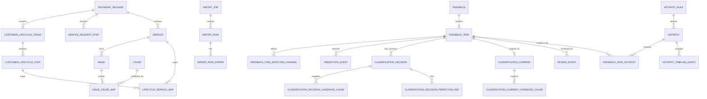

# 05 — Mô hình Dữ liệu

> **Cập nhật v2.0 (19/08/2026):** 20 migrations đã chạy. Thêm bảng `touchpoint` + `touchpoint_service_map` (migration 019). `hotspot` thêm cột `action_priority`. `classification_current` thêm `touchpoint_id`, `touchpoint_value_status`. `feedback.source_metadata_json` → **JSONB** với GIN index (migration 020). HotspotStatus thêm **REOPENED**.


# Nền tảng Phân tích Hành trình CX, Dịch vụ & Nguyên nhân Gốc rễ

**Phiên bản:** 2.0 — cập nhật 19/08/2026  
**Trạng thái:** Baseline Xây dựng Pilot P0  
**Trích xuất từ:** `docs/PRD.md` v1.3, `docs/service_taxonomy.md` v3.0.0, `docs/Business_Rules.md` v1.1, `docs/System_Design.md` v1.1  
**Cơ sở dữ liệu baseline:** PostgreSQL  
**ORM baseline:** SQLAlchemy 2.x + Alembic  
**Phạm vi:** Các bảng và ràng buộc bắt buộc cho P0; các điểm mở rộng P1 được chọn lọc được đánh dấu rõ ràng.

---

## 1. Mục đích

Tài liệu này xác định mô hình dữ liệu quan hệ cấp độ triển khai cho Nền tảng CX P0.

Đây là hợp đồng lưu trữ giữa:

```text
PRD / Taxonomy / Business Rules
            ↓
       Data Model
            ↓
       API Contract
            ↓
       UI / Worker / Analytics
```

Mô hình BẮT BUỘC phải duy trì các chân lý nghiệp vụ sau:

1. `Feedback` là một phong bì nguồn bất biến.
2. `FeedbackItem` là đơn vị nguyên tử cho phân loại, đánh giá, phân tích và điểm nóng (hotspot).
3. Vòng đời Khách hàng và Vòng đời Yêu cầu Dịch vụ là các chiều độc lập.
4. Issue là một danh mục lỗi/triệu chứng được ghi nhận, không phải là nguyên nhân.
5. Candidate Cause là một giả thuyết; Confirmed Root Cause yêu cầu phải có điều tra/bằng chứng.
6. Gợi ý từ AI là các đề xuất bất biến và BẮT BUỘC KHÔNG ĐƯỢC ghi đè lên các quyết định đã được chấp nhận.
7. Các quyết định từ con người/nguồn là append-only.
8. `ClassificationCurrent` là một projection đọc có thể dựng lại, không phải là nguồn sự thật lịch sử.
9. Các nhãn Taxonomy là dữ liệu tham chiếu có phiên bản và BẮT BUỘC KHÔNG ĐƯỢC hard-code bởi mã ứng dụng.
10. Phân tích, xuất dữ liệu và phát hiện điểm nóng BẮT BUỘC phải sử dụng cùng một ngữ nghĩa điều kiện hợp lệ đã được quản trị.

---

# 2. Nguyên tắc Mô hình hóa

## DM-001 — Khóa chính UUID

Các bảng giao dịch do ứng dụng sở hữu NÊN sử dụng khóa chính UUID.

Kiểu PostgreSQL được khuyến nghị:

```sql
uuid
```

Các dòng taxonomy tham chiếu CÓ THỂ sử dụng định danh UUID trong khi vẫn duy trì các mã ổn định dễ đọc như `SV-07` hoặc `IS-07-01`.

---

## DM-002 — Mã Ổn định và ID Nội bộ là Khác nhau

Ví dụ:

```text
service_id   = 7ce6... UUID
service_code = SV-07
name_vi      = Kỹ thuật, tiện ích & tài sản chung
```

Các API CÓ THỂ lọc theo mã ổn định đối với các yêu cầu do con người thao tác, nhưng các khóa ngoại BẮT BUỘC phải hướng tới các ID nội bộ bất biến.

Các mã đã phát hành BẮT BUỘC không bao giờ được tái sử dụng cho một ý nghĩa khác.

---

## DM-003 — Dấu thời gian

Tất cả các dấu thời gian được lưu trữ BẮT BUỘC phải có thông tin múi giờ.

Kiểu được khuyến nghị:

```sql
timestamptz
```

Lưu trữ chuẩn là UTC. Khi hiển thị sẽ chuyển đổi sang múi giờ được cấu hình của người dùng.

Các trường giao dịch chuẩn:

```text
created_at
created_by
updated_at        # chỉ có trên các bảng vận hành/projection có thể thay đổi
```

Các sổ nhật ký chỉ thêm mới sử dụng `created_at`/dấu thời gian nghiệp vụ và không cung cấp ngữ nghĩa cập nhật tùy ý.

---

## DM-004 — Phế thải Mềm, Không Xóa Cứng Lịch sử

Các giá trị tham chiếu đã được sử dụng bởi các bản ghi lịch sử BẮT BUỘC KHÔNG ĐƯỢC xóa cứng.

Sử dụng:

```text
status
effective_from
effective_to
retired_at
```

tại những nơi áp dụng.

---

## DM-005 — Ngữ nghĩa Không xác định Rõ ràng

Các trường tham chiếu phân loại sử dụng:

```text
KNOWN
UNKNOWN
MISSING
NOT_APPLICABLE
```

Bất biến:

```text
KNOWN            → referenced_id BẮT BUỘC KHÔNG được null
UNKNOWN           → referenced_id BẮT BUỘC phải null
MISSING           → referenced_id BẮT BUỘC phải null
NOT_APPLICABLE    → referenced_id BẮT BUỘC phải null
```

Không tạo các dòng giả-taxonomy gọi là `UNKNOWN`, `N/A`, hoặc `MISSING`.

---

# 3. Mô hình ER Cấp cao



Các thực thể Điều tra/RCA/CAPA cố ý được loại trừ khỏi ERD của P0. Hợp đồng mở rộng P1 của chúng được ghi lại trong §14.

---

# 4. Không gian tên PostgreSQL

P0 CÓ THỂ sử dụng schema `public` mặc định. Đối với việc thắt chặt bảo mật cho môi trường sản xuất, khuyến nghị phân tách logic như sau:

```text
ref      # taxonomy/reference
cx       # feedback/classification
ops      # import/hotspot/investigation
sec      # audit/security
mart     # analytics views/materialized views
```

Ranh giới package SQLAlchemy quan trọng hơn sự phân tách schema PostgreSQL vật lý đối với P0.

---

# 5. Enum Chuẩn

Sử dụng enum PostgreSQL, bảng tra cứu, hoặc text có ràng buộc `CHECK` một cách nhất quán. Không trộn lẫn các dạng biểu diễn cho cùng một khái niệm.

## 5.1 `value_status`

```text
KNOWN
UNKNOWN
MISSING
NOT_APPLICABLE
```

## 5.2 `taxonomy_release_status`

```text
DRAFT
APPROVED
PUBLISHED
RETIRED
```

## 5.3 `classification_state`

```text
PENDING_REVIEW
ACCEPTED
REJECTED
SUPERSEDED
```

`ClassificationCurrent` thông thường sẽ trỏ đến quyết định `ACCEPTED` có hiệu lực mới nhất.

## 5.4 `decision_source`

```text
MANUAL
SOURCE_TRUSTED
HUMAN_ACCEPTED_AI
HUMAN_CORRECTED_AI
POLICY_AUTO_APPLIED
SYSTEM_MIGRATION
```

Bản thân kết quả AI không phải là một quyết định. `POLICY_AUTO_APPLIED` bị vô hiệu hóa trong P0 trừ khi một trường rủi ro thấp cụ thể được phê duyệt riêng.

## 5.5 `sentiment`

```text
POSITIVE
NEUTRAL
NEGATIVE
UNKNOWN
```

## 5.6 `operational_severity`

```text
SEV-1
SEV-2
SEV-3
SEV-4
```

## 5.7 `cause_determination_status`

```text
NOT_ASSESSED
UNKNOWN
SUGGESTED
UNDER_INVESTIGATION
CONFIRMED
NOT_APPLICABLE
```

Các bộ ghi phân loại/đánh giá của P0 chỉ có thể sử dụng `NOT_ASSESSED`, `UNKNOWN`, `SUGGESTED`, `NOT_APPLICABLE`. `UNDER_INVESTIGATION` và `CONFIRMED` là các trạng thái Điều tra/RCA chỉ dành cho P1.

## 5.8 `analytic_eligibility`

```text
INCLUDED
EXCLUDED
PENDING
```

## 5.9 `feedback_item_status`

```text
ACTIVE
SPLIT_PARENT
RETIRED
```

## 5.10 `import_job_status`

```text
UPLOADED
MAPPED
VALIDATING
VALIDATED
QUEUED
PROCESSING
COMPLETED
PARTIAL
FAILED
CANCELLING
CANCELLED
```

## 5.11 `hotspot_status`

```text
CANDIDATE
ACKNOWLEDGED
INVESTIGATING
RESOLVED
DISMISSED
REOPENED
```

---

# 6. Các Bảng Tham chiếu và Taxonomy

## 6.1 `taxonomy_release`

Mục đích: ranh giới phiên bản bất biến cho ngữ nghĩa phân loại taxonomy/tham chiếu đã phát hành.

| Column | Type | Null | Rule |
|---|---|---:|---|
| taxonomy_release_id | uuid PK | No | Định danh nội bộ |
| version | varchar(32) | No | Định phiên bản ngữ nghĩa duy nhất, ví dụ `3.0.0` |
| status | enum | No | DRAFT/APPROVED/PUBLISHED/RETIRED |
| effective_from | timestamptz | Yes | Bắt buộc trước khi phát hành |
| effective_to | timestamptz | Yes | Null khi đang hoạt động |
| source_checksum | varchar(128) | No | Checksum của seed cấu trúc |
| notes | text | Yes | Ghi chú phát hành |
| approved_by | uuid | Yes | Bắt buộc tại APPROVED |
| approved_at | timestamptz | Yes | Bắt buộc tại APPROVED |
| published_by | uuid | Yes | Bắt buộc tại PUBLISHED |
| published_at | timestamptz | Yes | Bắt buộc tại PUBLISHED |
| created_at | timestamptz | No | |
| created_by | uuid | No | |

Các ràng buộc:

```text
UNIQUE(version)
effective_to IS NULL OR effective_to > effective_from
PUBLISHED → published_by/published_at/effective_from NOT NULL
```

Một bản phát hành đã phát hành là bất biến về mặt ngữ nghĩa ngoại trừ metadata về phế thải.

---

## 6.2 `customer_lifecycle_stage`

| Column | Type | Null | Rule |
|---|---|---:|---|
| customer_lifecycle_stage_id | uuid PK | No | |
| taxonomy_release_id | uuid FK | No | |
| stage_code | varchar(16) | No | `A`, `C`, `TR`, `HO`, `RES`, `OPS` |
| name_vi | varchar(255) | No | |
| name_en | varchar(255) | Yes | |
| definition | text | Yes | |
| sort_order | smallint | No | |
| active | boolean | No | mặc định true |

Ràng buộc:

```text
UNIQUE(taxonomy_release_id, stage_code)
```

Cổng kiểm tra bản phát hành: chính xác 6 giai đoạn Vòng đời Khách hàng đang hoạt động.

---

## 6.3 `customer_lifecycle_step`

| Column | Type | Null | Rule |
|---|---|---:|---|
| customer_lifecycle_step_id | uuid PK | No | |
| taxonomy_release_id | uuid FK | No | |
| customer_lifecycle_stage_id | uuid FK | No | Cùng release |
| step_code | varchar(20) | No | ví dụ `RES-03` |
| name_vi | varchar(255) | No | |
| name_en | varchar(255) | Yes | |
| definition | text | Yes | |
| sort_order | smallint | No | |
| active | boolean | No | |

Ràng buộc:

```text
UNIQUE(taxonomy_release_id, step_code)
```

Cổng kiểm tra bản phát hành: chính xác 36 bước Vòng đời Khách hàng đang hoạt động.

---

## 6.4 `service_request_step`

| Column | Type | Null |
|---|---|---:|
| service_request_step_id | uuid PK | No |
| taxonomy_release_id | uuid FK | No |
| step_code | varchar(20) | No |
| name_vi | varchar(255) | No |
| name_en | varchar(255) | Yes |
| definition | text | Yes |
| sort_order | smallint | No |
| active | boolean | No |

Ràng buộc:

```text
UNIQUE(taxonomy_release_id, step_code)
```

Cổng kiểm tra bản phát hành: chính xác 8 bước đang hoạt động `SRV-01..SRV-08`.

---

## 6.5 `service`

| Column | Type | Null | Rule |
|---|---|---:|---|
| service_id | uuid PK | No | |
| taxonomy_release_id | uuid FK | No | |
| service_code | varchar(16) | No | `SV-01..SV-10` |
| name_vi | varchar(255) | No | |
| name_en | varchar(255) | No | |
| outcome_definition | text | No | |
| in_scope | text | Yes | |
| out_of_scope | text | Yes | |
| default_severity | varchar(8) | Yes | SEV-1..4 |
| active | boolean | No | |

Ràng buộc:

```text
UNIQUE(taxonomy_release_id, service_code)
```

Cổng kiểm tra bản phát hành: chính xác 10 dịch vụ đang hoạt động.

---

## 6.6 `issue`

| Column | Type | Null | Rule |
|---|---|---:|---|
| issue_id | uuid PK | No | |
| taxonomy_release_id | uuid FK | No | |
| service_id | uuid FK | No | Chính xác một service trong cùng release |
| issue_code | varchar(20) | No | ví dụ `IS-07-01` |
| name_vi | varchar(255) | No | |
| name_en | varchar(255) | No | |
| definition | text | No | |
| inclusion_examples | jsonb | Yes | Mảng chuỗi |
| exclusion_examples | jsonb | Yes | Mảng chuỗi |
| safety_critical | boolean | No | mặc định false |
| severity_override | varchar(8) | Yes | |
| active | boolean | No | |

Các ràng buộc:

```text
UNIQUE(taxonomy_release_id, issue_code)
FK(service_id, taxonomy_release_id) phải khớp với cùng một release
```

Cổng kiểm tra bản phát hành:

```text
28 active issues
SV-01..SV-09 → chính xác 3 issues mỗi service
SV-10 → chính xác IS-10-01
```

---

## 6.7 `cause`

Một cause là một giả thuyết điều tra có thể tái sử dụng, không phải sự thật đã xác minh.

| Column | Type | Null |
|---|---|---:|
| cause_id | uuid PK | No |
| taxonomy_release_id | uuid FK | No |
| cause_code | varchar(32) | No |
| name_vi | varchar(255) | No |
| name_en | varchar(255) | Yes |
| mechanism | text | Yes |
| contributing_factor | text | Yes |
| external_condition | text | Yes |
| responsible_party_hint | text | Yes |
| required_evidence | text | Yes |
| active | boolean | No |

Ràng buộc:

```text
UNIQUE(taxonomy_release_id, cause_code)
```

`UNKNOWN` BẮT BUỘC KHÔNG ĐƯỢC tạo dưới dạng một dòng cause.

---

## 6.8 `issue_cause_map`

| Column | Type | Null |
|---|---|---:|
| issue_cause_map_id | uuid PK | No |
| taxonomy_release_id | uuid FK | No |
| issue_id | uuid FK | No |
| cause_id | uuid FK | No |
| rank_hint | smallint | Yes |
| active | boolean | No |
| effective_from | timestamptz | Yes |
| effective_to | timestamptz | Yes |

Ràng buộc:

```text
UNIQUE(taxonomy_release_id, issue_id, cause_id)
```

Ánh xạ này chỉ thu hẹp các giả thuyết điều tra. Nó không xác nhận một nguyên nhân gốc rễ.

---

## 6.9 `lifecycle_service_map`

| Column | Type | Null |
|---|---|---:|
| lifecycle_service_map_id | uuid PK | No |
| taxonomy_release_id | uuid FK | No |
| lifecycle_type | varchar(40) | No |
| lifecycle_step_id | uuid | No |
| service_id | uuid FK | No |
| mapping_strength | varchar(20) | Yes |
| active | boolean | No |
| effective_from | timestamptz | Yes |
| effective_to | timestamptz | Yes |

`lifecycle_type`:

```text
CUSTOMER_LIFECYCLE
SERVICE_REQUEST_LIFECYCLE
```

Ánh xạ này là N:N và BẮT BUỘC KHÔNG ĐƯỢC tự động tạo các phân loại đã được chấp nhận.

---

## 6.10 `interaction_channel`

Các kênh chuẩn:

```text
CH-APP
CH-WEB
CH-HOTLINE
CH-EMAIL
CH-FRONTDESK
CH-SOCIAL
CH-INPERSON
CH-SYSTEM
```

| Column | Type | Null |
|---|---|---:|
| interaction_channel_id | uuid PK | No |
| channel_code | varchar(32) | No |
| name_vi | varchar(255) | No |
| name_en | varchar(255) | Yes |
| active | boolean | No |

`source_system` là riêng biệt và BẮT BUỘC KHÔNG ĐƯỢC tham chiếu tới bảng này.

---

## 6.11 `location`

P0 hỗ trợ một phân cấp vị trí chuẩn hóa mà không yêu cầu GIS đầy đủ.

| Column | Type | Null |
|---|---|---:|
| location_id | uuid PK | No |
| project_id | uuid | No |
| parent_location_id | uuid FK self | Yes |
| location_code | varchar(64) | No |
| location_type | varchar(32) | No |
| name | varchar(255) | No |
| path_code | text | Yes |
| active | boolean | No |
| metadata_json | jsonb | Yes |

Phân cấp ví dụ:

```text
PROJECT
 └── BUILDING
      └── FLOOR
           └── UNIT / ZONE / ASSET_AREA
```

Bản lượng phân loại P0 vẫn giữ tối đa một `location_id` đã chuẩn hóa cho mỗi Feedback Item.

---

## 6.12 `service_owner_config`

| Column | Type | Null |
|---|---|---:|
| service_owner_config_id | uuid PK | No |
| project_id | uuid | No |
| service_id | uuid FK | No |
| location_scope_id | uuid FK | Yes |
| owner_user_id | uuid | Yes |
| owner_team_key | varchar(128) | Yes |
| effective_from | timestamptz | No |
| effective_to | timestamptz | Yes |
| active | boolean | No |

Được sử dụng cho phân công sở hữu hotspot/hành động mặc định, không dùng để định nghĩa taxonomy.

---

# 7. Các Bảng Tiếp nhận và Nhập dữ liệu

## 7.1 `import_job`

| Column | Type | Null |
|---|---|---:|
| import_job_id | uuid PK | No |
| project_id | uuid | No |
| source_system | varchar(128) | No |
| original_filename | varchar(512) | No |
| object_key | text | No |
| file_checksum | varchar(128) | No |
| file_size_bytes | bigint | No |
| content_type | varchar(128) | No |
| status | enum | No |
| mapping_profile_id | uuid FK | Yes |
| total_rows | integer | Yes |
| valid_rows | integer | Yes |
| invalid_rows | integer | Yes |
| committed_rows | integer | Yes |
| error_object_key | text | Yes |
| requested_by | uuid | No |
| created_at | timestamptz | No |
| started_at | timestamptz | Yes |
| completed_at | timestamptz | Yes |
| correlation_id | varchar(128) | No |
| version | integer | No |

Indexes:

```text
(project_id, created_at DESC)
(status, created_at)
(file_checksum)
```

---

## 7.2 `import_mapping_profile`

| Column | Type | Null |
|---|---|---:|
| import_mapping_profile_id | uuid PK | No |
| project_id | uuid | No |
| name | varchar(255) | No |
| source_system | varchar(128) | No |
| mapping_json | jsonb | No |
| normalization_json | jsonb | Yes |
| created_by | uuid | No |
| created_at | timestamptz | No |
| updated_at | timestamptz | No |
| active | boolean | No |

---

## 7.3 `import_row`

Bảo toàn nguồn gốc theo dòng và an toàn khi thử lại.

| Column | Type | Null |
|---|---|---:|
| import_row_id | uuid PK | No |
| import_job_id | uuid FK | No |
| row_number | integer | No |
| source_record_key | varchar(255) | Yes |
| idempotency_key | varchar(255) | No |
| raw_row_json | jsonb | Yes |
| normalized_row_json | jsonb | Yes |
| validation_status | varchar(32) | No |
| commit_status | varchar(32) | No |
| feedback_id | uuid FK | Yes |
| created_at | timestamptz | No |
| committed_at | timestamptz | Yes |

Các ràng buộc:

```text
UNIQUE(import_job_id, row_number)
UNIQUE(import_job_id, idempotency_key)
```

Khi tồn tại một khóa nguồn ổn định, tính idempotent cấp feedback nên áp dụng thêm ràng buộc:

```text
UNIQUE(source_system, source_record_key)
```

---

## 7.4 `import_row_error`

| Column | Type | Null |
|---|---|---:|
| import_row_error_id | uuid PK | No |
| import_row_id | uuid FK | No |
| field_name | varchar(128) | Yes |
| error_code | varchar(64) | No |
| message | text | No |
| severity | varchar(16) | No |
| metadata_json | jsonb | Yes |
| created_at | timestamptz | No |

---

# 8. Các Bảng Phản hồi

## 8.1 `feedback`

Phong bì nguồn bất biến.

| Column | Type | Null | Rule |
|---|---|---:|---|
| feedback_id | uuid PK | No | |
| project_id | uuid | No | Phạm vi pilot |
| source_system | varchar(128) | No | CRM/crawler/file/v.v. |
| source_record_key | varchar(255) | Yes | Khóa ổn định nếu có |
| intake_channel_id | uuid FK | Yes | Kênh tiếp nhận phản hồi |
| source_url | text | Yes | Chỉ dùng tham chiếu |
| external_ticket_id | varchar(255) | Yes | Ticket nguồn tùy chọn |
| reported_at | timestamptz | No | Thời gian sự kiện/nguồn |
| ingested_at | timestamptz | No | Thời gian nền tảng tiếp nhận |
| content_raw | text | No | Nội dung đặc quyền bất biến |
| content_masked | text | No | Văn bản hiển thị mặc định |
| source_metadata_json | jsonb | Yes | Metadata ngoài taxonomy |
| import_job_id | uuid FK | Yes | Nguồn gốc |
| import_row_id | uuid FK | Yes | Nguồn gốc |
| raw_content_checksum | varchar(128) | No | Hỗ trợ tính toàn vẹn/khử trùng lặp |
| created_at | timestamptz | No | |

Các ràng buộc:

```text
content_raw không thể thay đổi sau khi insert
UNIQUE(source_system, source_record_key) khi source_record_key IS NOT NULL
```

Các index khuyến nghị:

```text
(project_id, reported_at DESC)
(source_system, source_record_key)
(raw_content_checksum)
```

---

## 8.2 `feedback_item`

Đơn vị phân tích nguyên tử.

| Column | Type | Null | Rule |
|---|---|---:|---|
| feedback_item_id | uuid PK | No | |
| feedback_id | uuid FK | No | |
| item_index | smallint | No | 1..N bên trong phong bì |
| parent_item_id | uuid FK self | Yes | Cho nguồn gốc tách mục |
| item_text_masked | text | No | Văn bản dùng cho đánh giá/AI |
| symptom_detail | text | Yes | Văn bản tự do |
| location_id | uuid FK | Yes | 0:1 |
| status | enum | No | ACTIVE/SPLIT_PARENT/RETIRED |
| analytic_eligibility | enum | No | |
| eligibility_reason | text | Yes | |
| split_source | varchar(32) | Yes | HUMAN/SYSTEM |
| split_by | uuid | Yes | |
| split_at | timestamptz | Yes | |
| created_at | timestamptz | No | |
| created_by | uuid | Yes | nullable đối với ingestion |

Các ràng buộc:

```text
UNIQUE(feedback_id, item_index)
bản lượng location = 0:1 theo thiết kế cột
các item SPLIT_PARENT bị loại khỏi phân tích thông thường
```

`item_text_masked` được phái sinh và CÓ THỂ khác với `feedback.content_masked` sau khi tách.

---

## 8.3 `feedback_item_affected_channel`

| Column | Type | Null |
|---|---|---:|
| feedback_item_id | uuid FK | No |
| interaction_channel_id | uuid FK | No |
| created_at | timestamptz | No |

Khóa chính:

```text
(feedback_item_id, interaction_channel_id)
```

Khác với `feedback.intake_channel_id`.

---

# 9. Sổ nhật ký Dự đoán AI

## 9.1 `prediction_run`

| Column | Type | Null |
|---|---|---:|
| prediction_run_id | uuid PK | No |
| project_id | uuid | No |
| taxonomy_release_id | uuid FK | No |
| model_name | varchar(255) | No |
| model_version | varchar(128) | No |
| pipeline_version | varchar(128) | No |
| prompt_or_config_hash | varchar(128) | Yes |
| status | varchar(32) | No |
| requested_by | uuid | No |
| started_at | timestamptz | Yes |
| completed_at | timestamptz | Yes |
| created_at | timestamptz | No |
| correlation_id | varchar(128) | No |

---

## 9.2 `prediction_event`

Một dòng = một ứng viên trường được dự đoán.

| Column | Type | Null |
|---|---|---:|
| prediction_event_id | uuid PK | No |
| prediction_run_id | uuid FK | No |
| feedback_item_id | uuid FK | No |
| taxonomy_release_id | uuid FK | No |
| field_name | varchar(64) | No |
| candidate_ref_id | uuid | Yes |
| candidate_code | varchar(64) | Yes |
| candidate_scalar | varchar(255) | Yes |
| rank | smallint | No |
| confidence | numeric(6,5) | Yes |
| rationale_masked | text | Yes |
| model_payload_json | jsonb | Yes |
| created_at | timestamptz | No |

Các `field_name` P0 được cho phép:

```text
customer_lifecycle_step
service_request_step
primary_service
issue
sentiment
```

Các ràng buộc:

```text
confidence trong khoảng từ 0 đến 1 khi non-null
UNIQUE(prediction_run_id, feedback_item_id, field_name, rank)
```

Các dòng dự đoán là append-only.

---

# 10. Sổ nhật ký Quyết định và Projection Hiện tại

## 10.1 `classification_decision`

Ảnh chụp nhanh bất biến của một quyết định phân loại.

| Column | Type | Null | Notes |
|---|---|---:|---|
| classification_decision_id | uuid PK | No | |
| feedback_item_id | uuid FK | No | |
| decision_version | integer | No | Đơn điệu theo từng item |
| taxonomy_release_id | uuid FK | No | Release đã phát hành |
| customer_lifecycle_value_status | value_status | No | |
| customer_lifecycle_step_id | uuid FK | Yes | Stage được phái sinh từ step |
| service_request_value_status | value_status | No | |
| service_request_step_id | uuid FK | Yes | |
| primary_service_value_status | value_status | No | |
| primary_service_id | uuid FK | Yes | |
| issue_value_status | value_status | No | |
| issue_id | uuid FK | Yes | |
| sentiment | varchar(16) | No | |
| operational_severity | varchar(8) | No | |
| cause_determination_status | varchar(32) | No | |
| other_reason | text | Yes | Bắt buộc đối với SV-10 |
| classification_state | varchar(32) | No | |
| decision_source | varchar(32) | No | |
| decision_reason | text | Yes | |
| decided_by | uuid | No | |
| decided_at | timestamptz | No | |
| created_at | timestamptz | No | |

Các ràng buộc:

```text
UNIQUE(feedback_item_id, decision_version)

trạng thái KNOWN ↔ FK được tham chiếu không được null
trạng thái khác KNOWN ↔ FK được tham chiếu phải null

issue KNOWN → primary_service BẮT BUỘC phải KNOWN
issue.service_id = primary_service_id trong cùng taxonomy release

customer lifecycle step → stage được phái sinh, không bao giờ được quyết định riêng biệt

SV-10 hoặc IS-10-01 → other_reason NOT NULL
```

Append-only: không cho phép UPDATE/DELETE tùy ý sau khi commit.

---

## 10.2 `classification_decision_candidate_cause`

| Column | Type | Null |
|---|---|---:|
| classification_decision_id | uuid FK | No |
| cause_id | uuid FK | No |
| rank | smallint | No |
| confidence | numeric(6,5) | Yes |
| rationale_masked | text | Yes |
| source | varchar(32) | No |

Khóa chính:

```text
(classification_decision_id, cause_id)
```

Quy tắc:

- Cho phép từ 0 đến nhiều cause cụ thể;
- `UNKNOWN` không phải là một dòng cause;
- `cause_determination_status = SUGGESTED` BẮT BUỘC phải có ít nhất một dòng candidate cause;
- `NOT_ASSESSED`, `UNKNOWN`, và `NOT_APPLICABLE` BẮT BUỘC KHÔNG ĐƯỢC có các dòng candidate cause;
- P0 BẮT BUỘC phải từ chối `UNDER_INVESTIGATION` và `CONFIRMED` trên các đường ghi quyết định phân loại.

---

## 10.3 `classification_decision_prediction_ref`

Khả năng truy xuất nguồn gốc từ quyết định đã chấp nhận/sửa đổi đến (các) dự đoán đã được xem xét.

| Column | Type | Null |
|---|---|---:|
| classification_decision_id | uuid FK | No |
| prediction_event_id | uuid FK | No |
| relation | varchar(32) | No |

Ví dụ:

```text
ACCEPTED
CORRECTED_FROM
CONSIDERED
```

---

## 10.4 `review_event`

Nhật ký đánh giá ngữ nghĩa bất biến.

| Column | Type | Null |
|---|---|---:|
| review_event_id | uuid PK | No |
| feedback_item_id | uuid FK | No |
| prediction_run_id | uuid FK | Yes |
| classification_decision_id | uuid FK | Yes |
| action | varchar(64) | No |
| reviewer_user_id | uuid | No |
| comment | text | Yes |
| created_at | timestamptz | No |
| correlation_id | varchar(128) | No |

Các action chuẩn:

```text
ACCEPT
CORRECT
MARK_UNKNOWN
MARK_MISSING
MARK_NOT_APPLICABLE
SPLIT_REQUIRED
SKIP
```

`ACCEPT`, `CORRECT`, `MARK_UNKNOWN`, `MARK_MISSING`, `MARK_NOT_APPLICABLE` yêu cầu `classification_decision_id` và tạo ra một Decision cộng với ReviewEvent. `SPLIT_REQUIRED` và `SKIP` yêu cầu `classification_decision_id = null` và chỉ tạo ra ReviewEvent.

---

## 10.5 `classification_current`

Projection 1:1 có thể dựng lại được sử dụng cho việc lọc, phân tích và UI.

| Column | Type | Null |
|---|---|---:|
| feedback_item_id | uuid PK/FK | No |
| current_decision_id | uuid FK | No |
| current_decision_version | integer | No |
| taxonomy_release_id | uuid FK | No |
| customer_lifecycle_value_status | value_status | No |
| customer_lifecycle_stage_id | uuid FK | Yes |
| customer_lifecycle_step_id | uuid FK | Yes |
| service_request_value_status | value_status | No |
| service_request_step_id | uuid FK | Yes |
| primary_service_value_status | value_status | No |
| primary_service_id | uuid FK | Yes |
| issue_value_status | value_status | No |
| issue_id | uuid FK | Yes |
| sentiment | varchar(16) | No |
| operational_severity | varchar(8) | No |
| cause_determination_status | varchar(32) | No |
| other_reason | text | Yes |
| classification_state | varchar(32) | No |
| last_decision_at | timestamptz | No |
| projection_version | integer | No |
| rebuilt_at | timestamptz | Yes |

Các ràng buộc:

```text
UNIQUE(feedback_item_id)
UNIQUE(current_decision_id)
```

Quan trọng:

> Bảng này là trạng thái phái sinh có thể dùng một lần/dựng lại. `classification_decision` là nguồn sự thật cho phân loại.

---

## 10.6 `classification_current_candidate_cause`

Projection đọc đã phản chuẩn hóa của các candidate cause gắn liền với quyết định hiện tại.

Khóa chính:

```text
(feedback_item_id, cause_id)
```

Các trường:

```text
feedback_item_id
cause_id
rank
confidence
current_decision_id
projection_version
```

---

# 11. Giao dịch Quyết định

Một thao tác ghi phân loại BẮT BUỘC phải diễn ra trong một giao dịch:

```text
1. Tải Feedback Item.
2. Khóa/đọc ClassificationCurrent hoặc quyết định hiện tại dự kiến.
3. So sánh phiên bản projection dự kiến / ID quyết định hiện tại.
4. Xác minh release taxonomy đã chọn ở trạng thái PUBLISHED.
5. Xác minh các quy tắc value_status/FK.
6. Phái sinh Customer Lifecycle Stage từ Customer Lifecycle Step đã chọn.
7. Xác minh Issue thuộc về Primary Service đã chọn.
8. Xác minh quy tắc SV-10.
9. Chèn ClassificationDecision.
10. Chèn các tham chiếu candidate cause / tham chiếu prediction.
11. Upsert ClassificationCurrent.
12. Thay thế projection candidate-cause hiện tại.
13. Chèn ReviewEvent.
14. Chèn AuditEvent.
15. Commit.
```

Trạng thái cũ:

```text
→ rollback
→ API trả về 409 VERSION_CONFLICT
```

---

# 12. Mô hình Tách Phản hồi

Hành vi tách trong P0:

```text
Feedback
 └── Item 1 (ACTIVE)
       ↓ người đánh giá thực hiện tách
       ├── Item 2 (ACTIVE, parent_item_id=Item 1)
       └── Item 3 (ACTIVE, parent_item_id=Item 1)

Item 1 → SPLIT_PARENT
```

Quy tắc:

- `Feedback.content_raw` gốc không bị thay đổi;
- các dự đoán/quyết định lịch sử đối với item cha vẫn có thể kiểm toán;
- item cha bị loại khỏi phân tích hiện tại;
- các item con nhận các phân loại độc lập;
- giao dịch tách được kiểm toán.

---

# 13. Các Bảng Điểm nóng

## 13.1 `hotspot_rule`

| Column | Type | Null |
|---|---|---:|
| hotspot_rule_id | uuid PK | No |
| project_id | uuid | Yes |
| name | varchar(255) | No |
| rule_version | varchar(32) | No |
| taxonomy_release_id | uuid FK | No |
| window_minutes | integer | No |
| threshold_count | integer | No |
| location_level | varchar(32) | No |
| dimension_config_json | jsonb | No |
| eligibility_definition_version | varchar(32) | No |
| active | boolean | No |
| created_by | uuid | No |
| created_at | timestamptz | No |

Gom nhóm mặc định của P0:

```text
Primary Service + Issue + Location + Time Window
```

---

## 13.2 `hotspot`

| Column | Type | Null |
|---|---|---:|
| hotspot_id | uuid PK | No |
| hotspot_rule_id | uuid FK | No |
| project_id | uuid | No |
| taxonomy_release_id | uuid FK | No |
| dimension_key | varchar(512) | No |
| service_id | uuid FK | No |
| issue_id | uuid FK | No |
| location_id | uuid FK | Yes |
| window_start | timestamptz | No |
| window_end | timestamptz | No |
| evidence_count | integer | No |
| status | hotspot_status | No |
| operational_severity | varchar(8) | No |
| assigned_user_id | uuid | Yes |
| assigned_team_key | varchar(128) | Yes |
| first_seen_at | timestamptz | No |
| last_seen_at | timestamptz | No |
| resolved_at | timestamptz | Yes |
| resolution_summary | text | Yes |
| version | integer | No |
| created_at | timestamptz | No |
| updated_at | timestamptz | No |

Tính Idempotency:

```text
UNIQUE(hotspot_rule_id, rule_version, dimension_key, window_start, window_end)
```

Khóa cửa sổ hoạt động xác định tương đương có thể chấp nhận được.

---

## 13.3 `feedback_item_hotspot`

| Column | Type | Null |
|---|---|---:|
| hotspot_id | uuid FK | No |
| feedback_item_id | uuid FK | No |
| linked_at | timestamptz | No |
| evidence_role | varchar(32) | No |

Khóa chính:

```text
(hotspot_id, feedback_item_id)
```

---

## 13.4 `hotspot_timeline_event`

Dòng thời gian append-only:

```text
hotspot_timeline_event_id
hotspot_id
from_status
to_status
action
actor_user_id
reason
metadata_json
created_at
correlation_id
```

---

# 14. Mở rộng P1 — Điều tra và Nguyên nhân Gốc rễ

Toàn bộ phần này thuộc về P1 và BẮT BUỘC KHÔNG ĐƯỢC đưa vào cổng nghiệm thu migration/repository của P0. P0 chỉ lưu giữ Hotspot, các Feedback Item bằng chứng, người sở hữu/trạng thái và Candidate Cause cơ bản. P1 mới giới thiệu Investigation, Confirmed Root Cause, Corrective Action, Preventive Action và RCA đầy đủ.

## 14.1 `investigation`

```text
investigation_id uuid PK
project_id uuid
hotspot_id uuid FK nullable
feedback_item_id uuid FK nullable
title varchar
status varchar
owner_user_id uuid
owner_team_key varchar
started_at timestamptz
closed_at timestamptz nullable
summary text nullable
created_at timestamptz
created_by uuid
version integer
```

Ít nhất một trong hai trường `hotspot_id` hoặc `feedback_item_id` NÊN được điền.

---

## 14.2 `investigation_evidence`

```text
investigation_evidence_id uuid PK
investigation_id uuid FK
evidence_type varchar
object_key text nullable
external_reference text nullable
description text
captured_at timestamptz
captured_by uuid
checksum varchar nullable
created_at timestamptz
```

---

## 14.3 `confirmed_root_cause`

```text
confirmed_root_cause_id uuid PK
investigation_id uuid FK
cause_id uuid FK nullable
root_cause_text text
confirmed_by uuid
confirmed_at timestamptz
evidence_summary text
created_at timestamptz
```

Quy tắc:

- confirmed root cause BẮT BUỘC phải tham chiếu đến một investigation;
- người xác nhận phải được cấp quyền;
- bằng chứng là bắt buộc;
- AI không thể trực tiếp chèn một confirmed root cause.

---

## 14.4 `corrective_action` / `preventive_action`

Các trường chung:

```text
*_action_id
confirmed_root_cause_id
description
owner_user_id
owner_team_key
due_at
status
completed_at
verification_note
created_at
created_by
version
```

---

# 15. Các Bảng Kiểm toán và Bảo mật

## 15.1 `audit_event`

Kiểm toán ngữ nghĩa append-only.

```text
audit_event_id uuid PK
occurred_at timestamptz
actor_user_id uuid
actor_role varchar
action varchar
resource_type varchar
resource_id uuid/varchar
project_id uuid
correlation_id varchar
reason text nullable
before_ref jsonb nullable
after_ref jsonb nullable
metadata_json jsonb nullable
```

Không nhân bản PII thô vào metadata kiểm toán trừ khi có yêu cầu nghiêm ngặt.

Tối thiểu các sự kiện được kiểm toán bao gồm:

- phát hành taxonomy;
- thực thi/thử lại/hủy bỏ nhập dữ liệu;
- xem/xuất nội dung thô;
- tách Feedback Item;
- quyết định/đánh giá phân loại;
- phân công/thay đổi trạng thái hotspot;
- thay đổi cấu hình;
- thay đổi vai trò/quyền hạn.

---

## 15.2 `pilot_scope_manifest`

Phạm vi truy cập cấp project trong P0.

```text
pilot_scope_manifest_id
user_id
project_id
role_key
raw_pii_allowed
export_allowed
active
effective_from
effective_to
```

Phạm vi chi tiết tới cấp tòa nhà/dịch vụ thuộc về P1.

---

# 16. Các Bảng Hàng đợi Công việc

P0 có thể sử dụng các công việc bền vững được lưu trữ trong PostgreSQL.

## 16.1 `async_job`

```text
async_job_id uuid PK
job_type varchar
resource_type varchar
resource_id uuid nullable
payload_json jsonb
status varchar
priority smallint
available_at timestamptz
claimed_by varchar nullable
claimed_at timestamptz nullable
lease_expires_at timestamptz nullable
attempt_count integer
max_attempts integer
last_error_code varchar nullable
last_error_message text nullable
correlation_id varchar
created_at timestamptz
completed_at timestamptz nullable
```

Worker claim:

```sql
SELECT ...
FROM async_job
WHERE status = 'QUEUED'
  AND available_at <= now()
ORDER BY priority DESC, created_at
FOR UPDATE SKIP LOCKED
LIMIT :batch_size;
```

Tất cả công việc BẮT BUỘC phải an toàn khi thử lại.

---

# 17. Lớp Ngữ nghĩa Phân tích

## 17.1 `analytics_feedback_item_v1`

P0 NÊN cung cấp một view hoặc trừu tượng hóa truy vấn được quản trị kết nối:

```text
feedback_item
+ feedback
+ classification_current
+ taxonomy labels
+ location
+ feedback_item_affected_channel
```

Vị ngữ hợp lệ trung tâm:

```sql
WHERE feedback_item.status = 'ACTIVE'
  AND feedback_item.analytic_eligibility = 'INCLUDED'
  AND classification_current.current_decision_id IS NOT NULL
  AND classification_current.classification_state = 'ACCEPTED'
```

Mọi KPI, biểu đồ, xuất dữ liệu và drill-down BẮT BUỘC phải sử dụng cùng một vị ngữ/phiên bản này.

Các cột gợi ý:

```text
feedback_item_id
feedback_id
project_id
reported_at
source_system
intake_channel_id
affected_channel_ids/codes
location_id
location_code

taxonomy_release_id
customer_lifecycle_stage_id/code
customer_lifecycle_step_id/code
service_request_step_id/code

primary_service_id/code/name
issue_id/code/name
sentiment
operational_severity
cause_determination_status

last_decision_at
current_decision_version
```

Không hiển thị `content_raw` trong view phân tích mặc định.

Lớp truy vấn phân tích P0 phải hỗ trợ phân rã theo `journey_stage`, `journey_step`, `service`, `issue`, `location`, `intake_channel`, và `affected_channel`, trả về `item_volume`, `negative_rate`, `active_hotspots`, và `trend` theo khoảng thời gian. Persona không phải là cột/chiều của P0.

---

# 18. Chiến lược Index

Các ứng viên tối thiểu:

```text
feedback(project_id, reported_at DESC)
feedback(source_system, source_record_key)

feedback_item(feedback_id)
feedback_item(location_id)
feedback_item(status, analytic_eligibility)

classification_current(primary_service_id, issue_id)
classification_current(customer_lifecycle_step_id)
classification_current(service_request_step_id)
classification_current(sentiment)
classification_current(operational_severity)
classification_current(last_decision_at)

prediction_event(feedback_item_id, field_name, created_at)
classification_decision(feedback_item_id, decision_version DESC)

hotspot(project_id, status, last_seen_at DESC)
hotspot(hotspot_rule_id, dimension_key)
feedback_item_hotspot(hotspot_id, feedback_item_id)

import_job(project_id, created_at DESC)
import_job(status, created_at)

audit_event(resource_type, resource_id, occurred_at DESC)
audit_event(actor_user_id, occurred_at DESC)
```

Các index phức hợp BẮT BUỘC phải được xác minh với kế hoạch truy vấn pilot trước khi chính thức đưa vào sản xuất.

---

# 19. Ranh giới PII

Luồng dữ liệu mặc định:

```text
content_raw
    ↓ chỉ dành cho quyền hạn đặc biệt / được kiểm toán
content_masked
    ↓ hiển thị trên workspace
item_text_masked
    ↓ AI + đánh giá + drill-down thông thường
```

Quy tắc:

- `content_raw` không bao giờ đi vào các view phân tích thông thường;
- nội dung thô không được ghi vào các log ứng dụng chuẩn;
- việc xem/xuất dữ liệu thô yêu cầu phải có quyền hạn và được kiểm toán;
- AI nhận văn bản đã ẩn danh theo mặc định;
- các URL bộ nhớ đối tượng phải là các signed URL có thời hạn ngắn.

---

# 20. Xóa và Lưu giữ

P0 không hỗ trợ việc xóa cứng tùy ý các bản ghi lịch sử đã được phân loại.

Mô hình khuyến nghị:

```text
sửa đổi nguồn → thêm metadata sửa đổi / chính sách tiếp nhận lại
loại trừ item → analytic_eligibility = EXCLUDED + lý do
phế thải taxonomy → RETIRED/effective_to
```

Các yêu cầu xóa dữ liệu do pháp lý/bảo mật riêng tư, nếu áp dụng, đòi hỏi một quy trình xóa được quản trị chuyên biệt thay vì thao tác CRUD trực tiếp.

---

# 21. Thứ tự Migration Alembic

Trình tự migration ban đầu được khuyến nghị:

```text
001 extensions + shared enums
002 taxonomy_release
003 lifecycle/reference tables
004 service + issue + cause + maps
005 channel + location + owner config
006 import tables
007 feedback + feedback_item
008 prediction ledger
009 decision ledger
010 current projection
011 hotspot tables
012 audit + pilot scope
013 async job queue
014 analytics views
015 indexes / constraints / triggers
016 seed taxonomy 3.0.0
```

P1 sẽ bổ sung một chuỗi migration riêng cho `investigation`, `investigation_evidence`, `confirmed_root_cause`, `corrective_action`, và `preventive_action` sau khi P0 được chấp nhận.

Không seed các nhãn chuẩn trong hằng số Python của ứng dụng.

---

# 22. Xác minh Seed

Trước khi phát hành taxonomy 3.0.0, trình xác minh BẮT BUỘC phải kiểm tra:

```text
6 giai đoạn Customer Lifecycle
36 bước Customer Lifecycle
8 bước Service Request
10 Services đang hoạt động
28 Issues đang hoạt động

SV-01..SV-09: 3 Issues mỗi service
SV-10: 1 Issue = IS-10-01

tất cả tham chiếu Issue.service_id đều hợp lệ
tất cả các ánh xạ đều sử dụng cùng một release taxonomy
các mẫu mã ổn định là hợp lệ
không có ngữ nghĩa mã bị trùng lặp
checksum của release đã phát hành được ghi lại
```

---

# 23. Các Thử nghiệm Cơ sở dữ liệu Bắt buộc

Các thử nghiệm tích hợp/hợp đồng của P0 BẮT BUỘC phải bao quát:

1. `feedback.content_raw` thô không thể bị thay đổi bởi các đường dịch vụ thông thường.
2. Một Feedback tạo ra ít nhất một Feedback Item.
3. Thao tác tách bảo tồn nguồn gốc Feedback và loại trừ item cha đã tách khỏi phân tích.
4. Customer Lifecycle Stage được phái sinh từ Customer Lifecycle Step.
5. `SRV-*` không thể lưu dưới dạng bước Customer Lifecycle.
6. `KNOWN` với FK null sẽ thất bại.
7. Khác `KNOWN` với FK non-null sẽ thất bại.
8. Issue từ Service/release khác sẽ thất bại.
9. SV-10 không có `other_reason` sẽ thất bại.
10. Phiên bản Decision là duy nhất và tăng đơn điệu.
11. Ghi projection hiện tại bị cũ sẽ thất bại.
12. Dự đoán không bao giờ tự động thay đổi phân loại hiện tại.
13. Projection hiện tại có thể được dựng lại từ sổ nhật ký quyết định.
14. Khóa nguồn ổn định bị trùng lặp có tính idempotent.
15. Khóa Hotspot mang tính xác định không tạo ra dữ liệu trùng lặp.
16. Các dòng Audit được tạo ra cho các thao tác thay đổi ngữ nghĩa.
17. View phân tích loại trừ các item không hợp lệ/cha đã tách/chưa được chấp nhận.
18. Taxonomy đã phát hành không thể bị thay đổi về mặt ngữ nghĩa.
19. Chỉ chấp nhận các giá trị chuẩn của `decision_source`, `cause_determination_status`, và review-action.
20. P0 từ chối các lượt ghi phân loại `UNDER_INVESTIGATION`/`CONFIRMED` và không có các bảng Investigation/RCA/CAPA.
21. Bộ lọc/phân rã Kênh ảnh hưởng trả về cùng một tập item hợp lệ như drill-down.

---

# 24. Tiêu chí Chấp nhận Mô hình Dữ liệu

Mô hình dữ liệu P0 sẵn sàng cho xây dựng khi:

- tất cả các bảng P0 ở trên đều có mô hình SQLAlchemy và migration Alembic;
- tất cả các ràng buộc taxonomy đều có thể thực thi được, không chỉ trên tài liệu;
- seed 3.0.0 vượt qua xác minh;
- import có thể lưu giữ nguồn gốc và thử lại an toàn;
- văn bản thô của feedback không thể thay đổi thông qua các dịch vụ thông thường;
- tách item nguyên tử mang tính giao dịch;
- predictions, decisions và current projection được tách biệt;
- concurrency lạc quan được hỗ trợ;
- view ngữ nghĩa phân tích trả về số lượng drill-down nhất quán;
- tính duy nhất của hotspot mang tính xác định;
- các ranh giới PII được thực thi;
- các thử nghiệm tích hợp bắt buộc đã vượt qua.

---

# 25. Các Điểm Mở rộng P1

Dành cho việc mở rộng sản xuất sau này:

- cấu hình connector và các bảng con trỏ đồng bộ;
- đồng bộ ticket CRM/CMMS bên ngoài;
- metadata tệp đính kèm;
- phạm vi RBAC cấp tòa nhà/dịch vụ;
- UI quản lý định nghĩa/phiên bản chỉ số;
- đồ thị bằng chứng điều tra phong phú hơn;
- các bảng/quy trình làm việc Investigation, Confirmed Root Cause, Corrective Action, Preventive Action và RCA đầy đủ;
- bộ đếm thời gian SLA/OLA;
- đăng ký nhận thông báo;
- quy trình hành động / chuỗi phê duyệt;
- engine chính sách lưu giữ/xóa dữ liệu;
- sao chép sang warehouse/lakehouse.

Các phần mở rộng này BẮT BUỘC KHÔNG ĐƯỢC yêu cầu thay đổi ý nghĩa cốt lõi của Feedback, Feedback Item, Prediction, Decision hoặc Classification Current.

---

## Phụ lục — Bảng Touchpoint (Migration 019)

### `touchpoint`

| Column | Type | Ghi chú |
|---|---|---|
| touchpoint_id | UUID PK | |
| taxonomy_release_id | UUID FK | → taxonomy_release |
| touchpoint_code | text | Pattern: TP-[STEP]-[NN] (ví dụ TP-RES-07-01) |
| lifecycle_step_id | UUID FK | → customer_lifecycle_step |
| name_vi | text | |
| name_en | text | |
| definition | text | |
| sort_order | int | |
| active | bool | |

### `touchpoint_service_map`

| Column | Type | Ghi chú |
|---|---|---|
| touchpoint_id | UUID FK PK | |
| service_id | UUID FK PK | |
| mapping_type | enum | PRIMARY \| SECONDARY |

### Thay đổi trên bảng `hotspot` (Migration 019)

Thêm cột: `action_priority` enum (IMMEDIATE, URGENT, PLANNED, MONITOR)

### Thay đổi trên bảng `classification_current` (Migration 019)

Thêm cột:
- `touchpoint_id` UUID FK (nullable) → touchpoint
- `touchpoint_value_status` enum (KNOWN, UNKNOWN, MISSING, NOT_APPLICABLE)

### Thay đổi trên bảng `feedback` (Migration 020)

- `source_metadata_json` đổi type TEXT → **JSONB**
- GIN index trên `source_metadata_json` cho fast document queries
- B-tree index trên `location.name` và `location.location_code`

### HotspotStatus enum — thêm REOPENED

```
CANDIDATE → ACKNOWLEDGED → INVESTIGATING → RESOLVED
                                         → DISMISSED
RESOLVED | DISMISSED → REOPENED (→ INVESTIGATING)
```
