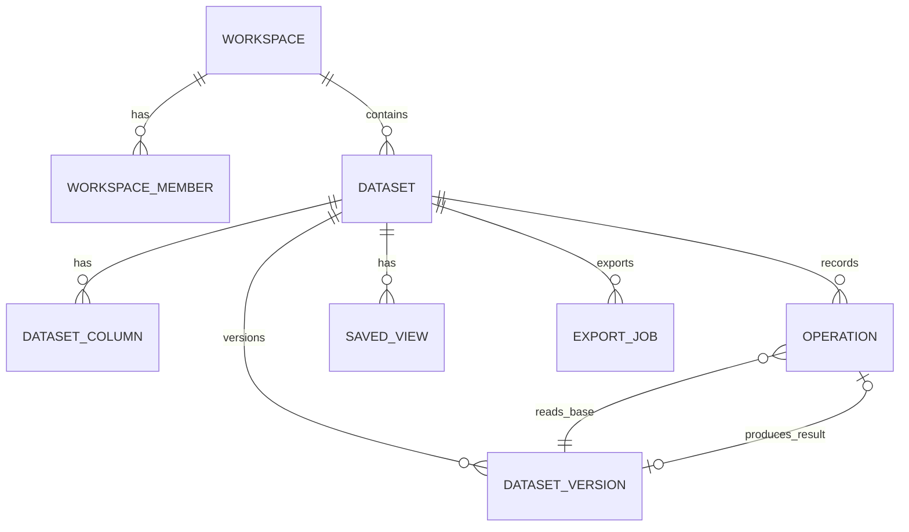
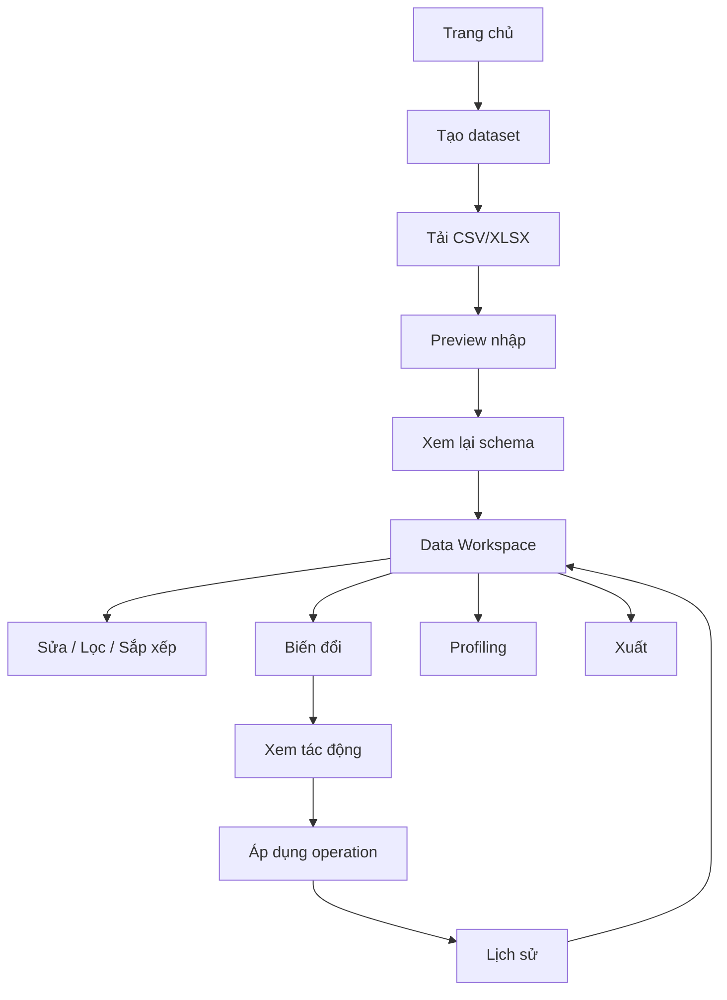
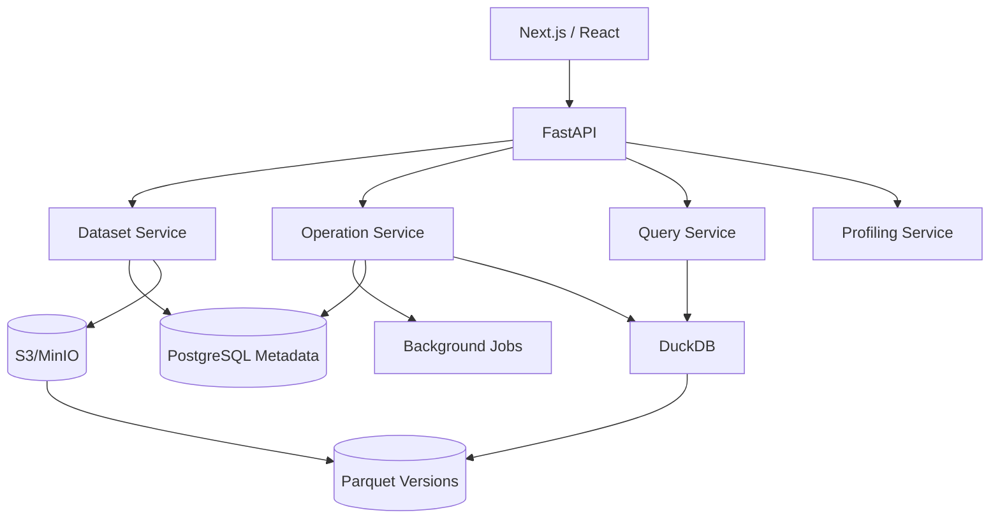

# Tài liệu yêu cầu sản phẩm — Analyst Data Workspace

**Phiên bản:** 1.1  
**Trạng thái:** Baseline yêu cầu; chờ kết quả spike Giai đoạn 0 trước khi chốt kiến trúc triển khai  
**Cập nhật:** 2026-08-08  
**Đối tượng:** Product, BA, UX/UI, Frontend, Backend, QA, Data/Platform Engineering  
**Phân loại:** Không gian tự phục vụ để chuẩn bị và phân tích dữ liệu

---

## 1. Định nghĩa sản phẩm

Analyst Data Workspace là ứng dụng web cho Data Analyst và Business Analyst, cung cấp môi trường giống bảng tính để chuẩn bị dữ liệu dạng bảng trước khi phân tích.

Mục tiêu đầu tiên được chủ động giới hạn:

> Người dùng có thể nhập Excel/CSV, xem và chỉnh sửa dữ liệu trong grid quen thuộc, lọc/sắp xếp, áp dụng phép biến đổi có thể tái lập, kiểm tra chất lượng, undo thay đổi và xuất bộ dữ liệu sạch mà không cần viết mã.

Sản phẩm ban đầu không phải bản thay thế Power BI, bản sao đầy đủ của Excel hay chatbot AI.

```text
Dữ liệu thô
  ↓
Data Workspace giống bảng tính
  ↓
Operation Engine
  ↓
Bộ dữ liệu đã kiểm tra / sẵn sàng phân tích
  ↓
Phân tích & Dashboard
  ↓
AI Data Assistant
  ↓
AI Analyst / Insight
```

## 2. Vấn đề cần giải quyết

Luồng hiện tại thường bị phân mảnh giữa Excel/CSV, Pandas, SQL/warehouse và BI. Phần lớn công sức lặp lại nằm ở sửa kiểu, lọc dòng lỗi, loại trùng, chuẩn hóa chuỗi, thay giá trị, tách/gộp cột, tạo trường ngày, append tệp định kỳ và join dữ liệu tham chiếu.

### P1 — Chỉnh sửa spreadsheet nhanh nhưng khó tái lập

Chuỗi `sales.xlsx → sales_v2.xlsx → sales_final_new.xlsx` lưu kết quả nhưng không lưu đáng tin cậy cách tạo ra kết quả.

### P2 — Biến đổi lặp lại tốn thời gian

Ví dụ quy trình tháng nào cũng thực hiện: trim `building`, cast `reported_date`, đổi `N/A` thành null, xóa dòng thiếu ID, loại trùng và tạo `month`.

### P3 — SQL/Python tạo ma sát không cần thiết cho thao tác đơn giản

Người dùng vẫn cần SQL/Python cho tác vụ phức tạp, nhưng không nên phải viết mã cho mọi bước làm sạch cơ bản.

### P4 — Công cụ BI thường bắt đầu sau bước chuẩn bị

Dữ liệu nguồn lộn xộn cần được chuẩn hóa trước khi đưa vào dashboard hoặc semantic model.

### P5 — AI không an toàn nếu thiếu lớp thao tác xác định

AI chạy Python/SQL tùy ý rất khó kiểm tra, xem trước, kiểm toán và hoàn tác. Vì vậy Operation Engine phải có trước AI.

## 3. Tầm nhìn và định vị

> Tạo con đường nhanh nhất từ dữ liệu dạng bảng thô đến bộ dữ liệu sẵn sàng phân tích bằng trải nghiệm spreadsheet quen thuộc, trong khi mọi thay đổi quan trọng đều có thể tái lập, kiểm tra và hoàn tác.

Định vị dài hạn:

> **Quen thuộc như Excel, tái lập như Power Query, có cấu trúc như database và được AI hỗ trợ khi hữu ích.**

Khác biệt cốt lõi là tổ hợp grid, ngữ nghĩa dataset có kiểu, operation, lịch sử, profiling, pipeline tái sử dụng và về sau là AI điều khiển chính các operation đó.

## 4. Nguyên tắc sản phẩm

| Mã | Nguyên tắc | Quy tắc |
|---|---|---|
| PP-01 | Tương tác quen thuộc | Người biết Excel phải hiểu grid mà không cần đào tạo dài. |
| PP-02 | Dataset là đối tượng lõi | `.xlsx` chỉ là định dạng nhập/xuất, không phải database khi chạy. |
| PP-03 | Nguồn gốc bất biến | Không operation nào ghi đè tệp tải lên ban đầu. |
| PP-04 | Biến đổi hàng loạt là operation | Operation có cấu trúc, version hóa và serializable. |
| PP-05 | Có xem trước và hoàn tác | Thao tác phá hủy/ảnh hưởng lớn phải cho xem tác động và có đường khôi phục. |
| PP-06 | UI và AI dùng chung engine | AI không có đường thực thi riêng. |
| PP-07 | Trình duyệt chỉ tải cửa sổ cần thiết | Grid dùng virtualization và truy vấn phía server. |
| PP-08 | Phiên bản được kiểm tra ở mọi mutation | Không ghi đè âm thầm khi base version đã cũ. |
| PP-09 | Bảo mật theo mặc định | Quyền được kiểm tra server-side; log không chứa giá trị ô theo mặc định. |

## 5. Mục tiêu và ngoài phạm vi MVP

### 5.1 Mục tiêu MVP

Không cần viết mã, người dùng có thể:

1. nhập CSV/XLSX và chọn sheet;
2. xem lại schema suy luận;
3. điều hướng grid ảo hóa;
4. sửa ô, dán vùng, thêm/xóa dòng và cột;
5. đổi tên, kích thước và thứ tự cột trong phạm vi phù hợp;
6. lọc, sắp xếp và tìm kiếm;
7. cast kiểu, replace, điền/xóa null, trim/đổi hoa thường;
8. loại trùng, tách/gộp cột và trích xuất phần ngày;
9. xem profiling và lịch sử;
10. undo/redo tuyến tính;
11. xuất CSV/XLSX theo phiên bản và phạm vi rõ ràng.

### 5.2 Ngoài phạm vi MVP

- tương thích toàn bộ công thức Excel, VBA/macro và định dạng/page layout nâng cao;
- cộng tác thời gian thực và chỉnh sửa mobile-first;
- dashboard đầy đủ, semantic model kiểu Power BI;
- Python notebook hoặc SQL editor tùy ý;
- kết nối trực tiếp warehouse/database và writeback;
- AI biến đổi hoặc AI insight;
- pipeline tái sử dụng, checkpoint có tên và khôi phục phiên bản tùy ý;
- giao diện quản trị row-level security.

## 6. Người dùng mục tiêu

### 6.1 Data Analyst — chính

Kỹ năng trung bình đến cao; cần kiểm tra dữ liệu thô, biến đổi nhanh, giữ quyền kiểm soát và chạy lại quy trình cho kỳ mới.

### 6.2 Business Analyst — chính

Kỹ năng thấp đến trung bình; cần tương tác quen thuộc như Excel, lọc/sắp xếp và làm sạch nhẹ.

### 6.3 Operations Analyst — phụ

Nhận tệp định kỳ, chuẩn hóa/kiểm tra theo cùng quy trình và xuất sang hệ thống sau.

## 7. Jobs to be done

- **JTBD-01:** hiểu nhanh cột, kiểu, null và giá trị phổ biến của tệp mới.
- **JTBD-02:** sửa trực tiếp giá trị sai như trong Excel.
- **JTBD-03:** làm sạch nhiều bản ghi an toàn với preview.
- **JTBD-04:** biết chính xác dữ liệu đã thay đổi thế nào và khôi phục được.
- **JTBD-05:** tái sử dụng quy trình khi tệp kỳ sau đến; thuộc Giai đoạn 1.1 nhưng MVP phải không khóa đường phát triển.

## 8. Mô hình miền cốt lõi



- **Workspace:** vùng chứa người dùng và dataset.
- **Dataset:** bảng logic nhập từ tệp hoặc nguồn dữ liệu tương lai.
- **Dataset column:** metadata có ID/key ổn định, tên và kiểu logic.
- **Dataset version:** trạng thái bất biến dùng cho lịch sử/rollback.
- **Operation:** mô tả có tính xác định của một mutation.
- **Saved view:** filter, sort, cột hiển thị và layout; không thay đổi dữ liệu.

> **Filter view** chỉ thay đổi phần nhìn thấy. **Remove rows operation** tạo phiên bản dữ liệu mới.

## 9. Luồng người dùng chính



# 10. Yêu cầu chức năng

## 10.1 Epic A — Xác thực và workspace

- **FR-AUTH-001 — Đăng nhập:** mọi truy cập workspace cần danh tính xác thực; email/password hoặc identity provider cấu hình sẵn là đủ cho MVP.
- **FR-AUTH-002 — Sở hữu workspace:** mọi dataset thuộc đúng một workspace.
- **FR-AUTH-003 — Vai trò:** Owner quản lý dataset/quyền; Editor sửa và biến đổi; Viewer chỉ đọc/lọc view và xuất nếu được cho phép. Mọi endpoint kiểm tra quyền server-side.

## 10.2 Epic B — Nhập dữ liệu

- **FR-IMP-001 — CSV:** tự phát hiện delimiter/encoding với UTF-8 mặc định; cho phép ghi đè; chọn header và preview.
- **FR-IMP-002 — XLSX:** nhận `.xlsx`; kiểm tra nội dung thay vì chỉ phần mở rộng; không thực thi macro.
- **FR-IMP-003 — Chọn sheet:** chọn một hoặc nhiều sheet; mặc định mỗi sheet tạo một dataset.
- **FR-IMP-004 — Preview:** tên tệp/sheet, 50 dòng đầu, cột/kiểu suy luận, ước lượng dòng và cảnh báo.
- **FR-IMP-005 — Header:** hỗ trợ dòng đầu làm header, sinh tên khi trống, đổi tên trùng theo quy tắc xác định (`name`, `name_2`) và cảnh báo.
- **FR-IMP-006 — ID dòng ổn định:** mỗi dòng có `_row_id` bất biến; không giả định cột nghiệp vụ là duy nhất.
- **FR-IMP-007 — Giữ nguồn:** lưu nguyên tệp cùng checksum; không ghi đè qua luồng ứng dụng.
- **FR-IMP-008 — Kết quả:** tạo dataset, `v1`, metadata cột và sự kiện `IMPORT_SOURCE`.
- **FR-IMP-009 — Công thức XLSX:** công bố rõ việc đọc cached value; cảnh báo nếu thiếu cached value; không tự tính công thức trong MVP.

## 10.3 Epic C — Suy luận schema

- **FR-SCHEMA-001:** hỗ trợ `text`, `integer`, `decimal`, `boolean`, `date`, `datetime`.
- **FR-SCHEMA-002:** lưu confidence 0–1 hoặc lý do suy luận.
- **FR-SCHEMA-003:** cột kiểu hỗn hợp hiển thị tỷ lệ và fallback, không cast phá hủy âm thầm.
- **FR-SCHEMA-004:** người dùng đổi kiểu qua menu; bulk cast phải preview các dòng lỗi.

## 10.4 Epic D — Grid bảng tính

| Mã | Yêu cầu MVP |
|---|---|
| FR-GRID-001 | Chỉ render ô/dòng đang thấy; không tạo DOM cho toàn bộ dataset. |
| FR-GRID-002 | Cuộn tự nhiên với cửa sổ dữ liệu phía server. |
| FR-GRID-003 | Chọn một ô, vùng liền kề, toàn dòng hoặc nhiều dòng. |
| FR-GRID-004 | Double-click, Enter hoặc gõ để sửa ô có quyền. |
| FR-GRID-005 | Kiểm tra giá trị theo kiểu; mặc định từ chối giá trị sai kiểu. |
| FR-GRID-006 | UI optimistic; backend từ chối thì rollback và báo lỗi. |
| FR-GRID-007 | Copy bằng Ctrl/Cmd+C. |
| FR-GRID-008 | Paste TSV từ Excel/Google Sheets; xác nhận khi cần thêm dòng. |
| FR-GRID-009 | Paste nguyên tử sau khi kiểm tra toàn vùng; bất kỳ ô lỗi nào cũng hủy toàn bộ. |
| FR-GRID-010 | Thêm dòng ở cuối hoặc gần dòng chọn. |
| FR-GRID-011 | Xóa dòng bằng operation có thể hoàn tác. |
| FR-GRID-012 | Thêm cột với tên, kiểu và giá trị mặc định tùy chọn. |
| FR-GRID-013 | Đổi tên; tên cột duy nhất trong dataset. |
| FR-GRID-014 | Xóa cột cần xác nhận, preview và ghi lịch sử. |
| FR-GRID-015 | Độ rộng nằm trong view state. |
| FR-GRID-016 | Thứ tự nằm trong view state, trừ khi người dùng chọn materialize cho export. |
| FR-GRID-017 | Freeze cột là P1 nếu grid hỗ trợ với chi phí thấp. |
| FR-GRID-018 | Arrow, Enter, Tab, Shift+Tab, copy/paste, Delete, undo/redo. |

## 10.5 Epic E — Lọc và tìm kiếm

- **FR-FLT-001:** filter không phá hủy dữ liệu.
- **FR-FLT-002:** text hỗ trợ equals/not equals/contains/not contains/starts/ends/null/not null/in list.
- **FR-FLT-003:** số hỗ trợ `=`, `!=`, `>`, `>=`, `<`, `<=`, between, null/not null.
- **FR-FLT-004:** ngày hỗ trợ on/before/after/between/this week/month/previous month/year; phép tương đối phải cố định timezone workspace.
- **FR-FLT-005:** MVP hỗ trợ nhóm AND; OR thuộc Giai đoạn 1.1 nếu không đủ đơn giản.
- **FR-FLT-006:** filter chip luôn nhìn thấy và xóa riêng được.
- **FR-FLT-007:** tìm kiếm toàn cục trên cột text có thể tìm kiếm.
- **FR-FLT-008:** menu cột tìm nhanh trong distinct value.

## 10.6 Epic F — Sắp xếp

- **FR-SORT-001:** tăng/giảm trên một cột.
- **FR-SORT-002:** sắp xếp đa cột với thứ tự ưu tiên rõ ràng.
- **FR-SORT-003:** sort là view state, không viết lại thứ tự vật lý.
- **FR-SORT-004:** các phép phụ thuộc “đầu/cuối” như deduplicate phải có thứ tự xác định và quy tắc xử lý bằng nhau.

## 10.7 Epic G — Biến đổi dữ liệu

Mọi phép biến đổi làm thay đổi dataset đều là operation. Dialog phải nêu phạm vi `ALL_ROWS`, `FILTERED_ROWS` hoặc `SELECTED_ROWS`; mặc định là toàn bộ dòng.

| Mã | Phép biến đổi và quy tắc |
|---|---|
| FR-TR-001 | Replace value chính xác; text có tùy chọn phân biệt hoa thường. |
| FR-TR-002 | Find/replace chuỗi con. |
| FR-TR-003 | Cast text→integer/decimal/date/datetime, number/date→text, integer↔decimal và boolean mapping an toàn; preview lỗi parse. |
| FR-TR-004 | Trim trái/phải/cả hai. |
| FR-TR-005 | lowercase/uppercase/title case. |
| FR-TR-006 | MVP điền null bằng hằng số, zero hoặc chuỗi rỗng nếu kiểu cho phép; forward/backward fill và thống kê thuộc 1.1. |
| FR-TR-007 | Xóa dòng nếu ANY/ALL cột chọn là null. |
| FR-TR-008 | Loại trùng theo một/nhiều khóa; giữ đầu/cuối trên thứ tự xác định; hiển thị số nhóm và dòng xóa. |
| FR-TR-009 | Tách cột theo delimiter, giới hạn số lần tách và preview cột kết quả. |
| FR-TR-010 | Gộp cột với delimiter và tên đầu ra. |
| FR-TR-011 | Tạo cột year/quarter/month/week/day/weekday từ date/datetime. |
| FR-TR-012 | Chuyển filter hiện tại thành thao tác xóa; phải preview count và mẫu. |
| FR-TR-013 | Phạm vi luôn hiển thị rõ; filter dùng trong scope phải được chuẩn hóa để tái lập. |

## 10.8 Epic H — Operation Engine

- **FR-OP-001 — Có cấu trúc:** lưu JSON theo schema có phiên bản, dùng ID cột ổn định, không lưu lệnh UI.
- **FR-OP-002 — Kiểm tra:** loại thao tác, tham số, dataset/cột, quyền, kiểu, scope và base version.
- **FR-OP-003 — Dry run:** bulk operation trả validity, affected count, row count trước/sau, mẫu và cảnh báo; apply dùng preview token ràng buộc với payload/base version khi bắt buộc.
- **FR-OP-004 — Nguyên tử:** thất bại không để lại dataset commit một phần.
- **FR-OP-005 — Kết quả:** operation ID, result version ID, số dòng, thời gian, cảnh báo và trạng thái.
- **FR-OP-006 — Idempotency:** retry cùng key + payload trả cùng kết quả; cùng key + payload khác trả conflict.
- **FR-OP-007 — Đồng thời:** mutation chứa `base_version_id`; phiên bản cũ trả `409 VERSION_CONFLICT`; commit dùng compare-and-swap hoặc khóa tương đương.
- **FR-OP-008 — Tác vụ nền:** thao tác dự kiến quá 3 giây trả job ID, có progress và trạng thái cuối; timeout client không được coi là bằng chứng thất bại.

## 10.9 Epic I — Lịch sử, versioning và undo

- **FR-HIS-001:** timeline có phân trang, actor, thời gian, trạng thái, loại và affected rows.
- **FR-HIS-002:** chi tiết có parameters, scope, cảnh báo và mẫu trước/sau đã giới hạn.
- **FR-HIS-003:** MVP chỉ undo thao tác có thể hoàn tác gần nhất.
- **FR-HIS-004:** redo còn hiệu lực cho đến khi xuất hiện nhánh chỉnh sửa mới.
- **FR-HIS-005:** checkpoint sau import, định kỳ, trước thao tác phá hủy lớn, trước export và trước kế hoạch AI nhiều bước trong tương lai.
- **FR-HIS-006:** sửa ô vẫn ghi operation; UI có thể nhóm các chỉnh sửa nhanh thành một activity nhưng audit vẫn đủ.
- **FR-HIS-007:** retention mặc định cấu hình được; giá trị đề xuất 30 ngày phải được xác nhận bằng yêu cầu pháp lý/vận hành và chi phí lưu trữ.
- **FR-HIS-008:** checkpoint có tên và khôi phục phiên bản tùy ý thuộc Giai đoạn 1.1; kiến trúc MVP không được ngăn cản.

## 10.10 Epic J — Profiling

- **FR-PROF-001:** tổng dòng/cột, null, ứng viên trùng tùy chọn, kích thước và phân bố kiểu.
- **FR-PROF-002:** mọi kiểu có row/non-null/null/distinct count và tỷ lệ.
- **FR-PROF-003:** text có top value, độ dài min/max/avg và ước lượng lỗi whitespace.
- **FR-PROF-004:** số có min/max/mean/median/stddev và P25/P75 nếu chi phí cho phép.
- **FR-PROF-005:** ngày có earliest/latest, số ngày lỗi và tóm tắt theo năm/tháng.
- **FR-PROF-006:** profile gắn với `version_id`, `computed_at`, trạng thái fresh/stale/computing; mutation làm profile cũ bị stale.

## 10.11 Epic K — Xuất dữ liệu

- **FR-EXP-001:** xuất CSV từ phiên bản đã chọn.
- **FR-EXP-002:** xuất XLSX gồm giá trị/header; không bảo đảm định dạng Excel gốc.
- **FR-EXP-003:** chọn toàn bộ hoặc kết quả filter; filter phải được lưu dưới dạng biểu thức/view có thể tái lập.
- **FR-EXP-004:** audit actor, thời gian, version, format và row count.
- **FR-EXP-005:** download URL ký số, thời hạn ngắn và vẫn chịu kiểm tra quyền.
- **FR-EXP-006:** giảm thiểu spreadsheet formula injection theo chính sách; không âm thầm làm sai dữ liệu mà không công bố cách escape.

# 11. Biến đổi nâng cao — Giai đoạn 1.1

- **Cột tính toán:** expression DSL có phiên bản, ban đầu gồm số học, so sánh, IF, chuỗi, ngày và null; không sao chép toàn bộ Excel formula engine.
- **Group by:** chọn khóa nhóm và metric.
- **Pivot:** hàng, cột và phép tổng hợp.
- **Join:** left/inner, full về sau; cần nguồn/version, ánh xạ khóa, cảnh báo khóa trùng, ước lượng cardinality và preview.
- **Append:** ghép tệp định kỳ có schema mapping.
- **Pipeline:** lưu chuỗi operation có tên; kiểm tra schema/kiểu trước khi chạy trên dataset mới; toàn pipeline áp dụng nguyên tử hoặc có checkpoint/rollback rõ ràng.

# 12. Phân tích — Giai đoạn 1.2

- vai trò trường: identifier, dimension, metric, time dimension;
- aggregation: count, count distinct, sum, average, min, max;
- biểu đồ đầu tiên: KPI, bar ngang/dọc, line, stacked bar, donut, table và pivot table;
- dashboard filter tái sử dụng mô hình filter có kiểu của Data Workspace.

# 13. Kết nối dữ liệu — Giai đoạn 1.3

Thứ tự dự kiến: PostgreSQL, MySQL, Snowflake, BigQuery, Redshift. Không tải toàn bộ bảng warehouse theo mặc định.

```text
Thao tác spreadsheet → Query planner → SQL parameterized/pushdown
→ Warehouse → Cửa sổ kết quả → Trình duyệt
```

Kết nối ban đầu chỉ đọc. Credentials nằm trong secrets manager. Writeback là capability quản trị riêng có quyền, audit và destination rõ ràng.

# 14. AI Data Assistant — Giai đoạn 2

AI là giao diện điều khiển, không phải runtime biến đổi riêng:

```text
Ngôn ngữ tự nhiên → Operation plan có schema → Kiểm tra server-side
→ Dry run → Hiển thị tác động → Phê duyệt → Checkpoint → Operation Engine
```

AI không được bỏ qua phân quyền, tự bịa cột, làm theo prompt injection trong ô dữ liệu hoặc mutation âm thầm. Chi tiết ở [AI_ASSISTANT_PHASE.md](AI_ASSISTANT_PHASE.md).

# 15. Yêu cầu UX

```text
┌────────────────────────────────────────────────────────────┐
│ Tên dataset       18.546 dòng × 22 cột          Xuất      │
├────────────────────────────────────────────────────────────┤
│ Data | Transform | Profile | Dashboard (sau)              │
├────────────────────────────────────────────────────────────┤
│ Tìm | Lọc | Sắp xếp | Biến đổi | + Cột                    │
├──────────────┬──────────────────────────────┬───────────────┤
│ Cột          │          DATA GRID           │ Lịch sử      │
├──────────────┴──────────────────────────────┴───────────────┤
│ Đang hiển thị 1–200 / 18.546                              │
└────────────────────────────────────────────────────────────┘
```

- **UX-R01:** grid chiếm diện tích chính.
- **UX-R02:** thao tác đơn giản ở menu cột/context menu; bulk transform dùng dialog.
- **UX-R03:** luôn hiển thị số dòng hiện tại và tổng trước filter.
- **UX-R04:** “Lọc dòng” và “Xóa dòng khớp” dùng từ ngữ/hình thức khác nhau.
- **UX-R05:** preview nêu tóm tắt, phạm vi, số ảnh hưởng, mẫu, lỗi, row count cuối và Cancel/Apply.
- **UX-R06:** hiển thị Saving/Saved/Save failed–retry.
- **UX-R07:** lỗi có hành động cụ thể, nêu giá trị lỗi theo mẫu giới hạn và lựa chọn xử lý.
- **UX-R08:** mọi màn hình async có loading, empty, failed, retry và job progress.
- **UX-R09:** thao tác bàn phím và focus đáp ứng mức accessibility được chọn trong release gate.

# 16. Hợp đồng preview biến đổi

Ví dụ cast ngày:

```json
{
  "preview_token": "pvt_123",
  "base_version_id": "ver_11",
  "operation_type": "CAST_COLUMN",
  "column_id": "col_reported_date",
  "source_type": "TEXT",
  "target_type": "DATE",
  "rows_scanned": 18546,
  "successful_rows": 18315,
  "failed_rows": 231,
  "examples_failed": [
    {"row_id": "r_182", "value": "N/A"},
    {"row_id": "r_991", "value": "31-31-2026"}
  ],
  "expires_at": "2026-08-08T10:15:00Z"
}
```

Người dùng có thể hủy, lọc giá trị lỗi, đổi lỗi thành null rồi áp dụng hoặc cung cấp format ngày và thử lại. Apply bị từ chối nếu token hết hạn, payload khác hoặc version đã đổi.

# 17. Danh mục operation MVP

| Code | Ý nghĩa | Hoàn tác | Preview |
|---|---|---:|---:|
| `UPDATE_CELL` | sửa một ô | Có | Không |
| `PASTE_RANGE` | dán vùng | Có | Khi lớn |
| `ADD_ROW` | thêm dòng | Có | Không |
| `DELETE_ROWS` | xóa dòng chọn | Có | Khi vượt ngưỡng |
| `ADD_COLUMN` | thêm cột | Có | Không |
| `DELETE_COLUMN` | xóa cột | Có | Có |
| `RENAME_COLUMN` | đổi tên | Có | Không |
| `CAST_COLUMN` | đổi kiểu | Có | Có |
| `REPLACE_VALUE` | thay giá trị | Có | Có |
| `FIND_REPLACE_TEXT` | thay chuỗi con | Có | Có |
| `TRIM_TEXT` | trim | Có | Có |
| `CHANGE_CASE` | đổi hoa/thường/title | Có | Có |
| `FILL_NULL` | điền null | Có | Có |
| `REMOVE_NULL_ROWS` | xóa dòng null | Có | Có |
| `REMOVE_ROWS_BY_FILTER` | xóa dòng khớp filter | Có | Có |
| `DEDUPLICATE` | loại trùng | Có | Có |
| `SPLIT_COLUMN` | tách cột | Có | Có |
| `MERGE_COLUMNS` | gộp cột | Có | Có |
| `EXTRACT_DATE_PART` | tạo phần ngày | Có | Có |

Mọi operation đi qua một executor interface, có `schema_version` và hành vi xác định.

# 18. Yêu cầu phi chức năng

## 18.1 Hiệu năng

- **NFR-PERF-001:** mục tiêu chính 100.000 dòng, 100 cột, tệp thường dưới 100 MB; stretch 1 triệu dòng với thực thi server-side. Giới hạn chính thức chỉ công bố sau benchmark.
- **NFR-PERF-002:** viewport đầu dùng được trong 3 giây với dataset 100.000 dòng ở điều kiện kiểm thử đã ghi lại.
- **NFR-PERF-003:** cuộn không cần đưa toàn bộ dòng vào bộ nhớ trình duyệt.
- **NFR-PERF-004:** P95 filter phổ biến dưới 2 giây trên benchmark 100.000 dòng.
- **NFR-PERF-005:** P95 backend lưu ô dưới 500 ms; phản hồi optimistic UI dưới 150 ms.
- **NFR-PERF-006:** tác vụ dự kiến trên 3 giây chạy nền và báo progress; ngưỡng có thể điều chỉnh sau đo lường.

Mọi con số cần bộ dữ liệu, phần cứng, concurrency, warm/cold cache và cách đo được version hóa; nếu không, chúng không phải tiêu chí release tái lập được.

## 18.2 Độ tin cậy

- **NFR-REL-001:** operation lỗi không sửa một phần phiên bản đã commit.
- **NFR-REL-002:** tệp nguồn bất biến và có checksum.
- **NFR-REL-003:** operation log, version và `current_version_id` nhất quán giao dịch.
- **NFR-REL-004:** export tham chiếu version rõ ràng.
- **NFR-REL-005:** retry không tạo mutation trùng; job treo và object mồ côi có quy trình khôi phục.

## 18.3 Bảo mật

- **NFR-SEC-001:** mọi request workspace cần xác thực.
- **NFR-SEC-002:** mọi endpoint dataset kiểm tra membership/role server-side.
- **NFR-SEC-003:** kiểm tra loại tệp theo nội dung, kích thước, zip bomb/resource limit; không chạy macro.
- **NFR-SEC-004:** giảm thiểu formula injection khi xuất CSV/XLSX theo chính sách được kiểm thử và công bố.
- **NFR-SEC-005:** mutation và export ghi actor, thời gian, request/job ID.
- **NFR-SEC-006:** credential connector tương lai ở secrets manager, không nằm dạng plaintext trong metadata DB.
- **NFR-SEC-007:** signed URL thời hạn ngắn; không ghi URL/token vào log.

## 18.4 Quyền riêng tư

- **NFR-PRI-001:** MVP không gửi nội dung dataset cho nhà cung cấp AI ngoài vì AI chưa thuộc MVP.
- **NFR-PRI-002:** khi có AI, công bố chính xác schema/mẫu/thống kê được gửi và có enterprise control.
- **NFR-PRI-003:** log/analytics không chứa giá trị ô, tên tệp nhạy cảm hoặc token theo mặc định; retention theo chính sách workspace.

## 18.5 Observability

Đo API latency, import/operation/export duration và failure, queue state, row count, storage, version conflict và recovery event. Metric/log dùng ID kỹ thuật, không gắn raw cell value.

# 19. Kiến trúc kỹ thuật đề xuất



Stack ứng viên: Next.js/React/TypeScript; AG Grid hoặc Handsontable sau benchmark; FastAPI; PostgreSQL; DuckDB; Polars khi phù hợp; Parquet; S3/MinIO; framework job chọn ở spike; Redis chỉ khi có nhu cầu đo được. Chi tiết ở [SYSTEM_ARCHITECTURE.md](SYSTEM_ARCHITECTURE.md).

# 20. Chiến lược lưu trữ

- **Raw:** `/raw/{workspace_id}/{dataset_id}/{object_id}/source.xlsx`, bất biến và có checksum.
- **Version:** object theo ID/version mới; không ghi đè file đã commit.
- **Metadata:** PostgreSQL lưu metadata, không mặc định lưu toàn bộ bảng phân tích.
- **Snapshot:** operation log + checkpoint định kỳ; materialize trước rủi ro cao hoặc export; chính sách cụ thể phải qua benchmark.
- **Recovery:** object ghi thành công chỉ “live” sau transaction metadata; job dọn object mồ côi sau thời gian an toàn.

# 21. Nguyên tắc API

Base path `/api/v1`. Read dùng window/cursor, không trả toàn dataset. Mutation cần base version, idempotency key và operation payload. Preview/apply dùng cùng logic executor; tác vụ dài có endpoint trạng thái job. Chi tiết ở [API_SPEC.md](API_SPEC.md).

# 22. Phân loại lỗi

| Code | Ý nghĩa |
|---|---|
| `DATASET_NOT_FOUND` | dataset không tồn tại hoặc không khả dụng |
| `VERSION_CONFLICT` | base version đã cũ |
| `IDEMPOTENCY_CONFLICT` | cùng key nhưng payload khác |
| `COLUMN_NOT_FOUND` | cột tham chiếu không tồn tại |
| `TYPE_VALIDATION_FAILED` | giá trị không tương thích |
| `OPERATION_INVALID` | tham số/scope sai |
| `PREVIEW_EXPIRED` | preview hết hạn hoặc không còn khớp |
| `IMPORT_PARSE_FAILED` | không đọc được tệp |
| `FILE_TOO_LARGE` | vượt giới hạn cấu hình |
| `PERMISSION_DENIED` | thiếu quyền |
| `EXPORT_FAILED` | tác vụ xuất thất bại |

Frontend ánh xạ mã lỗi thành thông báo có hành động; response không có stack trace hay giá trị nhạy cảm.

# 23. Sự kiện phân tích sản phẩm

`dataset_upload_started/completed/failed`, `cell_updated`, `filter_applied`, `sort_applied`, `transform_previewed/applied/failed`, `undo_used`, `redo_used`, `profile_opened`, `dataset_exported`.

Không đưa raw cell content, prompt hoặc signed URL vào analytics event.

# 24. Chỉ số thành công

## 24.1 North-star: Time to Analysis-Ready Dataset (TARD)

Thời gian từ import thành công đến lúc người dùng đánh dấu/xuất dataset đã sẵn sàng. Sau khi có baseline, mục tiêu là giảm median TARD ít nhất 50% so với quy trình Excel/thủ công trên cùng benchmark; không đặt mục tiêu tuyệt đối thiếu dữ liệu nền.

## 24.2 Chỉ số sản phẩm

Weekly active analyst, dataset/analyst, transform/dataset, tỷ lệ import đến export, thời gian tới transform đầu, failure/undo rate, quay lại trong 7/30 ngày và tỷ lệ dùng lại pipeline sau Giai đoạn 1.1.

## 24.3 Chỉ số chất lượng

Import success, schema inference error, operation failure, version conflict, export mismatch và sự cố mất dữ liệu (mục tiêu 0).

# 25. Kịch bản chấp nhận end-to-end MVP

Với dataset chuẩn khoảng 20.000 dòng × 20 cột, người dùng phải:

1. tải XLSX, chọn sheet và xem schema;
2. mở workspace, sửa một ô và dán vùng nhỏ;
3. lọc `project = Vinhomes Symphony`, sắp `reported_date DESC`;
4. xem profile `building`;
5. đổi `N/A` thành null và trim `building`;
6. cast `reported_date` sang Date, xem lỗi và đổi lỗi thành null;
7. xóa dòng null `reported_date`;
8. deduplicate theo `ticket_id`, giữ dòng đầu trên thứ tự đã xác định;
9. xem lịch sử, undo rồi redo deduplicate;
10. xuất CSV và XLSX, đối soát row count/version.

MVP không đạt nếu cần SQL/Python, nếu thao tác phá hủy không preview/undo được hoặc export không khớp phiên bản/phạm vi.

# 26. Yêu cầu QA

- **Import:** CSV rỗng, UTF-8 tiếng Việt, quoted comma/newline, encoding/delimiter, nhiều sheet, header trùng/trống, công thức thiếu cached value, ngày hỗn hợp, null nhiều, text dài, zip bomb/resource limit và 100.000 dòng.
- **Grid:** bàn phím, edit/cancel, paste đúng/vượt kích thước, sai kiểu, paste nguyên tử, xóa khi filter, undo paste, edit nhanh và version conflict.
- **Transform:** 0/1/tất cả dòng khớp, null, mixed type, input sai, preview hết hạn, retry cùng idempotency key và worker lỗi giữa commit.
- **Export:** row count, tên cột, giá trị, Unicode, ngày, null, all/filtered, formula injection và URL hết hạn.
- **Recovery:** object mồ côi, job treo, cache cũ, metadata rollback và replay/restore checkpoint.

# 27. Release gate MVP

- **Toàn vẹn:** không commit một phần; mọi operation phá hủy MVP undo được; nguồn phục hồi được; export đối soát đúng.
- **Hiệu năng:** benchmark 100.000 dòng đạt mục tiêu trong môi trường đo đã công bố.
- **Usability:** ít nhất 5 người dùng đại diện hoàn tất kịch bản chuẩn sau onboarding ngắn, không cần developer hỗ trợ.
- **Bảo mật:** auth, authorization, upload validation, formula-injection policy và safe logging được kiểm thử.
- **Observability/phục hồi:** lỗi import/operation/export truy theo request/job ID; diễn tập recovery thành công.

# 28. Trình tự phát triển MVP

1. nền tảng và metadata/version model;
2. CSV → Parquet và grid chỉ đọc;
3. spike chiến lược edit/version + XLSX;
4. sửa ô/dòng/cột và validation có kiểu;
5. filter/sort/search;
6. Operation Engine, idempotency, preview/apply;
7. lịch sử, undo/redo, checkpoint/recovery;
8. danh mục transform;
9. profiling và export;
10. security/performance hardening và pilot UX.

Không trì hoãn thiết kế operation chung cho đến giai đoạn AI.

# 29. Rủi ro và giảm thiểu

| Rủi ro | Giảm thiểu |
|---|---|
| R1 — Cố sao chép Excel | Chỉ làm tính năng trực tiếp cải thiện chuẩn bị dữ liệu dạng bảng. |
| R2 — Grid license/capability sai | Prototype cùng một luồng trên AG Grid và Handsontable rồi đo trước khi chốt. |
| R3 — Chi phí version | Delta/operation log + snapshot định kỳ; benchmark replay/compaction. |
| R4 — UI và backend lệch trạng thái | Version rõ, acknowledgement, idempotency và conflict detection. |
| R5 — Suy luận kiểu làm hỏng dữ liệu | Giữ raw, lưu confidence và preview cast. |
| R6 — Kỳ vọng file lớn tăng sớm | Công bố giới hạn đã benchmark; quy mô warehouse chuyển sang pushdown. |
| R7 — AI vượt governance | AI chỉ sinh operation/query plan được kiểm tra. |
| R8 — Object storage và metadata lệch | Commit protocol, object bất biến, reconciliation và garbage collection. |
| R9 — Export làm thay đổi dữ liệu vì chống formula injection | Chính sách escape rõ, có lựa chọn an toàn và QA đối soát. |

# 30. Quyết định còn để ngỏ

AG Grid/Handsontable; snapshot hay delta/replay; framework job; partition Parquet; expression engine; collaboration model; abstraction query warehouse; AI provider. Mỗi quyết định cần ADR ghi bối cảnh, benchmark, lựa chọn và hệ quả.

# 31. Lộ trình giai đoạn

- **Giai đoạn 1:** chuẩn bị dữ liệu không cần mã.
- **1.1:** pipeline tái sử dụng, cột tính toán, append/join/group/pivot, checkpoint có tên và restore.
- **1.2:** metric, dimension, chart và dashboard.
- **1.3:** connector, secrets, pushdown, refresh, ưu tiên chỉ đọc.
- **2:** AI điều khiển cùng operation xác định.
- **3:** AI phân tích, trực quan hóa, phát hiện bất thường và giải thích.

# 32. Quyết định rút ra từ benchmark

1. giữ step history và nguồn không đổi;
2. đặt ngữ nghĩa record/table có kiểu bên dưới UX spreadsheet;
3. AI tương lai dùng capability hiện có, kèm checkpoint và phê duyệt;
4. version/history là tính năng nhìn thấy được, không chỉ là chi tiết triển khai;
5. warehouse scale cần pushdown;
6. writeback cần kiến trúc quyền/audit riêng.

Chi tiết và nguồn chính thức ở [BENCHMARK.md](BENCHMARK.md).

# 33. Definition of done cho nền tảng sản phẩm

Trước Dashboard hoặc AI, phải có operation schema ổn định và version hóa; mọi bulk transform dùng schema đó; preview/apply dùng cùng executor; lịch sử đầy đủ; destructive operation undo được; version rõ; raw bất biến; filter/sort tách mutation; ID/schema ổn định; benchmark 100.000 dòng đạt; export khớp version; và recovery đã được diễn tập.

# 34. Tài liệu liên quan

- [Đối chuẩn thị trường](BENCHMARK.md)
- [Kiến trúc hệ thống](SYSTEM_ARCHITECTURE.md)
- [Mô hình dữ liệu](DATA_MODEL.md)
- [Đặc tả API](API_SPEC.md)
- [User story và tiêu chí chấp nhận](USER_STORIES_AND_ACCEPTANCE.md)
- [Backlog MVP](MVP_BACKLOG.md)
- [Lộ trình](ROADMAP.md)
- [AI Data Assistant](AI_ASSISTANT_PHASE.md)

# 35. Yêu cầu cuối cùng

Sản phẩm phải tối ưu câu sau:

> **“Tôi nhận được một bộ dữ liệu thô. Tôi muốn hiểu nó, làm sạch an toàn, biết chính xác điều gì đã thay đổi và tạo ra phiên bản sẵn sàng phân tích mà không cần viết mã.”**

Tính năng không cải thiện đáng kể luồng này không được chiếm chỗ của ưu tiên MVP.
