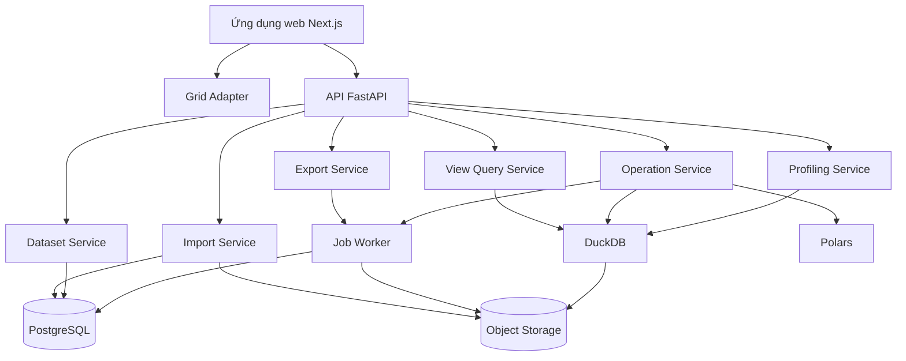
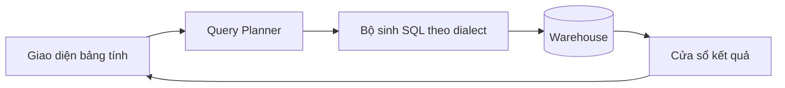
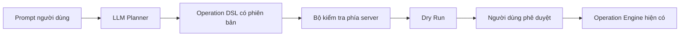

# Kiến trúc hệ thống

## 1. Mục tiêu kiến trúc

- giữ nguyên dữ liệu nguồn;
- duy trì tương tác bảng tính nhanh và ổn định;
- bảo đảm phép biến đổi có tính xác định;
- tách thao tác view khỏi mutation dữ liệu;
- hỗ trợ lịch sử và undo;
- thêm AI trong tương lai mà không thay execution engine;
- có lộ trình từ tệp cục bộ đến query pushdown ở quy mô warehouse;
- bảo đảm mọi mutation có tính nguyên tử, idempotent và được kiểm toán.

## 2. Mô hình thành phần



API là ranh giới xác thực/phân quyền. Worker không tin payload từ hàng đợi; nó đọc operation đã được kiểm tra và xác nhận lại trạng thái phiên bản trước khi commit.

## 3. Các lớp dữ liệu

### Lớp raw

Object được tải lên ban đầu, bất biến. Mỗi object có checksum, content type đã xác minh và metadata nguồn.

### Lớp working/version

Snapshot/checkpoint Parquet cùng operation log. Phiên bản đã commit là bất biến; `current_version_id` trỏ đến trạng thái đang dùng.

### Lớp metadata

PostgreSQL lưu người dùng, workspace, dataset, cột, phiên bản, operation, saved view, job và audit metadata.

## 4. Luồng đọc

```text
Grid yêu cầu cửa sổ dòng đang hiển thị + version_id
  → API xác thực người dùng và quyền
  → View Service kiểm tra filter/sort có kiểu
  → DuckDB truy vấn phiên bản Parquet tương ứng
  → API trả cửa sổ dữ liệu + tổng số dòng khớp + version_id
```

Không đọc toàn bộ bảng vào trình duyệt. Response phải có giới hạn kích thước và không dùng offset vô hạn nếu benchmark cho thấy chi phí tăng cao; khi đó chuyển sang cursor/keyset.

## 5. Luồng mutation

```text
UI tạo operation + base_version_id + idempotency key
  → API kiểm tra quyền, schema, tham số và phiên bản
  → executor dry-run khi bắt buộc
  → UI hiển thị tác động
  → người dùng xác nhận
  → backend khóa/đối chiếu phiên bản cơ sở
  → engine ghi delta hoặc object phiên bản mới vào đường dẫn mới
  → transaction metadata tạo version, cập nhật current_version và operation
  → lịch sử được cập nhật
```

Object dữ liệu có thể được ghi trước transaction metadata nhưng chỉ trở nên “live” sau commit. Job dọn rác xóa object mồ côi sau thời gian an toàn; không ghi đè object của phiên bản đã commit.

## 6. Chiến lược sửa ô

Sửa ô về logic vẫn là operation nhưng có thể tối ưu lưu trữ. Các phương án cần benchmark:

1. gom thay đổi vào bảng overlay/delta, định kỳ compact sang Parquet;
2. materialize toàn bộ dataset nhỏ sau một batch chỉnh sửa;
3. dùng bảng DuckDB làm working copy và checkpoint sang Parquet.

Spike MVP ưu tiên so sánh phương án 1 và 3 trên dữ liệu 100.000 dòng, gồm latency đọc sau nhiều delta, tốc độ undo, chi phí compaction và khả năng khôi phục khi worker lỗi.

## 7. Chiến lược snapshot

Không tạo full snapshot cho mọi mutation. Định hướng:

- nguồn thô bất biến;
- operation log cho mọi chỉnh sửa;
- checkpoint định kỳ;
- checkpoint trước thao tác phá hủy có tác động lớn;
- snapshot tại thời điểm xuất hoặc tạo phiên bản có tên;
- compaction theo số delta, kích thước delta hoặc độ trễ đọc.

Chính sách chính xác phải được quyết định bằng benchmark; operation log không được là cơ chế khôi phục duy nhất nếu replay quá dài hoặc phụ thuộc mã executor đã thay đổi. Schema operation/executor cần version hóa.

## 8. Đồng thời và idempotency

Mọi mutation chứa `base_version_id`. Nếu đã cũ, trả:

```text
409 VERSION_CONFLICT
```

Frontend làm mới trạng thái và yêu cầu người dùng thử lại hoặc giải quyết xung đột. Cùng một idempotency key và cùng payload trả lại kết quả trước; cùng key nhưng payload khác trả `409 IDEMPOTENCY_CONFLICT`.

Transaction cập nhật `current_version_id` phải dùng compare-and-swap hoặc row lock để hai worker không cùng commit từ một base version.

## 9. Tác vụ nền và phục hồi

- job có trạng thái `pending/running/succeeded/failed/cancelled`;
- retry chỉ được phép với operation idempotent;
- heartbeat phát hiện worker mất kết nối;
- timeout không đồng nghĩa operation chắc chắn thất bại, client phải tra trạng thái job;
- metadata lỗi lưu mã lỗi và request/job ID, không lưu dữ liệu ô nhạy cảm;
- quy trình phục hồi phải xử lý object mồ côi, operation treo và metadata đã commit nhưng cache chưa cập nhật.

## 10. Kiến trúc warehouse tương lai



Mặc định không trích xuất toàn bộ bảng. Query planner phải parameterize giá trị, áp giới hạn truy vấn và tôn trọng quyền nguồn. Quyền ghi/writeback là một capability riêng, không tự phát sinh từ kết nối chỉ đọc.

## 11. Kiến trúc AI tương lai



AI không có kênh mutation database trực tiếp. Nội dung ô được xem là dữ liệu không đáng tin cậy, không phải chỉ dẫn hệ thống; ngữ cảnh gửi mô hình phải được tối thiểu hóa và kiểm toán theo chính sách.
