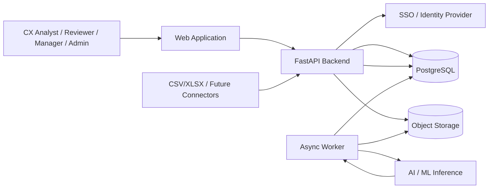
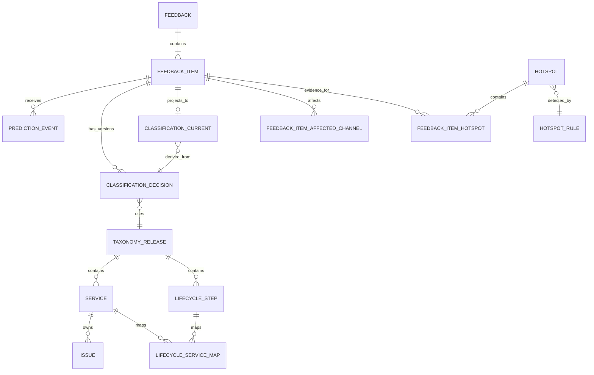
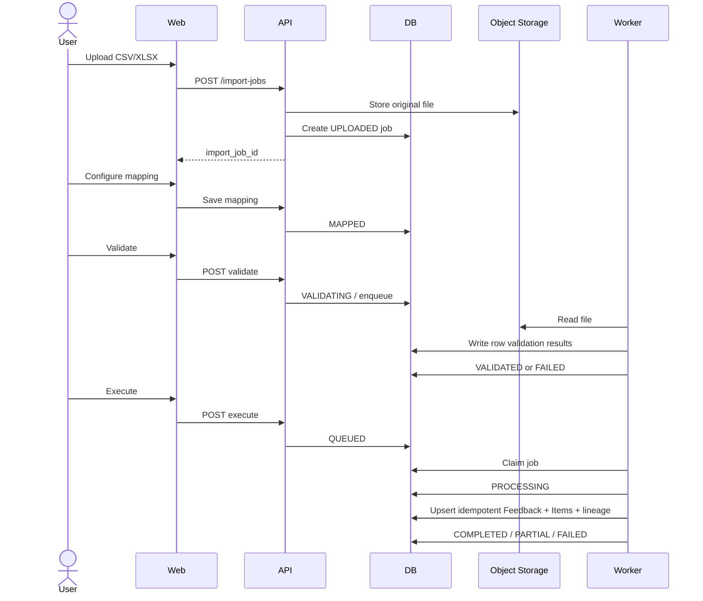
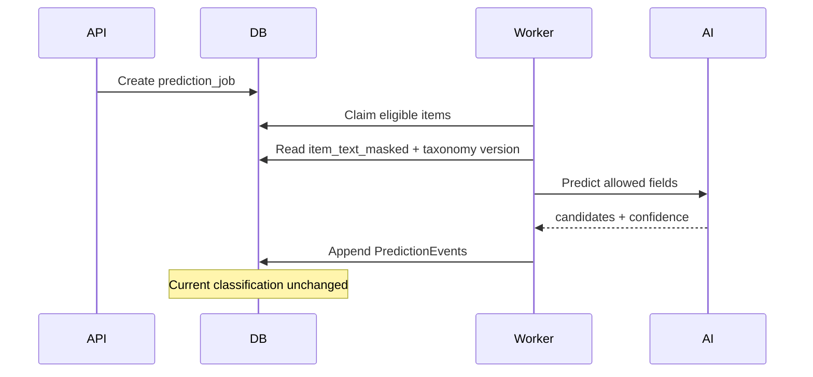
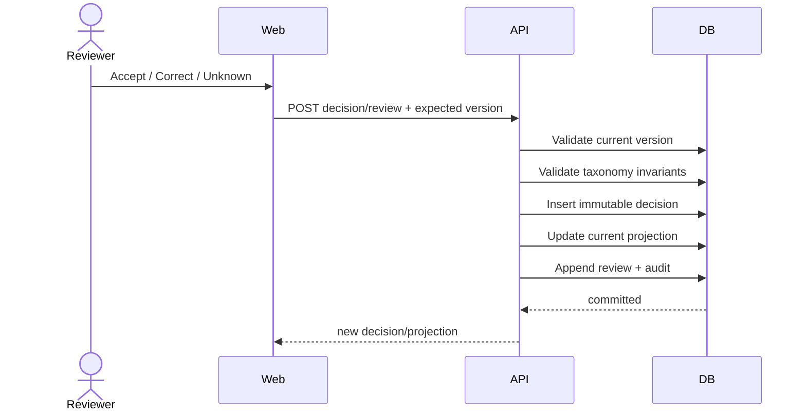
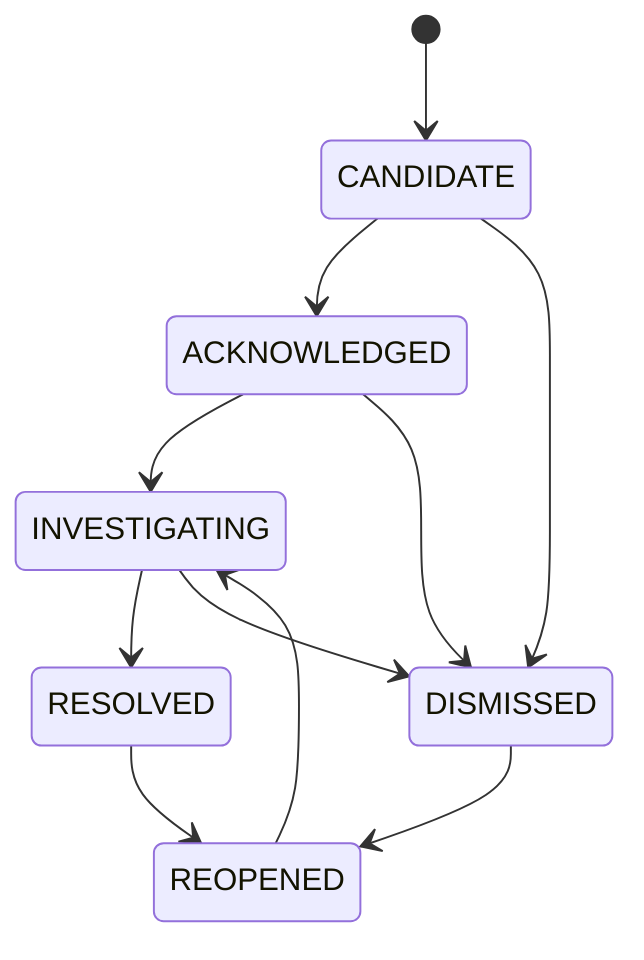

# 04 — System Design

# CX Journey, Service & Root Cause Intelligence Platform

**Version:** 1.0  
**Status:** P0 Pilot Architecture Baseline  
**Derived from:** `docs/PRD.md` v1.2, `docs/service_taxonomy.md` v3.0.0, `docs/Business_Rules.md` v1.0  
**Repository baseline:** Python 3.12, FastAPI, Pydantic, SQLAlchemy 2, psycopg 3, Alembic; repository already separates `apps/api`, `apps/web`, and `apps/worker`.

---

## 1. Purpose

This document defines how the P0 CX Platform should be implemented as a coherent, testable system.

It translates the product/domain contracts into:

- application architecture;
- module boundaries;
- persistence model;
- asynchronous processing;
- API design;
- security/audit behavior;
- analytics read paths;
- hotspot processing;
- deployment/observability;
- failure handling;
- build order.

The system design deliberately optimizes for a production-limited pilot and clear domain contracts before scale-out complexity.

---

# 2. Architecture Decision Summary

## SD-ADR-001 — Use a Modular Monolith for P0

P0 SHOULD use one domain-oriented backend application plus one asynchronous worker, not multiple microservices.

```text
apps/web
   ↓ HTTPS
apps/api
   ↓
Domain/Application Modules
   ↓
PostgreSQL
   ↘
    Job Queue / Job Tables
             ↓
        apps/worker
```

**Why**

- P0 is a pilot with many domain rules but limited scale.
- Most operations require transactional consistency across feedback, decisions, audit, and projections.
- Splitting into services early would add distributed consistency and deployment overhead without clear product value.
- Domain module boundaries can later become service boundaries if needed.

---

## SD-ADR-002 — PostgreSQL Is the P0 System of Record

PostgreSQL SHOULD store:
- reference/taxonomy data;
- import-job metadata;
- Feedback/Feedback Item;
- prediction ledger;
- decision ledger;
- current projection;
- audit;
- hotspot state/evidence;
- metric configuration.

Large uploaded files/error files MAY be stored in S3-compatible object storage.

---

## SD-ADR-003 — Append-Only Ledgers + Rebuildable Projection

The classification architecture MUST separate:

```text
Prediction Ledger        (immutable)
Decision Ledger          (immutable)
Review/Audit Events      (immutable)
        ↓
Current Classification Projection
        ↓
Analytics / Hotspot / UI reads
```

The projection is disposable/rebuildable derived state.

---

## SD-ADR-004 — P0 Async Queue Can Be PostgreSQL-Backed

Because the current Python dependency baseline does not require Redis/Celery, P0 MAY implement a durable PostgreSQL job queue with worker claiming via transaction/`FOR UPDATE SKIP LOCKED`.

Recommended migration path:

```text
P0:
PostgreSQL job table + apps/worker

Scale-out:
Redis / SQS / RabbitMQ / managed queue
```

The job contract must remain queue-technology agnostic.

---

## SD-ADR-005 — AI Is an External/Replaceable Adapter

Domain/application logic MUST NOT depend directly on one ML provider/model.

```text
ClassificationService
        ↓
PredictionPort
        ↓
Model Adapter
   ├── local model
   ├── hosted model
   └── LLM endpoint
```

All prediction output is persisted with model/pipeline/taxonomy version before review.

---

# 3. System Context



---

# 4. P0 Repository Mapping

Recommended repository structure:

```text
apps/
├── api/
│   ├── main.py
│   ├── routers/
│   ├── dependencies/
│   └── exception_handlers/
├── worker/
│   ├── main.py
│   ├── jobs/
│   └── schedulers/
└── web/
    └── ...

packages/
├── domain/
│   ├── feedback/
│   ├── taxonomy/
│   ├── classification/
│   ├── import_jobs/
│   ├── analytics/
│   ├── hotspot/
│   ├── auth/
│   └── audit/
├── application/
│   ├── commands/
│   ├── queries/
│   └── services/
├── persistence/
│   ├── models/
│   ├── repositories/
│   └── migrations/
├── ai/
│   ├── ports.py
│   └── adapters/
├── observability/
└── shared/

tests/
├── unit/
├── integration/
├── contract/
└── e2e/
```

Rule: routers/controllers should remain thin. Business invariants belong in domain/application services, not inside HTTP handlers.

---

# 5. Backend Module Boundaries

## 5.1 Taxonomy Module

Responsibilities:
- read lifecycle/service/issue/cause dictionaries;
- validate taxonomy release shape;
- validate lifecycle-service mappings;
- validate stable/effective IDs;
- publish an approved release;
- expose published reference data to UI/API.

P0:
- read/validate/publish;
- no arbitrary row-level CRUD.

Core objects:

```text
TaxonomyRelease
LifecycleStage
LifecycleStep
Service
Issue
Cause
LifecycleServiceMapping
Location
ServiceOwnerConfig
```

---

## 5.2 Import Module

Responsibilities:
- upload metadata;
- mapping profile;
- preview;
- schema/row validation;
- execution;
- retry;
- error report;
- row lineage;
- idempotency.

Core objects:

```text
ImportJob
ImportMappingProfile
ImportRow
ImportRowError
```

---

## 5.3 Feedback Module

Responsibilities:
- immutable Feedback envelope;
- Feedback Item creation/split;
- masked text;
- source/location/channel normalization;
- Feedback workspace queries.

Core objects:

```text
Feedback
FeedbackItem
FeedbackItemAffectedChannel
```

---

## 5.4 Classification Module

Responsibilities:
- AI prediction ledger;
- human/source decision ledger;
- review actions;
- optimistic concurrency;
- current projection rebuild;
- taxonomy consistency validation.

Core objects:

```text
PredictionRun
PredictionEvent
ClassificationDecision
DecisionCandidateCause
DecisionPredictionRef
ReviewEvent
ClassificationCurrent
ClassificationCurrentCandidateCause
```

---

## 5.5 Analytics Module

Responsibilities:
- central eligibility predicate;
- metric definitions;
- KPI query functions/views;
- filter-context serialization;
- drill-down consistency.

P0 metrics:
- item volume;
- negative rate;
- unknown rate;
- top service;
- top issue;
- top location;
- active hotspots;
- data-quality counts.

---

## 5.6 Hotspot Module

Responsibilities:
- deterministic rule configuration;
- eligible item selection;
- rolling-window evaluation;
- idempotent candidate upsert;
- evidence linkage;
- lifecycle/owner changes;
- audit.

Core objects:

```text
HotspotRule
Hotspot
HotspotOccurrence [optional]
FeedbackItemHotspot
HotspotTimelineEvent
```

---

## 5.7 Security & Audit Module

Responsibilities:
- authenticated principal;
- pilot scope;
- role/privilege checks;
- raw-PII enforcement;
- immutable audit events;
- correlation ID.

---

# 6. Logical Data Model



---

# 7. Recommended PostgreSQL Tables

## 7.1 Reference & Governance

```text
taxonomy_release
customer_lifecycle_stage
customer_lifecycle_step
service_request_step
service
issue
cause
issue_cause_map
lifecycle_service_map
location
interaction_channel
service_owner_config
pilot_scope_manifest
metric_definition
```

Important constraints:
- codes unique per canonical namespace;
- Issue belongs to exactly one Service;
- published release immutable except retirement metadata;
- effective dates validated;
- no reused stable code.

---

## 7.2 Intake

```text
import_job
import_mapping_profile
import_row
import_row_error
feedback
feedback_item
feedback_item_affected_channel
```

Suggested uniqueness:

```text
UNIQUE(source_system, source_record_key)
```

when the source guarantees a stable key.

Otherwise use a deterministic idempotency key/checksum scoped to source/import policy.

---

## 7.3 Classification

```text
prediction_run
prediction_event
classification_decision
classification_decision_candidate_cause
classification_decision_prediction_ref
review_event
classification_current
classification_current_candidate_cause
```

Suggested constraints:

```text
UNIQUE(feedback_item_id, decision_version)
UNIQUE(feedback_item_id) on classification_current
```

`classification_decision` is append-only.

---

## 7.4 Hotspot

```text
hotspot_rule
hotspot
hotspot_timeline_event
feedback_item_hotspot
```

Recommended idempotency key:

```text
UNIQUE(dimension_key, rule_version, active_window_key)
```

or an equivalent deterministic unique key.

---

## 7.5 Audit

```text
audit_event
```

Suggested fields:

```text
audit_event_id
occurred_at
actor_user_id
actor_role
action
resource_type
resource_id
project_id
correlation_id
reason
before_ref
after_ref
metadata_json
```

Audit records should avoid duplicating sensitive raw content unless explicitly required.

---

# 8. Classification Current Projection

The projection exists to optimize read/filter workloads.

```text
feedback_item_id
current_decision_id
customer_lifecycle_value_status
customer_lifecycle_stage_id
customer_lifecycle_step_id
service_request_value_status
service_request_step_id
primary_service_value_status
primary_service_id
issue_value_status
issue_id
sentiment
operational_severity
cause_determination_status
other_reason
classification_state
taxonomy_release_id
last_decision_at
projection_version
```

## Projection update algorithm

Within one transaction:

```text
1. Lock/read current projection version.
2. Validate expected previous decision/version.
3. Validate taxonomy release is allowed.
4. Validate Service/Issue/lifecycle invariants.
5. Insert new immutable ClassificationDecision.
6. Insert decision child references.
7. Upsert ClassificationCurrent from new decision.
8. Write audit/review event.
9. Commit.
```

If step 2 detects stale state, return HTTP `409 Conflict`.

---

# 9. Import Flow



---

# 10. Import Worker Contract

Each worker operation MUST be safe to retry.

Pseudo-behavior:

```text
claim job
↓
for each uncommitted row:
    derive idempotency key
    validate normalized fields
    if existing successful row/key:
        mark replay-safe success
    else:
        transaction:
            create Feedback
            create initial Feedback Item
            create lineage
            mark row success
↓
aggregate job status
```

No silent row loss is allowed.

---

# 11. AI Prediction Flow



Prediction fields in P0:

```text
customer_lifecycle_step
service_request_step (optional)
primary_service
issue
sentiment
```

Customer Lifecycle Stage is derived from step.

---

# 12. AI Review / Human Decision Flow



---

# 13. Hotspot Detection Flow

P0 baseline:

```text
Eligible current-classification items
        ↓
Normalize event bucket + configured location level
        ↓
Group by Service + Issue + Location
        ↓
Evaluate rolling W
        ↓
count >= N ?
   ├── no → no candidate
   └── yes
        ↓
idempotent upsert Hotspot CANDIDATE
        ↓
link evidence Feedback Items
        ↓
resolve default owner
        ↓
audit/timeline
```

## Candidate lifecycle



Every mutation requires actor/timestamp/reason.

---

# 14. Analytics Read Path

Analytics MUST read from a governed semantic query layer, not from arbitrary raw tables.

Recommended logical view:

```text
analytics_feedback_item_v1
```

joining:

```text
feedback_item
+ feedback
+ classification_current
+ published reference labels
+ location
```

and applying one central eligibility predicate.

Example conceptual predicate:

```sql
WHERE feedback_item.status = 'ACTIVE'
  AND feedback_item.analytic_eligibility = 'INCLUDED'
  AND classification_current.current_decision_id IS NOT NULL
  AND classification_current.classification_state = 'ACCEPTED'
```

Exact implementation may differ, but all KPI, chart, export, and drill-down queries must reuse the same predicate/version.

---

# 15. API Design

Base prefix:

```text
/api/v1
```

## 15.1 Conventions

Every request should have:
- authenticated principal;
- correlation ID;
- pilot-scope enforcement.

Mutation endpoints that can be retried SHOULD accept:

```http
Idempotency-Key: <client-generated-key>
```

Responses SHOULD expose:

```text
request_id / correlation_id
resource version
created/updated timestamp
```

Standard errors:

```text
400 VALIDATION_ERROR
401 UNAUTHENTICATED
403 FORBIDDEN
404 NOT_FOUND
409 VERSION_CONFLICT / IDEMPOTENCY_CONFLICT
422 DOMAIN_RULE_VIOLATION
429 RATE_LIMITED
500 INTERNAL_ERROR
```

---

## 15.2 Import

```http
POST /api/v1/import-jobs
POST /api/v1/import-jobs/{id}/validate
POST /api/v1/import-jobs/{id}/execute
POST /api/v1/import-jobs/{id}/retry
GET  /api/v1/import-jobs/{id}
GET  /api/v1/import-jobs/{id}/errors
```

---

## 15.3 Feedback

```http
GET  /api/v1/feedback-items
GET  /api/v1/feedback/{id}
GET  /api/v1/feedback-items/{id}
POST /api/v1/feedback/{id}/items/split
GET  /api/v1/feedback-items/{id}/predictions
GET  /api/v1/feedback-items/{id}/decisions
POST /api/v1/feedback-items/{id}/decisions
GET  /api/v1/feedback-items/{id}/current-classification
```

Filtering should use stable IDs/codes, not localized labels.

---

## 15.4 Taxonomy

```http
GET  /api/v1/customer-lifecycle/stages
GET  /api/v1/customer-lifecycle/steps
GET  /api/v1/service-request-lifecycle/steps
GET  /api/v1/services
GET  /api/v1/services/{id}/issues
GET  /api/v1/issues/{id}/candidate-causes
GET  /api/v1/lifecycle-service-mappings
GET  /api/v1/locations
POST /api/v1/taxonomy-versions/{id}/validate
POST /api/v1/taxonomy-versions/{id}/publish
```

P0 does not expose general row-level taxonomy CRUD.

---

## 15.5 AI

```http
POST /api/v1/ai/prediction-jobs
GET  /api/v1/ai/prediction-jobs/{id}
POST /api/v1/ai/predictions/{id}/review
```

---

## 15.6 Hotspot

```http
GET  /api/v1/hotspots
GET  /api/v1/hotspots/{id}
POST /api/v1/hotspots/{id}/acknowledge
POST /api/v1/hotspots/{id}/assign
POST /api/v1/hotspots/{id}/dismiss
POST /api/v1/hotspots/{id}/resolve
POST /api/v1/hotspots/{id}/reopen
```

---

# 16. Authentication & Authorization

P0 uses SSO plus application role/privilege enforcement.

Minimum roles:

```text
PILOT_ADMIN
ANALYST
REVIEWER
VIEWER
```

Authorization must be evaluated server-side.

Recommended principal context:

```text
user_id
role_ids
privileges
allowed_project_ids
raw_pii_allowed
export_allowed
```

P0 may use a pilot project allowlist. Fine-grained building/service scope is P1.

---

# 17. PII and Data Boundary

## Raw vs Masked

```text
content_raw      → privileged storage/read
content_masked   → default analytics/AI display
item_text_masked → AI inference default
```

Rules:
- do not log raw PII in standard application logs;
- do not put raw PII in correlation/error messages;
- AI receives masked text unless approved use case requires otherwise;
- raw view/export always audited;
- attachment support is out of P0.

---

# 18. Audit Design

Audit should be application-generated for semantic operations rather than relying only on DB logs.

Minimum audited actions:
- taxonomy publish;
- import execute/retry;
- Feedback Item split;
- raw content view/export;
- classification decision;
- review action;
- hotspot assign/status change;
- configuration/rule change;
- admin role/privilege change.

Audit event and domain transaction should commit together where practical.

---

# 19. Transaction Boundaries

Use database transactions for operations that must remain consistent.

## Decision transaction

```text
validate expected version
+ insert decision
+ update projection
+ insert review event
+ insert audit
= one transaction
```

## Feedback split transaction

```text
validate source item
+ create child/new items
+ update split metadata
+ audit
= one transaction
```

## Hotspot state mutation

```text
validate transition
+ update hotspot
+ timeline event
+ audit
= one transaction
```

Async external calls (AI/object storage) should not be held inside long DB transactions.

---

# 20. Concurrency Model

## Classification

Use optimistic concurrency:
- `projection_version`;
- or `expected_current_decision_id`.

Conflict → HTTP `409`.

## Job claiming

For PostgreSQL-backed queue:

```sql
SELECT ...
FOR UPDATE SKIP LOCKED
LIMIT ...
```

Worker marks claimed lease/state and processes outside long-held locks.

## Hotspot

Use deterministic unique key plus UPSERT to prevent duplicate candidates.

---

# 21. Indexing Strategy

Minimum candidate indexes:

```text
feedback(reported_at, project_id)
feedback(source_system, source_record_key)

feedback_item(feedback_id)
feedback_item(location_id)
feedback_item(status, analytic_eligibility)

classification_current(primary_service_id, issue_id)
classification_current(customer_lifecycle_step_id)
classification_current(service_request_step_id)
classification_current(sentiment)
classification_current(operational_severity)
classification_current(last_decision_at)

prediction_event(feedback_item_id, field_name, created_at)
classification_decision(feedback_item_id, decision_version)

hotspot(status, last_seen)
hotspot(rule_version, dimension_key)
feedback_item_hotspot(hotspot_id, feedback_item_id)

audit_event(resource_type, resource_id, occurred_at)
audit_event(actor_user_id, occurred_at)
```

Composite indexes should be validated against actual pilot query plans before production sign-off.

---

# 22. Object Storage

Use object storage for:
- original uploaded file;
- generated error file;
- optional import preview artifact;
- future export artifacts.

Recommended metadata in DB:

```text
object_key
content_type
size_bytes
checksum
created_at
created_by
retention_class
```

Do not expose permanent public URLs. Use short-lived signed access where needed.

---

# 23. Observability

Every API/job flow should carry a correlation ID.

## Logs

Structured fields:

```text
timestamp
level
service/app
correlation_id
user_id (when safe)
job_id
resource_type
resource_id
event
duration_ms
error_code
```

Never log raw PII by default.

## Metrics

P0 platform metrics:
- API latency/error rate;
- import job duration/rows/sec;
- import failed-row rate;
- worker queue depth/age;
- AI batch duration/failure rate;
- review queue age;
- unknown/ineligible rate;
- hotspot detection lag;
- duplicate/idempotency conflict count.

## Tracing

Optional P0, recommended if infrastructure already supports OpenTelemetry.

---

# 24. Performance Targets

From product requirements:

```text
Feedback list/filter p95 < 3s
Feedback detail p95 < 2s
Standard dashboard p95 < 5s
```

These targets are valid only after pilot sizing is agreed:
- historical row count;
- daily ingest;
- concurrent users;
- retention;
- max file size.

The system design should not claim enterprise-scale production SLO before those inputs are known.

---

# 25. Reliability

Required P0 properties:
- resumable/retryable import;
- idempotent ingestion;
- rebuildable classification projection;
- deterministic hotspot idempotency;
- database backup/restore procedure;
- migration rollback/forward-fix plan;
- worker crash recovery;
- no silent row loss.

Core feedback read/decision target after limited production rollout: ≥99.9% availability, subject to approved infrastructure/SLO.

---

# 26. Failure Handling

## Import file failure

```text
invalid/unreadable schema
→ FAILED
→ expose error
→ no production Feedback commit
```

## Row failure

```text
row invalid
→ row error
→ continue valid rows when policy allows
→ PARTIAL
```

## Worker crash

```text
job lease expires / job remains retryable
→ another worker reclaims
→ idempotency prevents duplicates
```

## AI failure

```text
prediction job failed/retryable
→ no accepted classification changes
→ manual workflow remains available
```

## Projection failure

```text
decision committed only if projection update succeeds in same transaction
```

If future architecture decouples projection asynchronously, an outbox/replay mechanism becomes mandatory.

---

# 27. Deployment Topology — P0

Logical topology:

```text
[Web]
  |
[Reverse Proxy / Load Balancer]
  |
[FastAPI API] -------- [Worker]
  |                       |
  +----------+------------+
             |
        [PostgreSQL]
             |
        [Backups]

[API/Worker] -------- [Object Storage]
[Worker] ------------ [AI Endpoint]
[API] --------------- [SSO]
```

P0 may deploy API and Worker from the same codebase/container image with different entrypoints.

Do not place AI inference in the synchronous upload request path.

---

# 28. Environment Strategy

Minimum:

```text
local
test/ci
staging/pilot
production-limited
```

Each environment must have:
- separate database;
- separate object namespace/bucket;
- explicit taxonomy seed/version;
- explicit feature flags;
- no accidental production AI mutation.

---

# 29. Configuration & Feature Flags

Versioned domain configuration:
- taxonomy release;
- lifecycle-service mappings;
- location hierarchy;
- Service owner mapping;
- metric definition;
- hotspot rule.

Environment feature flags:
- AI auto-apply: OFF in P0;
- safety hard trigger: OFF in P0 until sign-off;
- realtime connector mutation: OFF in P0;
- P1 RCA/ticket features: OFF until available.

Configuration must not be buried in source-code constants when it affects business meaning.

---

# 30. Security Baseline

- TLS in transit.
- Secrets from environment/secret manager, never committed.
- Database credentials least privilege.
- SSO token validation server-side.
- RBAC on every protected route.
- Pilot project allowlist.
- Raw-PII privilege.
- Input file type/size validation.
- SQLAlchemy parameterized queries.
- Export authorization and audit.
- Rate limits where abuse risk exists.
- Dependency vulnerability scanning in CI where available.

---

# 31. Testing Strategy

## Unit

Test domain invariants:
- value-status rules;
- issue/service consistency;
- allowed hotspot transitions;
- classification snapshot creation;
- taxonomy validator.

## Integration

Test:
- PostgreSQL constraints;
- migrations;
- decision transaction;
- import idempotency;
- projection rebuild;
- hotspot UPSERT;
- PII authorization.

## Contract

Test API schema/status/error codes.

## End-to-End P0 Vertical Slice

Input:

```text
"Thang máy S2 sáng nào cũng phải chờ rất lâu."
```

Expected:

```text
Import
→ Feedback
→ Feedback Item
→ manual Decision
→ Current Projection
→ Feedback Workspace
→ Pilot Analytics
```

Later F6:

```text
3 accepted equivalent items
within configured 2h window
→ exactly 1 Hotspot CANDIDATE
→ correct evidence
→ correct owner/state
→ retry creates no duplicate
```

---

# 32. CI Quality Gates

Recommended gates:

```text
format/lint
→ mypy strict
→ unit tests
→ integration tests
→ migration check
→ taxonomy seed validator
→ API contract tests
```

Taxonomy CI must verify:
- 10 Services / 28 Issues;
- Issue ownership;
- 6 stages / 36 customer steps;
- 8 service-request steps;
- code uniqueness;
- required `OPS-01..OPS-08`;
- SV-10 constraints.

---

# 33. Database Migration Strategy

Use Alembic.

Rules:
- schema changes are versioned;
- destructive migrations require explicit data migration/retention plan;
- never drop historical taxonomy/decision data just because UI no longer uses it;
- migration should be backward-compatible during pilot deploy where feasible;
- seed/reference publication should be distinguishable from schema migration.

Recommended separation:

```text
alembic migrations → database structure
structured seed     → taxonomy/reference/config release
```

---

# 34. Recommended Build Order

Follow the product vertical slicing:

```text
F0 Governance Foundation
  ↓
F1 Reference Data
  ↓
F2 Trusted Intake
  ↓
F3 Human Classification
  ↓
F4 AI Assist
  ↓
F5 Pilot Insight
  ↓
F6 Detect & Own
```

Concrete engineering order:

1. common enums/IDs/error model/correlation ID;
2. PostgreSQL + Alembic;
3. pilot auth/RBAC/audit;
4. taxonomy/location seed validator + publish/read API;
5. import job schema and worker;
6. Feedback/Feedback Item;
7. decision ledger + projection;
8. Feedback list/detail filters;
9. analytics semantic queries;
10. AI prediction ledger + review;
11. hotspot rule/worker/lifecycle;
12. hardening, observability, runbook.

---

# 35. What Not to Build in P0

Do not prematurely introduce:
- distributed microservices;
- event streaming platform solely for pilot;
- BMS/IoT ingestion;
- full CMMS;
- native CRM replacement;
- full ticket/SLA engine;
- autonomous root-cause confirmation;
- AI auto-apply;
- dynamic taxonomy row editor;
- enterprise-wide fine-grained authorization;
- semantic clustering/anomaly model before deterministic baseline works.

---

# 36. Open Architecture Decisions

These must be resolved before production-limited sign-off:

| Decision | Impact | Safe P0 default |
|---|---|---|
| Pilot sizing | DB indexes, worker concurrency, file limit, SLO | Do not claim enterprise SLO |
| Hosting platform | deployment/HA/backup | containerized API+worker + managed PostgreSQL preferred |
| Object storage | import/error artifact retention | S3-compatible private bucket |
| SSO provider | auth integration | adapter behind auth module |
| Job queue technology | async throughput/recovery | PostgreSQL-backed queue |
| AI provider/model | latency/cost/data boundary | adapter + masked text, suggest-only |
| PII retention | storage/deletion/export | deny raw/export by default |
| Hotspot schedule | detection delay/cost | periodic worker job |
| Location hierarchy | hotspot key/query | missing location makes item ineligible for location hotspot |
| Service owner config | hotspot routing | unassigned queue if missing |

---

# 37. P1 Evolution Path

When P0 is stable:

```text
File import
→ realtime source connectors

PostgreSQL job queue
→ managed queue when throughput requires

Basic pilot RBAC
→ project/building/service scoped authorization

Deterministic hotspot
→ anomaly/recurrence engine + approved hard triggers

External ticket reference
→ native/integrated Ticket/SLA

Candidate Cause schema
→ investigation + RCA + CAPA

AI suggest-only
→ selected low-risk auto-apply behind calibrated per-field feature flag
```

Do not change the domain contracts merely because infrastructure evolves.

---

# 38. Architecture Principles

1. **Stable contract first.**
2. **One vocabulary source of truth.**
3. **Append-only evidence, rebuildable projections.**
4. **Server-side security.**
5. **Idempotent asynchronous work.**
6. **Metric consistency from one eligibility contract.**
7. **No silent fallback.**
8. **Version everything that changes business meaning.**
9. **Complete one vertical slice before broadening scope.**
10. **Keep P0 simple enough to understand and operate.**

---

# 39. Source of Truth

This design is based on:

- `docs/PRD.md`
- `docs/service_taxonomy.md`
- `docs/Business_Rules.md`
- current repository dependency baseline in `pyproject.toml`
- current application separation under `apps/api`, `apps/web`, and `apps/worker`

If a design choice changes a business invariant, update `Business_Rules.md`/PRD first.  
If a design choice changes only implementation technology while preserving contracts, record it as an ADR and update this document.
