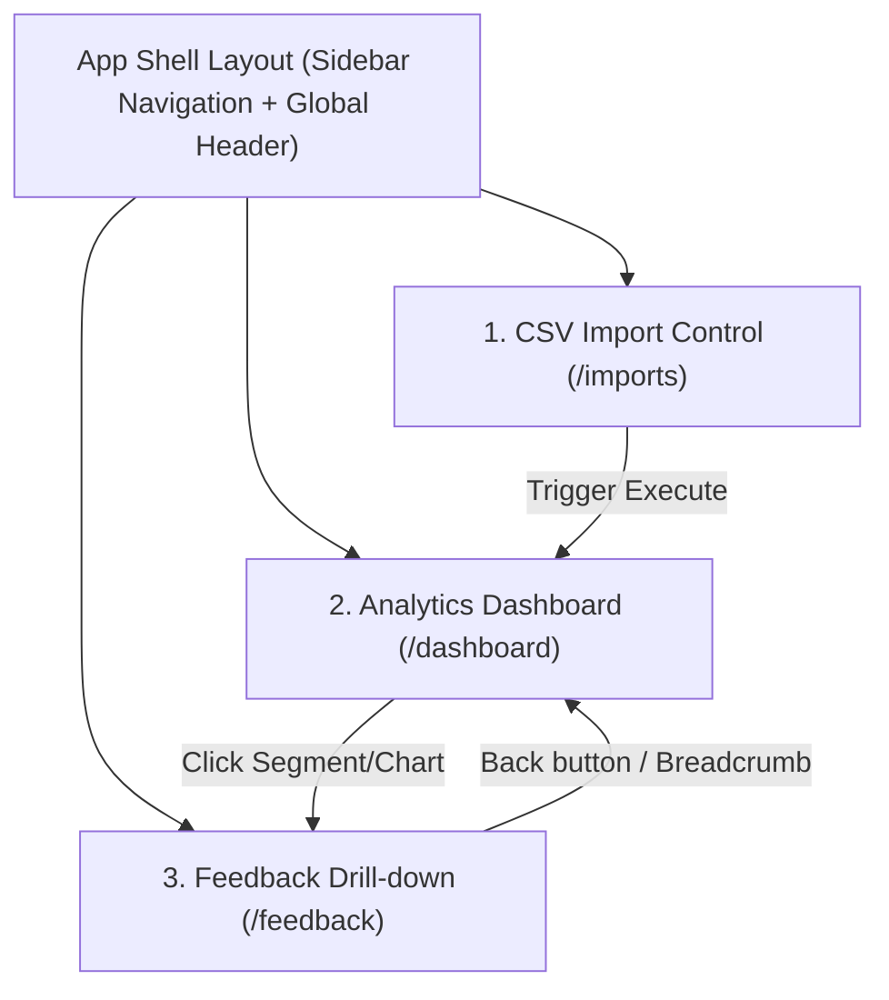

# UI/UX Design Specification — Trusted CSV to Dashboard Pilot

- **Status:** Approved Draft
- **Target Audience:** Frontend Engineers, UX/UI Designers, Product Owners
- **Related Specs:** [PRD](../PRD.md), [ADR-003](./adr/ADR-003-data-dashboard-stack-and-code-layout.md), [FEAT-04](../features/FEAT-04-dashboard-ui.md)

---

## 1. Overview & Design Principles

Tài liệu này quy chuẩn toàn bộ giao diện người dùng (UI), trải nghiệm người dùng (UX), cấu trúc component và hệ thống thiết kế (Design Tokens) cho pilot **Trusted CSV to Dashboard**.

### Nguyên tắc thiết kế (Design Principles)
1. **Context Preservation**: Người dùng lọc ở Dashboard khi click drill-down sang danh sách Feedback chi tiết phải giữ nguyên 100% ngữ cảnh lọc (Date range, Service, Location, Severity).
2. **Data Transparency**: Mọi con số KPI đều có thể đối soát (reconcile) về các bản ghi nguồn `feedback_item` cụ thể.
3. **Graceful State Handling**: Xử lý mượt mà mọi trạng thái: Loading, Empty Data, Partial Validation Error, Fatal System Error.
4. **Modern High-Density Aesthetics**: Giao diện chuẩn Dark Mode với độ tương phản cao, thẻ Glassmorphic, font chữ hiện đại (Inter / Roboto) và màu sắc nhận diện trực quan cho Sentiment/Severity.

---

## 2. Layout Structure & Wireframes

Ứng dụng bao gồm 3 góc nhìn chính (Views):



---

### View 1: CSV Import Control Panel (`/imports`)

Màn hình cho phép CX Analyst tải file CSV (`trusted-feedback-csv/v1`), theo dõi tiến trình kiểm tra (validation), xem lỗi theo dòng và thực thi import vào hệ thống.

#### Wireframe Blueprint:
```text
+-----------------------------------------------------------------------------------+
|  Header: Project Selection [ Pilot Project v1 ▼ ]     User: Analyst (CX)          |
+-----------------------------------------------------------------------------------+
|  IMPORT CSV DATASET                                                               |
|  +-----------------------------------------------------------------------------+  |
|  | 📁 Drag & Drop your trusted CSV file here or [Browse File]                   |  |
|  | Supported format: .csv (UTF-8, Max 10,000 rows, Max 15MB)                   |  |
|  +-----------------------------------------------------------------------------+  |
|                                                                                   |
|  VALIDATION STATUS                                                                |
|  File: feedback_july_batch.csv (8.4 MB)  |  Status: VALIDATING (65%)              |
|  [========================================------------------]                     |
|                                                                                   |
|  +-----------------------+ +-----------------------+ +-------------------------+  |
|  |  TOTAL ROWS: 10,000   | |  VALID ROWS: 9,850    | |  INVALID ROWS: 150    |  |
|  +-----------------------+ +-----------------------+ +-------------------------+  |
|                                                                                   |
|  ERROR INSPECTOR                                            [ 📥 Download Errors ]|
|  +-----+--------------------+--------------------------------------------------+  |
|  | Row | Field              | Error Reason                                     |  |
|  +-----+--------------------+--------------------------------------------------+  |
|  | 42  | created_at         | Invalid ISO-8601 timestamp format                |  |
|  | 108 | service_id         | Service 'UNKNOWN_SRV' not found in taxonomy      |  |
|  +-----+--------------------+--------------------------------------------------+  |
|                                                                                   |
|  [ Cancel ]                                            [ 🚀 Execute Import ]      |
+-----------------------------------------------------------------------------------+
```

---

### View 2: Analytics Dashboard Overview (`/dashboard`)

Giao diện chính để CX Manager theo dõi các chỉ số KPI, xu hướng theo thời gian và phân rã (breakdown) dữ liệu theo Service, Issue, Location.

#### Wireframe Blueprint:
```text
+-----------------------------------------------------------------------------------+
|  FILTER BAR                                                                       |
|  [ Date Range: 2026-08-01 to 2026-08-10 ▼ ]  [ Service: All ▼ ]  [ Location: All ▼ ]|
|  [ Sentiment: Negative ▼ ] [ Severity: High/Critical ▼ ]    [ 🔄 Reset Filters ]   |
+-----------------------------------------------------------------------------------+
|  KPI SUMMARY CARDS                                                                |
|  +-----------------------+ +-----------------------+ +-------------------------+  |
|  | TOTAL FEEDBACK VOLUME | | NEGATIVE RATE (%)     | | VALIDATION PASS RATE    |  |
|  | 12,845  (↑ +6.2%)     | | 14.2%  (↓ -1.5%)     | | 98.5%                   |  |
|  +-----------------------+ +-----------------------+ +-------------------------+  |
|                                                                                   |
|  FEEDBACK TREND OVER TIME (Click any point to drill-down)                         |
|  1200 |              /\                                                           |
|   800 |  /\         /  \      /\                                                  |
|   400 | /  \_______/    \____/  \                                                 |
|     0 +--------------------------------------------->                             |
|        08-01  08-03  08-05  08-07  08-09  08-10                                   |
|                                                                                   |
|  BREAKDOWN BY SERVICE                        BREAKDOWN BY LOCATION                |
|  +---------------------------------------+  +----------------------------------+  |
|  | Support  [===================] 4,812   |  | Building A  [==============] 3.9k|  |
|  | Billing  [==============] 3,540       |  | Building B  [===========] 3.2k   |  |
|  | Product  [==========] 2,611           |  | Building C  [======] 2.1k        |  |
|  +---------------------------------------+  +----------------------------------+  |
+-----------------------------------------------------------------------------------+
```

---

### View 3: Feedback Drill-Down List (`/feedback`)

Màn hình hiển thị danh sách Feedback chi tiết (đã mask thông tin PII), cho phép xem chi tiết từng bản ghi và đối soát nguồn (lineage).

#### Wireframe Blueprint:
```text
+-----------------------------------------------------------------------------------+
|  < Back to Dashboard   |  Active Filters: [Service: Support] [Sentiment: Negative]|
+-----------------------------------------------------------------------------------+
|  FEEDBACK DRILL-DOWN LIST (Showing 1 - 20 of 1,420 items)                         |
|  +-------------+------------+--------------------+-----------+--------------------+
|  | Timestamp   | Service    | Masked Feedback    | Sentiment | Action             |
|  +-------------+------------+--------------------+-----------+--------------------+
|  | 08-10 14:20 | Support    | Customer complained| NEGATIVE  | [ 👁️ View Details ]|
|  |             |            | about slow response|           |                    |
|  | 08-10 13:05 | Billing    | Payment failed on  | NEGATIVE  | [ 👁️ View Details ]|
|  |             |            | invoice #XXXXX     |           |                    |
|  +-------------+------------+--------------------+-----------+--------------------+
|  Pagination: [ < Prev ] Page 1 of 71 [ Next > ]                                  |
+-----------------------------------------------------------------------------------+
|  DRAWER: FEEDBACK ITEM DETAILS                                                   |
|  Item ID: fb_item_98214                                                           |
|  Timestamp: 2026-08-10T14:20:00Z                                                  |
|  Service: Customer Support  | Location: Floor 3, Bldg A                           |
|  Category: Slow Response    | Severity: HIGH                                      |
|  Masked Content: "Khách hàng phản ánh nhân viên *** chậm trễ hỗ trợ..."           |
|                                                                                   |
|  PROVENANCE & LINEAGE:                                                            |
|  Import Job ID: job_csv_8812  | Source Reference: July_Batch_V1.csv               |
|  Decision: SOURCE_TRUSTED     | Metric Token: snapshot_20260810                   |
+-----------------------------------------------------------------------------------+
```

---

## 3. Design System & Style Tokens

### Color Palette (Dark Mode Tailwind / CSS Tokens)
- **Background Main (`--bg-main`)**: `#0f172a` (Slate 900)
- **Card Surface (`--bg-surface`)**: `rgba(30, 41, 59, 0.7)` (Slate 800 + Glassmorphism Backdrop Blur)
- **Border Subtle (`--border-subtle`)**: `rgba(255, 255, 255, 0.1)`
- **Primary Accent (`--accent-primary`)**: `#6366f1` (Indigo 500)
- **Positive / Success (`--color-success`)**: `#10b981` (Emerald 500)
- **Negative / Alert (`--color-negative`)**: `#f43f5e` (Rose 500)
- **Neutral / Warning (`--color-warning`)**: `#f59e0b` (Amber 500)

### Typography
- **Primary Font Family**: `Inter, system-ui, sans-serif`
- **Monospace Font (for IDs/Log/Code)**: `JetBrains Mono, Fira Code, monospace`
- **Scale**:
  - H1 Page Title: `24px / 1.3`, Semibold
  - H2 Section Header: `18px / 1.4`, Medium
  - KPI Stat Value: `32px / 1.2`, Bold
  - Body Text: `14px / 1.5`, Regular
  - Small / Monospace ID: `12px / 1.4`, Regular
